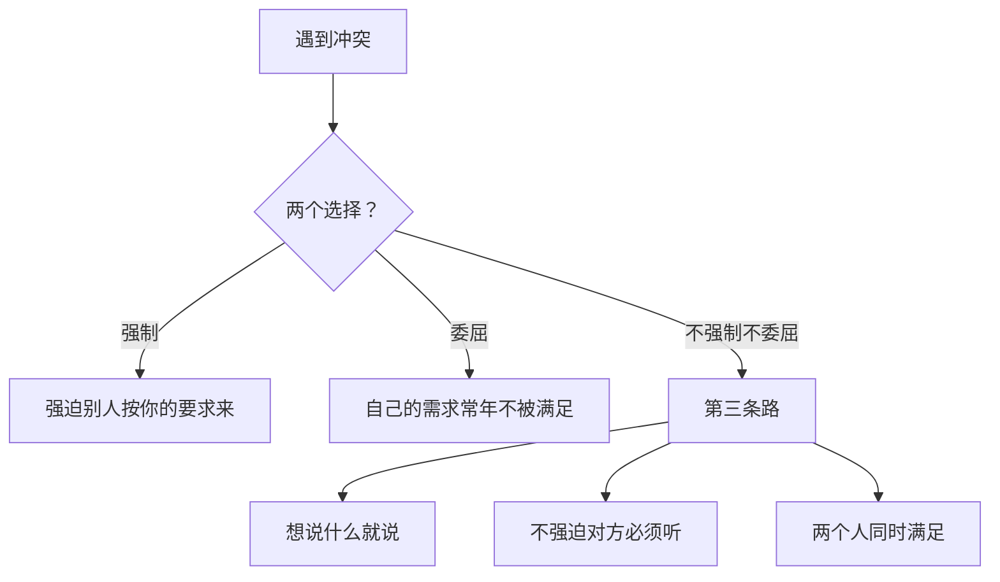

# 第08课：不强制，不委屈，不评判

## 学习目标

- 理解"第三条路"的核心理念
- 掌握"同时满足"的思维方式
- 学会打破二元思维

## 异地恋的隐喻

女生接受北京的工作机会，男朋友在上海。两个人周末想见面，问题来了——去谁的城市？

"你过来"VS"你过来"——谁都不愿让步。

第三条路的方案：**既不去北京，也不去上海，而是在中间城市约会**。

好处：两个人走得都不远，谁都有主动权，陌生城市约会还很浪漫。最后他们选择了一个中间城市定居。

> [!TIP] 核心信念
> 每当你在想"到底让A听B的，还是B听A的"，你要相信：**存在一条路，让A和B同时满足**。

## 不强制、不委屈、不评判

- **不强制**：你不能强迫别人按你的要求来
- **不委屈**：你可以坚持你想要的东西
- **不评判**：每个需求都值得被找到方式满足，不需要加以评判

## 生活中的第三条路

| 表面冲突 | 常见解决 | 第三条路 |
|---|---|---|
| 老公看球赛，老婆看韩剧 | 争电视 | 一个看电视一个看iPad，靠在沙发上各看各的 |
| 老公喜欢安静看书，老婆黏人 | 吵架 | 老公看书，老婆在旁边安静陪着，老公偶尔捶捶背 |
| 老公乱扔东西，老婆爱整洁 | 互相改造 | 一半房间乱扔，一半房间整洁 |

## 创造力是钥匙

很多夫妻发现不用争输赢以后，发展出各种创意：
- 轮流值班：单号听你的，双号听我的
- 划拳决定
- "拍卖"：谁出价更高听谁的

> [!NOTE] 
> 你们不是在搞政治，你们是在玩游戏。玩得开心就继续，不开心就换个玩法。

## 最动人的故事

一个自闭症男孩害怕身体接触，别人拥抱他他会很害怕。他的父母接受了这一点，发明了一个独特的信号：每次见面时，张开手掌，用五个手指尖跟孩子的指尖轻轻触碰一下——用这个方式表达"我爱你"。

这既不是非要抱着孩子让他接受爱，也不是保持距离。更不会评判：为什么别人都可以拥抱就你不行。

**它是独一无二的——你也是。**

## 课后练习

找到一个你和伴侣"非此即彼"的冲突场景（比如去哪里吃饭、周末干什么、谁来洗碗），尝试想出一个"第三条路"的方案——既不是A也不是B，但两个人同时满足。

Continue with [[lessons/0009-li-jie-gai-bian-de-zu-li|第09课：为什么光抱怨不改变——理解改变的阻力]]。