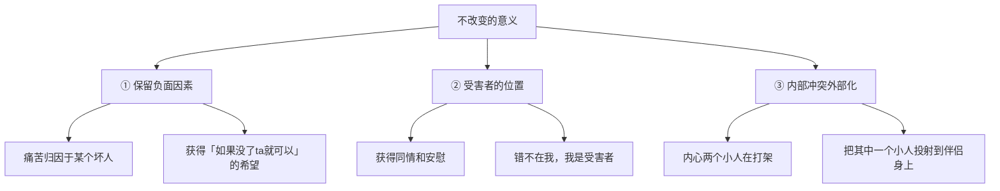

# 第09课：理解改变的阻力

## 学习目标

- 理解"不改变"的三重心理意义
- 掌握对改变的更宽容的态度
- 学会识别自己是否处在改变的阻力中

## "那又不是我的错"

在亲密关系中，很多人会说："我们家情况特别复杂""你说的那些方法对一般的婚姻可能有用，但我的婚姻太糟了"。这时候你给建议，他会说"没用"。

这句话很重要。绝大部分亲密关系出问题，两边的人都在试图证明："那又不是我的错。"

**对错不重要，改变最重要**——但有时候对错也重要。

如果一个人持续待在一段不理想的亲密关系里不改变，这本身就有意义。

> [!TIP] 停顿的智慧
> 如果你听到"没用"、"你不了解我们家的情况"——不要再给建议了。陪他等一等。

## 不改变的三重意义

### 意义一：保留负面因素
我们需要在生活里保留一些问题。比如保留一个糟糕透顶的人，在遇到更大痛苦时，就可以把问题算到他头上。这样就有了想象空间："如果老婆节约一点，我日子是不是就好多了？"

### 意义二：受害者的位置更受欢迎
抱怨伴侣不好→获得别人的安慰和同情，这是一种社交需求。有人希望自己是受害者——他可以获得补偿。不是所有问题你都要承担责任，偶尔坐坐弱者的位置，可以收获关心和温暖。

### 意义三：内部冲突外部化
内心有两个小人在打架："要不要听老婆的？听=省事，不听=做自己"。如果老婆逼我必须听她的，我就不用在心里打架了——她扮演了其中一个小人，我专注扮演另一个。

## 对改变的不同态度

以前的思路是：你提出不满，就应该想办法去改变。但现在理解到，你"不想改变"本身是有意义的。

如果你听前面那些课觉得有道理但不想听，不妨想一想：
- 是不是面对枕边这个人，你已经累了？
- 是不是在等他什么时候主动改变，你才愿意配合？
- 是不是觉得"太晚了，我们回不去了"？

**这样想一定有你的道理**——也许你是在用这种方法保护自己。

## 课后练习

不急着做任何改变。只是静静地观察：你在一段关系中保持现状，带给了你什么好处？这段关系现状，在帮你回避什么更大的问题？

然后把学到的方法暂时储备在头脑里。等到有一天你觉得可以了，它们自然会有用。

Continue with [[lessons/0010-gou-tong-zhi-dao-bian-jie-xu-qiu|第10课：立足边界表达需求]]——开始沟通模块的学习。