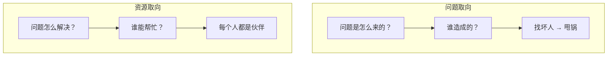

# 第12课：资源取向的沟通

## 学习目标

- 理解问题取向与资源取向的本质区别
- 掌握"你不是问题，你是资源"的沟通心态

## 合理化的拒绝

妻子说："我不开心，因为你总是加班出差，我想多一点时间相处。"

丈夫的回应可能是："我工作那么忙，要赚钱养家，哪有时间陪你？"

这就是**合理化的拒绝**——"我没错，我有道理，所以我不能满足你"。反应的本质是：**对方把你的需求当成了指责**。

## 问题取向 vs 资源取向

同一句话可以从两个角度理解：
- 问题取向："我不开心，因为陪我的时间不够多"（你是问题）
- 资源取向："我不开心，我想要你多陪我"（你是解决问题的资源）

> [!TIP] 
> **你不是问题，你是解决问题的资源。** 这种思维方式没有敌人，也没有坏人。

## 三个沟通建议

### 1. 把我们变成一边，把问题变成另一边
- ❌ "你说吧，你要怎么解决这个问题"
- ✅ "我们一起解决这个问题"
- 你跟伴侣站在同一边，问题在对面

### 2. 少用过去时，多用现在时
- ❌ "你从来就没有尊重过我" → "谁说我不尊重你"
- ❌ "以前你都会来接我" → "以前你对我有说有笑"
- ✅ 谈论过去是为了挖掘对现在有用的经验："我们有那么亲密的时候，说明我们有这个能力。现在怎么找回来？"

### 3. 少谈问题，多谈能力
问题本身也是一种能力。加班出差既是问题也是资源——它体现了当事人的责任心。如果妻子说："我看到你在为这个家付出很多，但我还想多一点跟你相处的时间怎么办？"——丈夫感受到的是自己的能力，自然愿意配合。

## 课后练习

把最近一个沟通冲突用两种方式重写：
1. 问题取向版本（谁错了？）
2. 资源取向版本（谁能做什么？）

感受一下两种版本带给你的不同感觉。

Continue with [[lessons/0013-wu-jie-xun-huan|第13课：误解与循环——理解关系中的长期冷战]]。