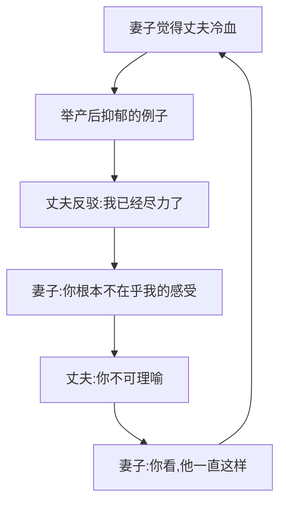

# 第13课：误解与循环

## 学习目标

- 理解良性争吵与恶性循环的区别
- 认识自我实现预言的危害
- 掌握跳出死循环的三个方法

## 良性争吵 vs 恶性循环

**良性争吵**：吵完之后有了新的理解——"原来他不是小题大做，是我以前不懂他"。这样的争吵有出口，能增进理解。

**恶性循环**：不管一方怎么说怎么做，在另一方看来都只是"又来了"——你讲道理他说"你又开始讲道理了"，你不讲道理他说"你果然不讲道理"。**已经没有办法产生新的信息了**。

## 自我实现预言

人有一种强大的**现实扭曲能力**——只要有了一个结论，接下来就只能看到这个结论：

- 觉得你是坏人 → 你对我笑是笑里藏刀，做好事是作秀，帮忙是有阴谋
- 我用有敌意的方式对你 → 你开始反击 → 你变成了我的敌人

点赞女同事朋友圈的段子：点赞 → 被怀疑有特殊关系；不点赞 → "做贼心虚，不然为什么不敢点"。完全相反的行为都能加工成同一个结论。

## 跳出死循环三方法

### 1. 看到例外
寻找那1%的不同。你觉得他冷漠，但有没有一次他倒了一杯热水？记下来。99%的结论不变，但那1%的例外增加了新的信息。

### 2. 寻找不同的解释
对同一个行为寻找多种可能的解释，不需要取舍哪一个是对的：
- 你身体不舒服他什么都不做 → 他是个混蛋（大概率）
- 也可能：他也在担心，但一担心就只会逃避
- 也可能：你的表达方式唤起了他童年时的愤怒

**多种解释放在脑子里，态度就不容易绝对化。**

### 3. 想到不同的应对方式
就算他100%是个混蛋——全世界的人对他这种人都只有一种办法吗？不一定，有人忍、有人离开、有人吵、有人不在乎。

你是在好几种办法中权衡后才用的这一种——想到这一点本身就已经是新的信息了。

## 课后练习

选一个伴侣的"问题行为"，写出三种可能的解释（哪怕第二种第三种只有1%的可能性）。然后问自己：如果第三种解释是真的，我现在的态度会变化吗？

Continue with [[lessons/0014-xin-fu-hao-xi-tong|第14课：走出循环——新的符号系统]]。