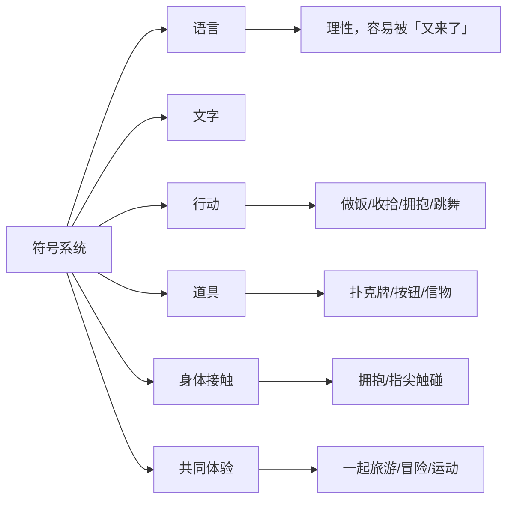

# 第14课：新的符号系统

## 学习目标

- 理解"新符号系统"如何打破僵化的沟通模式
- 掌握道具、行动等非语言沟通方法

## 扑克牌案例

妻子产后抑郁时觉得丈夫亏待了自己，丈夫觉得妻子钻牛角尖。他们陷入无休止的争吵——不管妻子说什么，丈夫都觉得"又来了"。

解决办法：给妻子一张扑克牌中的**王牌**。

- 妻子不用再重复旧事，晃一下牌代表"这是你欠我的"
- 丈夫不用再防御，看到牌就知道"她有求于我"
- 后来他们甚至不需要真的用牌，说一句"是不是要我找扑克牌"就能解决问题

> [!TIP] 
> 当所有语言都变成了"又来了"，语言本身已经无法传递新的信息。你需要 **换一门不同的语言**。

## 为什么需要新符号系统

使用同一套语言系统时间长了，它就失去了传递新信息的能力：
- 还没开口，对方已经想到你会说什么
- 无论说什么，对方都用过去的框架解读

**问题不是出在内容或口才上，而是"说话"这个动作本身就没用了。**

## 超越语言的符号

**行动比语言更强大**：
- "别说话，抱我"——一个拥抱胜过千言万语
- 下厨做饭、收拾房间、摆上蜡烛——用行动表达在乎
- 一起跳舞、打球、跳伞、潜水——创造属于两人的沟通方式

## 注意：符号必须是正向的

哭泣有时也被用作符号，但丈夫从中解读到的是指责和挑衅。**符号要双方都觉得舒服、正面的**。

更好的方式：妻子在丈夫肩膀上找一个"按钮"，需要他停下时就轻拍一下——两个人都觉得好玩。

## 课后练习

你和伴侣之间，有没有已经"说烂了"的话题？试一个非语言的沟通方式：
- 写一封信（手写）
- 用行动表达（做一顿饭、一个拥抱）
- 创造属于你们的"暗号"（一个手势、一个道具、一个按钮）

Continue with [[lessons/0015-ban-lv-yu-hai-zi|第15课：伴侣与孩子的平衡]]——开始模块四的学习。