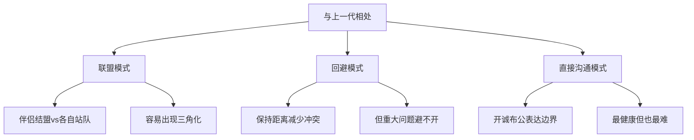

# 第16课：如何处理与上一代的关系

## 学习目标

- 理解代际边界在亲密关系中的重要性
- 掌握与上一代相处的三种模式

## 代际边界的挑战

两个在大城市生活的夫妻，生活方式高度契合。但过年一回到老家，矛盾就来了——对于怎么跟父母相处，意见不一致。女方觉得在父母面前也可以做自己，男方觉得要顾忌老人的感受。

这是文化差异的一个重要表现。来自不同家庭的两个人，对"怎么跟上一代相处"有着完全不同的信念。

## 三种相处模式

### 联盟模式
夫妻各自与自己父母结盟，容易导致关系分裂。

### 回避模式
"少见面少冲突"——短期内有效，但遇到重大决策（买房、育儿、养老）时矛盾集中爆发。

### 直接沟通模式
开诚布公地表达自己的边界，同时尊重对方的文化。**丈夫/妻子的翻译角色至关重要**。

## 丈夫的翻译角色

回到过年回家做家务的例子：
- 丈夫对母亲说："妈，他们家风俗跟咱不一样，小两口一起干活是他们对长辈的尊重。"
- 这句话既解释了不同文化，又翻译出了"尊重"这个正面含义——母亲一下子就理解了

> [!WARNING] 
> 沉默是最糟糕的选择。你不说，双方都按照自己的文化解读对方——误会在所难免。

## 课后练习

和伴侣一起聊聊：
1. 你们各自的原生家庭有什么"文化"（关于钱、家务、节日、表达爱的方式）？
2. 有哪些你们想改变、不想复制到自己家庭中的部分？
3. 你们希望建立什么样的"小家庭文化"？

Continue with [[lessons/0017-san-jiao-hua|第17课：三角化——家庭中的隐性威胁]]。