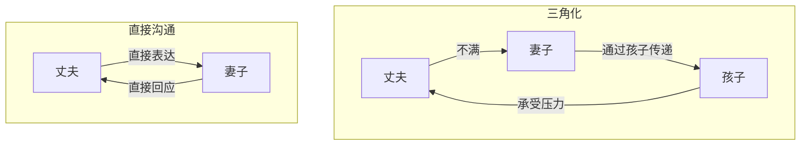

# 第17课：三角化

## 学习目标

- 理解三角化的定义和危害
- 掌握去三角化的方法

## 什么是三角化

**三角化**是指：两个人之间的问题，通过第三个人来传递和消化。

最常见的例子：妻子对丈夫不满，不直接说，而是对孩子抱怨"你爸爸太不负责任了"。孩子成了夫妻问题的"中转站"。

## 三角化的危害

1. **问题得不到解决**——真正的问题被转移，从未被面对
2. **第三方被卷入**——孩子被迫承受不属于他年龄的压力
3. **角色固化**——每个人都被固定在扭曲的位置上

在第15课中，妻子从小就走在一家三口中间，"左手牵一个右手牵一个，夫妻完全靠孩子连起来"——这就是典型的三角化。孩子成了父母关系的粘合剂，而不是独立的人。

> [!WARNING] 
> "要不是为了孩子，我早就离婚了"——这句话本身就是三角化。孩子成了夫妻问题的替代品。

## 去三角化的方法

### 1. 识别三角化
当你对孩子说"你爸爸/妈妈怎样怎样"时，停下来问自己：**这应该是两个人之间的问题，还是需要第三方介入的问题？**

### 2. 回到两人之间
把问题还给当事人：
- 夫妻之间的问题，回到夫妻之间解决
- 不要通过孩子、父母或其他第三方传递信息

### 3. 直接表达
练习[[lessons/0010-gou-tong-zhi-dao-bian-jie-xu-qiu|第10课]]的边界沟通：以我开头，直接对当事人说。

### 4. 让孩子做回孩子
"这事由爸爸决定"——让孩子看到父母是一个整体，而不是需要他协调的两个人。

## 课后练习

想一想你的亲密关系中，是否存在三角化：
- 有没有通过孩子或父母传递过不满？
- 有没有让孩子在你们之间"选边站"？
- 如果有，尝试一次回到两个人之间的直接沟通。

Continue with [[lessons/0018-xing-yu-qin-mi|第18课：性爱与亲密——X-Ai与亲密]]。