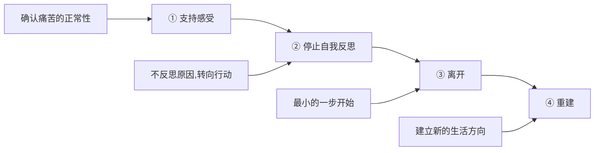

# 第20课：暴力零容忍

## 学习目标

- 理解暴力的界定标准（喊停能否停下来）
- 认识精神暴力的特征与危害
- 掌握离开暴力的四步方法

## 暴力零容忍

对暴力**零容忍**，没有讨价还价的余地。

## 暴力的界定

伴侣之间争吵是正常的，如何界定正常的攻击和暴力？

**简单标准**：你感觉不舒服，你喊停——能不能真的停下来？
- 能停 → 正常的攻击行为
- 停不下来，在你喊停的情况下还在升级 → **暴力的范畴**

身体上的暴力如此，精神上的暴力也一样。

> [!WARNING] 精神暴力
> 不完全动手打人，但持续在语言上羞辱、贬损、操控对方。2019年北大女生暴力事件——男友要她拍裸照、叫主人、先怀孕再流产，最终女生服药自杀进入脑死亡——这就是精神暴力的典型案例。

## 为什么离不开暴力关系

这是对受害者的最大误解——不是软弱，而是**底层的认知已经被暴力扭曲了**。

面对极端的失控体验，当事人必须为处境找一个内在合理性，否则会被无力感击溃。于是他们通过**自我否定**来建立可控感：
- "可能是我的错，他打我骂我，因为我确实没有做好"
- "如果将来有一天我做好了，一切就可以停止了"

这是一种幻觉。痛苦他就是痛苦——无论对方怎么美化或扭曲。

## 离开暴力的四步

### 第一步：支持感受
不催促、不指责。一遍一遍确认：
- "你现在很混乱，任何人经历这样的关系都会混乱"
- "这段关系给你造成了很大的伤害"
- "所有经历暴力的人都会有跟你一样的感受"

### 第二步：停止自我反思，转向行动
"我为什么这么软弱？"——反思不会帮助你。把话题转向未来：
- "等这个阶段过去以后，你离开了这个人，下一步要怎么生活？"
- 想象画面：如果你找到了力量，你在做什么？

### 第三步：离开——从最小的一步开始
离开不需要征得对方的同意。**启动动作越小越轻巧越好**：
- 带上手机钱包身份证，随便选一个日子离开
- 不要收拾东西，先离开再说
- 不需要通知对方，不需要仪式

### 第四步：重建
离开不是结束。重建新的生活方向——学习、创业、建立新的社交圈。

## 课后练习

即使你不处在一段暴力关系中，也建议了解这些常识：
1. 建立自己的底线——你能接受什么、不能接受什么
2. 如果你身边有人正处在暴力关系中，不要催促他离开——先**支持他的感受**，让他知道你看到了他的痛苦

Continue with [[lessons/0021-jie-shu-ye-hen-hao|第21课：为什么说结束也很好——开始模块五的学习]]。