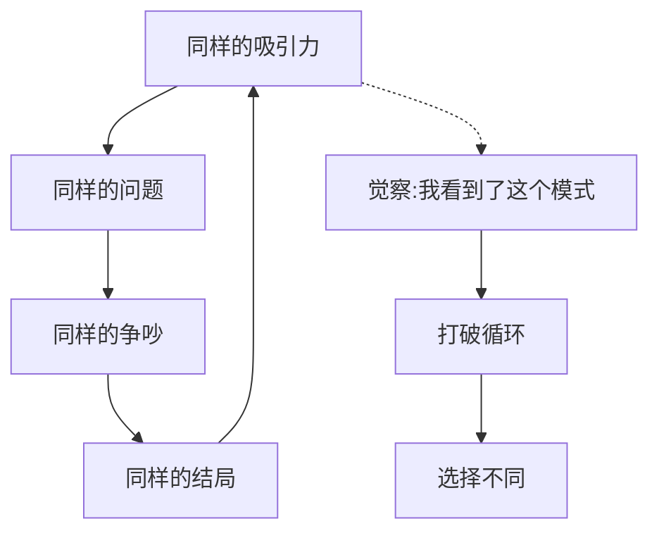

# 第21课：结束也很好

## 学习目标

- 理解关系结束的正面意义
- 学会识别和打破重复模式

## 不是只有白头到老才是好的

对现代人来说，不是只有白头到老这一种亲密关系是好的。越来越多的人选择分开、追求新的幸福，能够以成熟的状态相互告别向前走——**这也是很好的关系**。

> [!NOTE] 
> 结束不是失败，而是完成了那个阶段。就像花朵凋谢是为了让果实生长。

## 打破重复模式

有些人总是在同样类型的关系中受伤——总是爱上同样"不对"的人，总是在同一个问题上吵架，总是以同样的方式结束。

如果没有觉察和改变，这些模式会重复上演。而当你有意识地选择结束一段关系时，你就在打破这个循环：

## 结束是一种主动选择

在第04课中我们谈到过：**自由选择是良好亲密关系的前提**。结束一段关系也是这个自由的一部分。

如果结束是你主动选择的，而不是被迫的：
- 它就不是失败
- 你可以带着尊严和完整离开
- 你为下一个阶段打开了空间

## 什么时候该考虑结束

没有一个标准答案，但可以问自己几个问题：
1. 这段关系还在帮助你成长吗？
2. 你还在主动选择这段关系，还是只是"习惯了"？
3. 如果不离开是因为**不敢离开**，还是因为**还想留下**？

## 课后练习

想象一下：如果这段关系今天结束了，五年后的你回头看，会觉得这是个遗憾，还是松了一口气？这个问题的答案可能比你想的更接近你的真实感受。

Continue with [[lessons/0022-nu-zhuan-bei|第22课：向前走——从愤怒到哀伤]]。