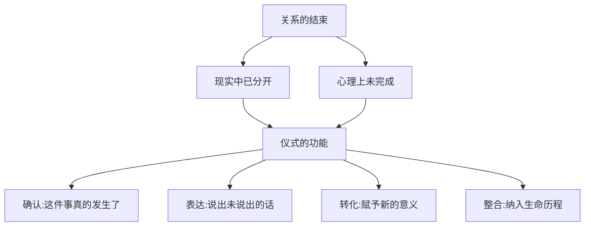

# 第23课：未完成的结束——仪式的意义

## 学习目标

- 理解告别仪式对关系结束的心理学意义
- 学会创造有意义的告别仪式

## 为什么需要仪式

有时候关系在法律上结束了，在心理上却没有。两个人虽然分开了，但怨恨、遗憾、未说的话、未表达的情感仍然在心里延续。

**仪式的作用就是完成这个"未完成"**。

> [!NOTE] 
> 仪式是用象征性的行为，帮助心理完成一个已经发生但尚未被处理的转变。

## 仪式的心理学功能

## 可以有哪些仪式

### 集体的仪式
- 正式签署离婚协议
- 请亲友见证的告别晚餐
- 共同清理和分配共同物品

### 私人的仪式
- 写一封告别信（不一定寄出）
- 删除旧照、整理回忆
- 一个人去曾经有特殊意义的地方做告别
- 把戒指或其他信物处理掉（卖掉、熔化、深埋）

### 新的开始仪式
- 换个新发型
- 搬进新家
- 开始一项新的爱好

## 什么时候做仪式

没有统一的时间表：
- 太早做，情绪还没有准备好
- 太晚做，仪式失去了意义
- **当你感觉"是时候了"的时候，就是最好的时间**

> [!WARNING] 
> 仪式不是为了对方做的，是为了自己做的。即使对方不在场、不配合，你也可以单独完成。

## 仪式的核心要素

一个完整的告别仪式包含三个元素：
1. **确认**——承认这件事真的发生了
2. **表达**——说出你的感受、感谢、遗憾
3. **放手**——象征性的"放下"动作（焚烧信件、解下手链等）

## 课后练习

如果你有一段"未完成"的关系，设计一个属于你自己的告别仪式：
1. 选一个地方、一个时间
2. 准备一个象征物（照片、信件、礼物）
3. 写下你想说的话（要说出来或烧掉）
4. 做一个"放手"的动作
5. 给自己一个新的开始信号

Continue with [[lessons/0024-gao-bie-shi-xin-de-kai-shi|第24课：带上祝福告别——告别是新的开始（最后一课）]]。