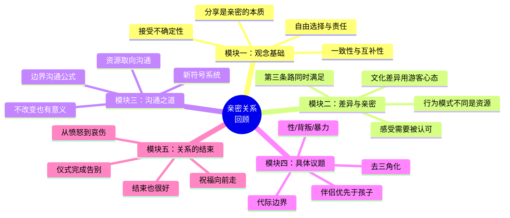

# 第24课：告别是新的开始

## 学习目标

- 理解"成熟分离"的概念
- 回顾整门课程的核心要点

## 带上祝福告别

最高形式的告别，是在分离时仍然带着对彼此的祝福。

这不容易做到——特别是当关系中充满了伤害、怨恨和失望时。但**成熟分离**的核心就是：
- 承认这段关系对你有意义（即使它结束了）
- 感谢对方曾在你生命中扮演的角色
- 各自带着完整的自己继续前行

> [!TIP] 
> 结束不是失败，是完成了那个阶段。像一场旅行——即使下了车，那段路程的风景也是真实的。

## 分手后如何继续做父母

对于有孩子的夫妻，关系结束后还需要继续合作做父母：

| ❌ 不好的方式 | ✅ 好的方式 |
|---|---|
| 在孩子面前说对方坏话 | 尊重对方作为父母的身份 |
| 用孩子传递信息 | 直接沟通 |
| 让孩子选边站 | 让孩子继续爱双方 |
| 用"为了孩子"的名义不离婚 | 即使分开也共同做好父母 |

在第04课中说过：最好的亲密关系以自由为前提。对离婚的夫妻来说，给孩子最好的礼物不是"勉强在一起的父母"，而是**即使分开了也能各自幸福、合作养育的父母**。

## 课程回顾：五个模块的核心

## 最后的思考

这门课从发刊词开始，讲到了新时代亲密关系的挑战：
1. **你不确定什么**——但可以接受不确定
2. **你有差异**——但差异可以互补
3. **你有需求**——但可以立足边界表达
4. **你有困难**——但可以找到资源
5. **你可能会结束**——但可以带着祝福往前走

> [!ABSTRACT] 送给你的话
> 越是美好的关系，就越意味着要接受成长、接受多元、接受它是一段不确定的挑战。愿你在亲密关系的旅程中，既能勇敢投入，也能从容告别。祝你和你爱的人指尖对指尖地触碰，心有灵犀。

## 课程完成清单

- [ ] 我理解了亲密关系的底层操作系统
- [ ] 我学会了用互补的眼光看待差异
- [ ] 我掌握了边界沟通的公式
- [ ] 我知道如何跳出沟通的恶性循环
- [ ] 我了解了如何处理关系中的具体议题
- [ ] 我明白了结束也可以是一种祝福

Continue exploring [[reference/glossary|核心术语表]] or [[reference/gou-tong-gong-shi|沟通原则速查]] for quick reference.