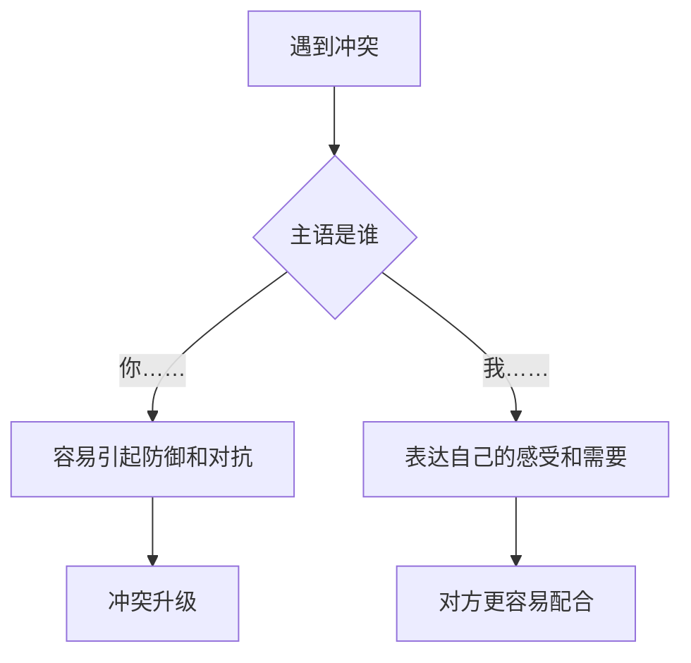
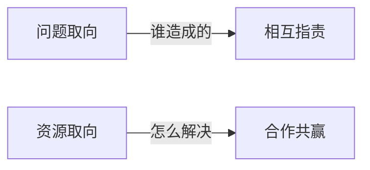

# 沟通原则速查

## 核心原则：立足边界表达需求

**口诀**：以我开头，我有困难，需要你的帮助

**示例对比**：

| ❌ 越界表达 | ✅ 边界内表达 |
|---|---|
| 你怎么这么没教养 | 我受不了这个声音 |
| 你能不能安静一点 | 我需要一个安静的环境 |
| 你为什么不来帮我 | 我不想一个人做饭，我想你来陪我 |
| 你说话声音太大了 | 你那么大声吼，我有点紧张 |

## 建设性需求：出租车原则

有问题 ≠ 知道要去哪。先想清楚方向再开口。

| 角色 | 三句话 |
|---|---|
| **听话方** | ① 谢谢你告诉我，你的感受很重要 ② 你过去有没有这样的时候？那时候怎么做的？ ③ 你在头脑里想象一个画面——你最想要的结果是什么样 |
| **说话方** | ① 我知道遇到什么问题，但没想好怎么办，我要想一想 ② 我需要你陪着我 / 我需要半天不要跟我说话 ③ 我被这个问题困扰，但不是指责你 |

## 资源取向沟通

1. **把我们变成一边，把问题变成另一边**
   - ❌ "你说吧，你要怎么解决这个问题"
   - ✅ "我们一起解决这个问题"

2. **少用过去时，多用现在时**
   - ❌ "你从来就没有尊重过我"
   - ✅ "我现在需要你听听我的感受"

3. **少谈问题，多谈能力**
   - ❌ "我们现在不如从前亲密了"
   - ✅ "我们曾经那么亲密，说明我们有亲密的能力"

## 如何打破沟通死循环

当所有沟通都变成"又来了"时：

1. 寻找**例外**——哪怕只有1%的不同
2. 寻找**新的解释**——还有别的可能吗？
3. 寻找**新的应对方式**——全世界的人对他都只有一种办法吗？
4. 创建**新的符号系统**——换一种语言说「我爱你」

---

本速查表是[[../index|李松蔚亲密关系24讲]]第10-12课的配套参考文档。