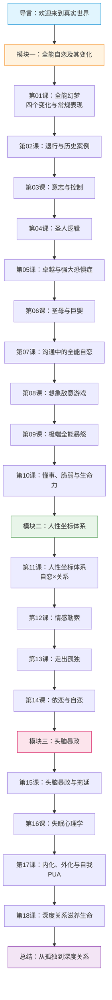

# 课程地图

## 模块概览

| 模块 | 课程 | 核心概念 | 建议用时 |
|------|------|----------|----------|
| **导言** | — | 全能感的四张面孔、人性坐标初步、头脑暴政 | 20 min |
| **一：全能自恋及其变化** | 第01-10课 | 全能自恋、全能暴怒、彻底无助、被害妄想 | 3-4 小时 |
| **二：人性坐标体系** | 第11-14课 | 自恋维度、关系维度、情感勒索、依恋 | 1.5-2 小时 |
| **三：头脑暴政** | 第15-18课 | 想象与体验、头脑暴政、深度关系 | 1.5-2 小时 |

## 推荐学习方式

1. 按顺序学习，每课完成后的"自我检查"部分
2. 结合自身经历反思，在 [[reference/glossary|术语表]] 中查阅核心概念
3. 完成全部课程后，回顾 [[reference/human-coordinate-system|人性坐标体系速查图]]

[[index|返回课程首页 →]]