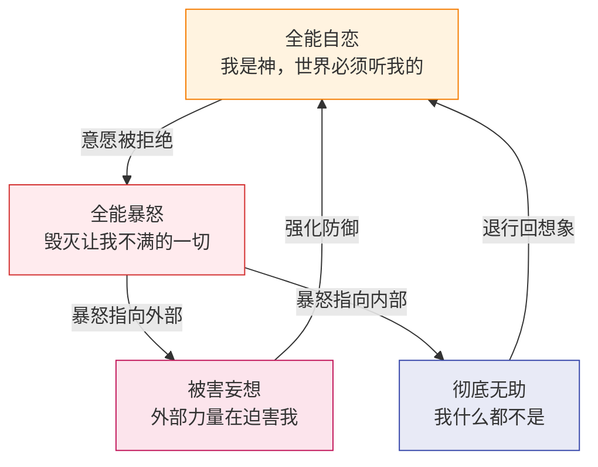
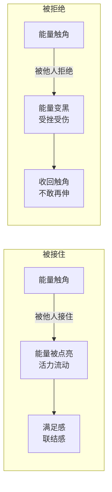
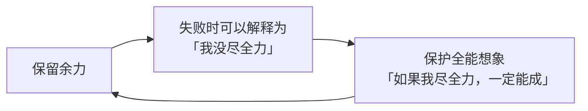

# 第01课：全能幻梦

> 「**全能感**是人类最原始的心理状态。婴儿认为自己是神，世界必须按照自己的意愿运转。成年后，这种心理如果没有被充分理解和整合，就会成为一切心理问题的根源。」

## 全能感的四张面孔

全能感有四种基本变化，它们构成了一个动态的心理过程：

| 面孔 | 核心信念 | 典型表现 | 例句 |
|------|----------|----------|------|
| **全能自恋** | 我是神，世界必须按我意愿运转 | 要求一切如自己所愿，不能接受任何意外 | 「他怎么可以这样对我？」 |
| **全能暴怒** | 胆敢拒绝我，就该被毁灭 | 被拒绝时产生不成比例的愤怒 | 「我恨不得毁掉一切」 |
| **彻底无助** | 我什么都不是，什么也做不了 | 暴怒转向自身，陷入抑郁和瘫痪 | 「算了，没用的」 |
| **被害妄想** | 外部力量在故意迫害我 | 怀疑他人的动机，感觉被针对 | 「他们就是要整我」 |

> [!WARNING] 重要认识
> 这四张面孔不是四个人格类型，而是同一个人在不同情境下可能切换的心理状态。每个人或多或少都有全能感，关键在于能否觉察它。

## 能量球意象

> [!NOTE] 核心隐喻
> 每个人都是一个**能量球**，不断向外界伸出「能量触角」——这些触角就是我们的意愿、需求、情感和表达。

被接住的关键词：**点亮、满足、联结、成长**

被拒绝的关键词：**变黑、受挫、收回、萎缩**

## 心理健康的标准

心理学家**科胡特（Heinz Kohut）**提出了简洁而深刻的心理健康标准：

> [!TIP] 心理健康 = 自信 + 热情
> - **自信**：活力能够滋养自己（自体的活力）
> - **热情**：活力能够滋养他人（客体的活力）

在 [[reference/human-coordinate-system|人性坐标体系]] 中，自信对应自恋维度的健康发展，热情对应关系维度的健康发展。

## 全能幻梦的常规表现

### 卓越强迫症

「不卓越不配活」——这是最典型的全能自恋表现之一。内心有一个声音不断要求自己必须做到顶尖、必须完美、必须是第一名。

> [!QUESTION] 你是否有过这样的内心独白？
> 「如果这次考试不是第一名，我就是个失败者。」
> 「做不好，还不如不做。」
> 「不完美就是零分。」

这种思维把连续的「优秀程度」简化为二元的「卓越 vs 失败」，中间没有任何灰度地带。

### 行动困难症

想法很多，但行动起来极其困难。原因在于：

- 在**想象**中，可以做到全能——瞬间完成、完美无缺
- 在**现实**中，任何行动都需要过程——需要时间、会犯错误、结果不确定
- 想象越丰满，行动越困难

### 投入困难症

与行动困难症密切相关，但更隐蔽——**不敢全力以赴**。

这种自我保护策略的代价：**永远不知道自己真正的能力边界在哪里**。

### 诛心论

把想法当作实际行为来对待。不问「对方做了什么」，只问「对方想了什么」。

> [!WARNING] 诛心论的破坏性
> 诛心论让任何关系都变得危险——因为在「想法」层面，每个人都会对别人产生不满、嫉妒甚至恨意。如果想法等于行为，那每个人都不可饶恕。

## 荒诞的现实案例

武志红在书中列举了一些令人啼笑皆非的全能梦案例：

- 「联合国官员」假证件骗局——花几万元买一个「联合国高级官员」职位
- 「民族资产解冻」诈骗——声称数万亿的民族资产等待「觉醒者」去解冻
- 各种「大师」包装——声称有超凡能力，吸引信徒膜拜

这些案例看似荒诞，实则深刻反映了人性的普遍需求：**渴望成为特殊的存在，渴望超越平凡。**

## 自我检查

1. 全能感的四个基本变化是什么？它们之间有什么关系？

四个变化：**全能自恋**、**全能暴怒**、**彻底无助**、**被害妄想**。

关系：全能自恋受挫后产生全能暴怒；暴怒指向外则形成被害妄想（投射）；暴怒指向内则导致彻底无助；彻底无助后又可能退行回全能自恋的想象世界，形成循环。

2. 什么是能量球意象？被接住和被拒绝分别意味着什么？

每个人是一个能量球，伸出能量触角（意愿、需求）。被他人接住时，能量被点亮，产生满足感和联结感；被拒绝时，能量变黑，产生受挫感，长期被拒绝会导致不敢再伸出触角。

3. 科胡特提出的心理健康标准是什么？

两个标准：**自信**（活力滋养自体）和**热情**（活力滋养客体）。自信让人在自恋维度健康发展，热情让人在关系维度健康发展。

4. 卓越强迫症、行动困难症、投入困难症三者有什么内在联系？

三者都源于**全能自恋**：卓越强迫症是用全能标准要求结果；行动困难症是因为现实行动不如想象全能；投入困难症是为了保护「如果尽全力就能成功」的全能想象。它们的共同根源是对「不完美」「不卓越」「可能会失败」的无法接受。

5. 什么是诛心论？它为什么对关系具有破坏性？

诛心论是把别人的想法等同于实际行为来评判。它具有破坏性是因为：每个人的内心都会产生各种想法（包括负面想法），如果想法就等于行为，那么没有人是「纯洁」的，任何关系都会充满猜疑和审判，真实沟通变得不可能。

## 实践练习

1. **觉察练习**：本周注意自己是否陷入「全能感的四张面孔」中的任何一种状态。记录下触发情境和你的反应。
2. **能量触角练习**：回想一次你向他人「伸出能量触角」被接住的经历，以及一次被拒绝的经历。体会两者在身体感受上的差异。
3. **卓越解压练习**：选一件你一直想做但觉得「不够完美」而没做的事，告诉自己「完成比完美重要」，试着去做。

## 本课要点

- 全能感有四个面孔：全能自恋、全能暴怒、彻底无助、被害妄想
- 心理健康的标志是自信和热情
- 卓越强迫症、行动困难症、投入困难症、诛心论都是全能自恋的常规表现
- 觉察是改变的第一步

## 下一步

[[0002-tui-xing-yang-guang|下一课：退行与历史案例 →]]

探讨当现实受挫时，人如何向全能感退行，以及杨广这样的历史人物如何成为全能自恋的典型案例。

---

[[reference/glossary|查看术语表]] | [[reference/human-coordinate-system|查看人性坐标体系速查]]
