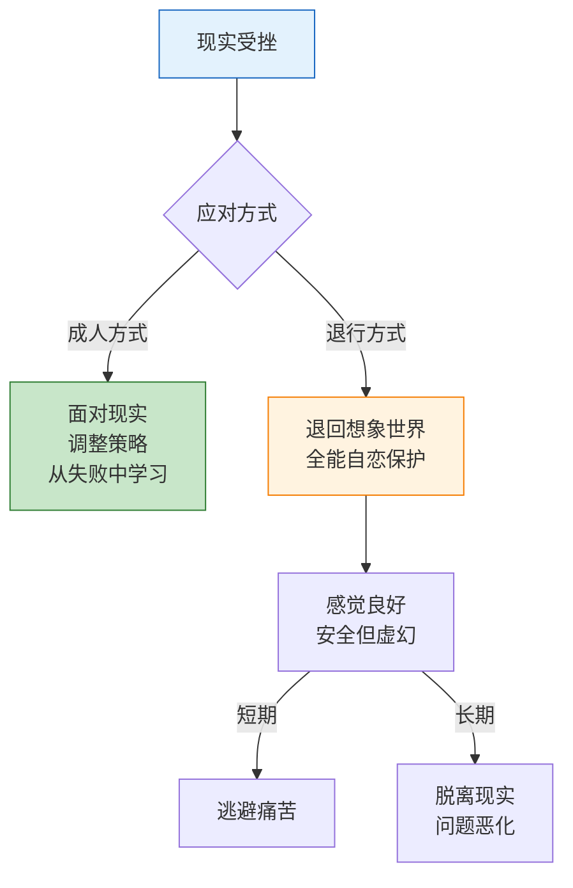
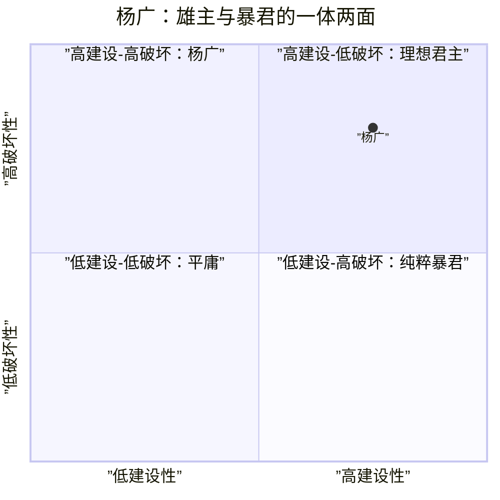

# 第02课：退行与历史案例

> **退行（Regression）**：当在现实中遭遇挫折和失败时，人可能退回到更原始的心理状态——全能自恋的想象世界。这种退行让人暂时获得安全感，但也可能让人越来越脱离现实。

## 退行的心理机制

> [!NOTE] 退行的两面性
> 退行本身是人类心理的自我保护机制，在适度范围内是正常的。但当退行成为主要的应对方式，人就越来越依赖想象来满足自己，现实能力反而会萎缩。

### 退行的典型表现

| 领域 | 退行表现 | 成人应对 |
|------|----------|----------|
| 工作 | 遇到困难就幻想换个环境一切都会好 | 分析困难的原因，制定改进方案 |
| 关系 | 吵架后幻想「换一个人就好了」 | 反思冲突，尝试沟通修复 |
| 学习 | 学不会就觉得自己「不是这块料」 | 分解目标，寻找学习方法 |
| 健康 | 生病时幻想「睡一觉就好了」 | 就医、调整生活方式 |

## 历史案例：杨广

武志红用隋炀帝杨广作为全能自恋的典型案例，分析了全能感如何在一个人身上同时推动伟大工程和导致毁灭。

### 杨广的双面性

### 杨广的「丰功伟业」

| 工程/政策 | 成就 | 背后的全能推动力 |
|-----------|------|------------------|
| **大运河** | 贯通南北水系，后世受益千年 | 超越所有前人的宏大工程 |
| **科举制度** | 打破门阀垄断，开启社会流动 | 建立全新的统治秩序 |
| **营建东都** | 建设洛阳为国际大都市 | 展现帝国的辉煌与权力 |
| **远征高句丽** | 三次大规模征伐 | 不允许任何小国不臣服 |

### 毁灭的根源

杨广的悲剧不在于他的目标有多大，而在于：

1. **不接受任何限制**——人力、物力、时间的限制都被他无视
2. **不允许任何反对**——凡是谏言的大臣都被处决
3. **不承认任何代价**——百姓的苦难在他看来只是实现宏图的必要牺牲
4. **不面对任何现实**——三次征伐高句丽全部失败，但他拒绝接受失败

> [!WARNING] 力量与脆弱的统一
> 杨广既是雄主也是暴君——这两个身份在一个人身上并不矛盾。他的开创性力量来自对全能自我的信仰，他的毁灭性行为也来自同一个来源。**全能自恋是一体两面：推动力有多大，破坏力就有多大。**

### 从杨广身上学到的

杨广的案例提醒我们几个关键认识：

1. **目标的大小不等于成就的大小**——宏大的目标需要匹配现实的节奏
2. **不接受反馈是危险的信号**——如果身边没有人能向你提出不同意见，你可能陷入了全能自恋
3. **代价必须被看见**——每一个「伟大」的背面都是具体的「代价」
4. **越快反而越慢**——杨广急于在短期内完成所有工程，结果是大隋二世而亡

## 退行与成长的对比

| 维度 | 退行（向全能感） | 成长（在现实中） |
|------|-----------------|------------------|
| 面对失败 | 否认失败，退回想象 | 承认失败，从中学习 |
| 面对限制 | 不承认任何限制 | 接受限制，寻找可行路径 |
| 面对他人 | 要求他人服从自己意志 | 尊重他人独立意志 |
| 面对时间 | 想要立竿见影 | 接受过程需要时间 |
| 情绪反应 | 全能暴怒或彻底无助 | 感受情绪，但不被情绪控制 |

> [!TIP] 退行的觉察练习
> 当你感到特别烦躁、特别想放弃、或者特别想「换一个环境重来」的时候，问自己：**我是不是正在向全能感退行？**

## 自我检查

1. 什么是「向全能感退行」？它在什么情况下容易发生？

「向全能感退行」是指当人在现实中遭受挫折时，退回到全能自恋的想象世界来获得心理安慰和保护。容易发生的情境包括：重大失败、关系破裂、长期压力、无力感强的时刻。

2. 杨广的案例如何体现全能自恋的推动力和破坏力？

推动力：他的全能感驱使他完成了大运河、科举制度等跨越时代的伟大工程。破坏力：他不接受任何限制和反对，不仅不听谏言，还处决了大量忠臣；他不计代价地三征高句丽，耗尽国力，导致隋朝灭亡。**推动力和破坏力来自同一个来源——全能自恋。**

3. 为什么说退行既是自我保护也有风险？

自我保护：退行让人暂时逃避现实痛苦，获得心理喘息空间。风险：如果长期依赖退行，人会越来越脱离现实，现实能力萎缩，导致更多问题。（[[reference/glossary|术语表]]中查看更多定义）

4. 如何区分「健康的宏大理想」和「全能自恋的宏大幻想」？

健康的宏大理想接受现实的节奏和限制，愿意从小处着手、逐步推进，接受过程中的反馈和调整。全能自恋的宏大幻想要求一步到位、完美无缺，不接受任何限制和反对，拒绝接受现实反馈。

5. 杨广案例对我们普通人有何启示？

即使我们没有杨广的权力，全能自恋同样可能在我们身上运作——比如在学业、工作、人际关系中，当我们设定不切实际的目标、不接受过程中的挫折、或者把失败归咎于外部因素时，都是在局部上重演杨广的模式。关键是要培养「现实感」和「对限制的接纳」。

## 实践练习

1. **退行日记**：本周记录一次你感到「想退行」的时刻。是什么触发了它？你是如何应对的？有没有更好的应对方式？

2. **反馈接受度练习**：找一个你信任的人，请他/她对你说一个关于你的真实但可能不好听的反馈。观察你的第一反应——是防御、愤怒（全能暴怒），还是好奇、感谢（成人状态）？

3. **目标现实化练习**：选一个你当前的目标，写下你希望达到的理想状态，然后写下为了实现它愿意接受的现实限制（时间、资源、能力边界）。

## 本课要点

- 退行是向全能感保护的心理机制
- 适度退行正常，长期依赖则脱离现实
- 杨广案例展示了全能自恋的一体两面
- 接受限制和反馈是走向成熟的关键

## 下一步

[[0003-yi-zhi-yu-kong-zhi|下一课：意志与控制 →]]

探讨意志成本的概念，学习区分可控与不可控，以及传销陷阱如何利用人的全能幻想。

---

[[reference/glossary|查看术语表]] | [[reference/human-coordinate-system|查看人性坐标体系速查]]
