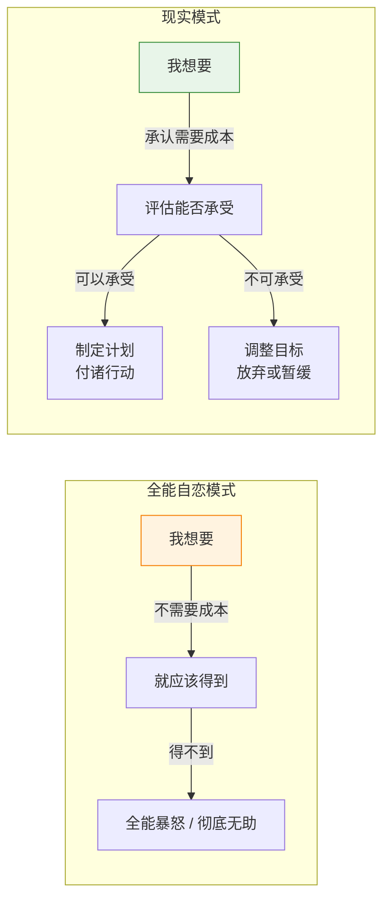
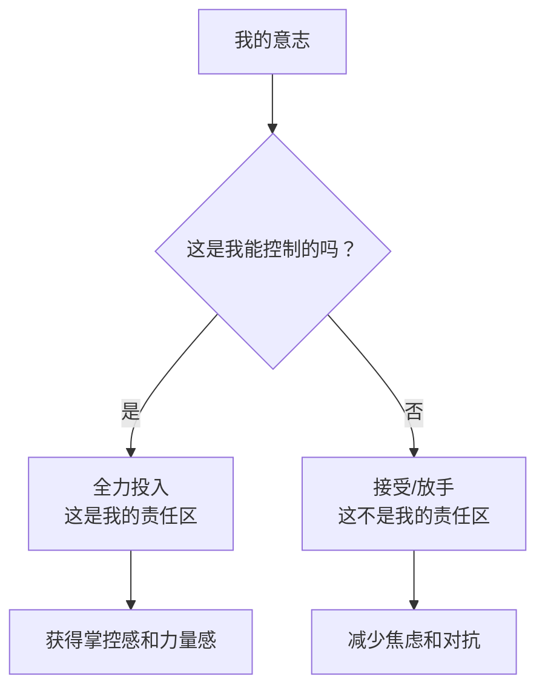
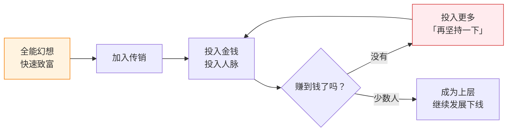
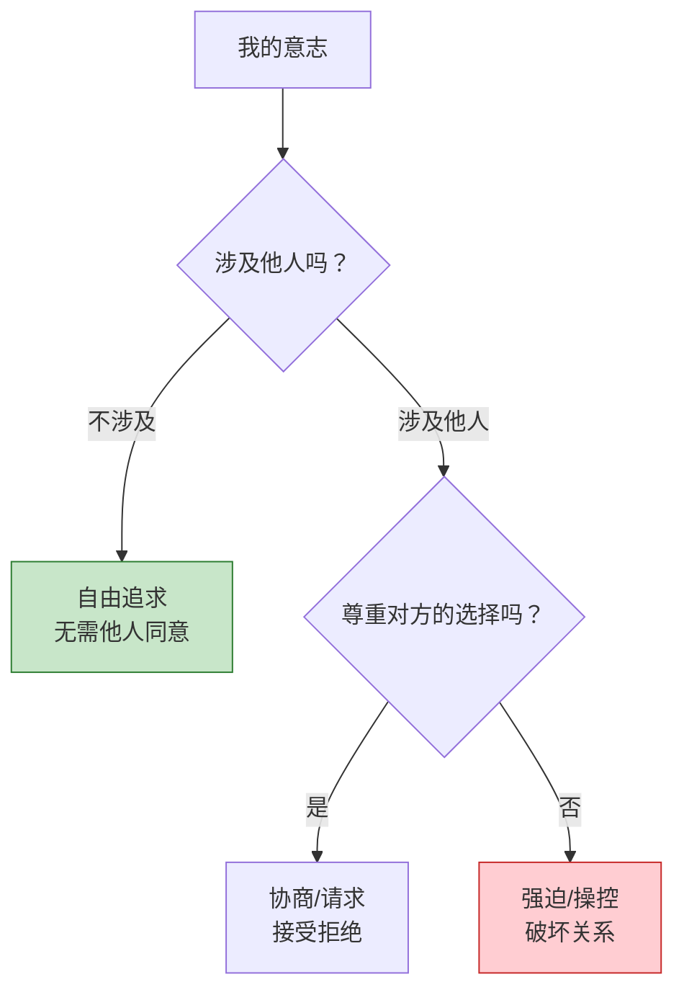

# 第03课：意志与控制

> **每一个「我想要」的背后，都藏着一个「我愿付出」。** 全能自恋者最不愿面对的就是意志的成本。

## 意志成本

> [!NOTE] 核心概念
> **意志成本**：每一个意志（愿望、目标、需求）的实现都需要付出成本——时间、精力、资源、关系、机会成本等。全能自恋者否认这一事实，认为「只要我想要，就应该得到」。

### 意志成本的几个维度

| 维度 | 低成本 | 高成本 | 全能自恋者的态度 |
|------|--------|--------|------------------|
| **时间** | 立即能做的事 | 需要长期坚持的事 | 「为什么不能马上实现？」 |
| **精力** | 顺手就能做 | 需要投入大量心力 | 「不应该这么累」 |
| **金钱** | 负担得起的支出 | 需要积蓄或借贷 | 「凭什么这么贵」 |
| **关系** | 不影响他人 | 需要他人配合 | 「他们应该配合我」 |
| **机会** | 没有其他损失 | 放弃其他可能性 | 「我全都要」 |

> [!WARNING]
> 许多心理痛苦来源于「不愿支付意志成本，却想要意志的结果」。比如：想要好身材但不愿规律运动；想要亲密关系但不愿冒被拒绝的风险；想要事业成功但不愿经历失败和积累。

## 控制你能控制的

这是斯多葛哲学的核心智慧，也与心理学中「健康自恋」的发展方向高度一致：

> [!TIP] 控制二分法
> - **能控制的**：自己的想法、态度、行为、努力程度
> - **不能控制的**：他人的想法和行动、外界环境、结果、命运

### 常见的控制误区

| 误区 | 表现 | 后果 |
|------|------|------|
| **过度控制** | 试图控制他人、控制结果 | 消耗大量精力，制造关系冲突 |
| **放弃控制** | 连自己能控制的也放弃 | 丧失主动性和力量感 |
| **幻想控制** | 以为能用想象控制现实 | 脱离现实，陷入全能幻想 |
| **控制替代** | 控制不了大事就控制小事（如洁癖、强迫行为） | 形式上有掌控感但本质上是逃避 |

### 健康控制的三个层次

1. **觉察层**：区分可控与不可控
2. **行动层**：专注于可控部分，对不可控部分放手
3. **接纳层**：接受「可控的范围比想象的小」，但不因此放弃行动

## 传销陷阱中的全能自恋

传销是最能体现「全能自恋如何被人利用」的现实场景。传销的运作机制恰恰击中了全能自恋的心理弱点：

### 传销的「全能配方」

| 传销话术 | 背后的全能承诺 | 现实真相 |
|----------|---------------|----------|
| 「月入百万不是梦」 | 快速致富，不需要过程 | 绝大部分人血本无归 |
| 「你只需要拉三个人」 | 轻轻松松就能成功 | 需要大量投入和人脉消耗 |
| 「这是千载难逢的机会」 | 错过就是你的损失 | 任何时候都在招人 |
| 「我们是一个大家庭」 | 无条件接纳和支持 | 目的是榨取你的资源 |

> [!WARNING] 识破幻想的保护
> 传销利用的就是人心中「不愿意接受缓慢致富」的全能自恋。**所有承诺「快速、轻松、巨大回报」的机会，都是在迎合你的全能幻想。**

## 意志的边界：尊重他人的独立意志

这是意志中最重要的课题之一——不仅要知道「我能控制什么」，还要知道「我不应该控制什么」。

### 关系中的意志边界

| 健康模式 | 全能自恋模式 |
|----------|-------------|
| 表达需求，接受拒绝 | 要求对方满足，不能接受拒绝 |
| 尊重对方的不同选择 | 替对方做决定，「这是为他好」 |
| 冲突时寻求协商 | 冲突时必须赢 |
| 接受对方的独立性 | 要求对方和自己完全一致 |

> [!QUESTION] 反思时刻
> 在亲密关系中，你是否曾经试图改变对方？你是否觉得「如果对方爱我，就应该按照我的意愿来」？——如果答案是肯定的，你可能正在用全能自恋的方式对待关系。

## 自我检查

1. 什么是意志成本？全能自恋者为什么不愿承认意志成本？

意志成本是指实现每一个意志（愿望、目标）都需要付出的代价——时间、精力、资源等。全能自恋者不承认它的存在，因为他们内心觉得自己是全能的——「只要我想要，就应该立刻得到」。承认意志成本意味着承认自己不是神，这触犯了全能自恋的核心信念。

2. 控制二分法的核心是什么？如何在生活中应用？

核心是区分「我能控制的」和「我不能控制的」——专注前者，对后者放手。应用步骤：遇到问题时先问「这在我的控制范围内吗？」如果是，全力行动；如果不是，尝试接受。（与 [[reference/glossary|术语表]]中「意志成本」概念相关）

3. 传销陷阱为什么与全能自恋密切相关？

传销利用人「快速致富、不劳而获」的全能幻想。它承诺轻松、快速、巨大的回报——这正是全能自恋的核心愿望。传销话术中的「你只需要...」「你不做就是你的损失」都是对全能感的精准操控。

4. 在关系中的意志边界是什么？为什么它如此重要？

意志边界是：我的意志止于他人身体的边界。我可以表达需求、提出请求，但必须尊重对方说「不」的权利。没有这个边界，关系就变成了控制和反控制的战场，而不是真正的联结。

5. 如何判断自己是在「健康控制」还是「过度控制」？

关键指标：当你感到焦虑、愤怒、失控时，可以检查自己是否在试图控制不可控的事物（他人、天气、结果等）；当身边的人开始回避你、不敢表达不同意见时，可能你的控制已经越界了。

## 实践练习

1. **成本清单**：选一个你当前想实现的目标，列出所有需要付出的成本（时间、精力、金钱、关系、机会成本）。评估：你是否愿意支付这些成本？

2. **控制区分练习**：每天结束时，写下三件事——一件你能控制的、一件你不能控制的、一件你试图控制但其实不可控的。

3. **边界练习**：本周注意你在关系中说「不」的时刻和被说「不」的时刻——你如何回应？什么感觉？

## 本课要点

- 每个意志都有成本，承认成本是走向现实的第一步
- 区分可控与不可控，专注于可控的部分
- 传销利用全能幻想来操控人的行为
- 尊重他人的意志边界是健康关系的基础

## 下一步

[[0004-sheng-ren-luo-ji|下一课：圣人逻辑 →]]

探讨什么是圣人逻辑，社会如何强迫一个人成为「圣人」，以及这种逻辑如何压制生命活力。

---

[[reference/glossary|查看术语表]] | [[reference/human-coordinate-system|查看人性坐标体系速查]]
