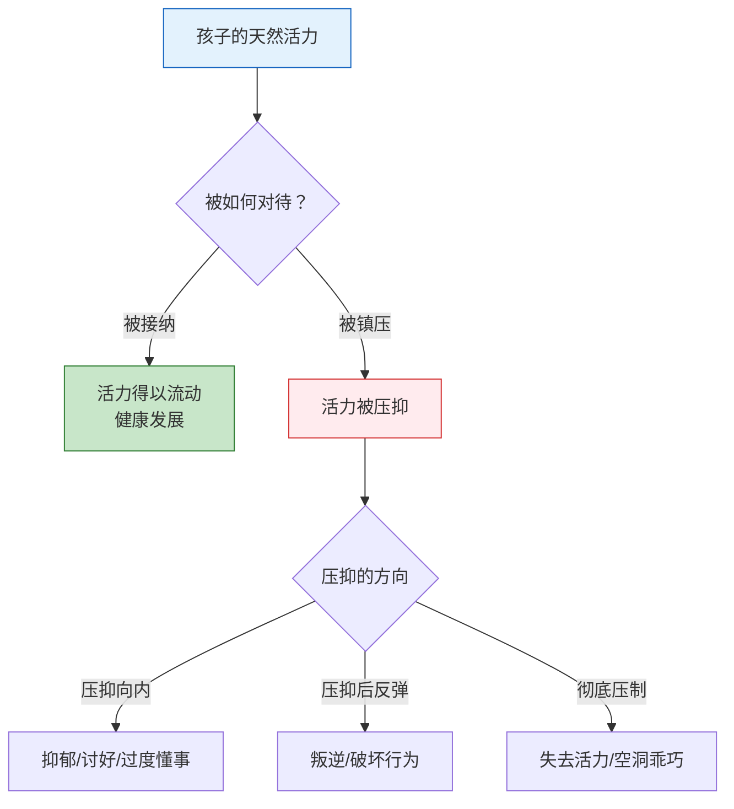
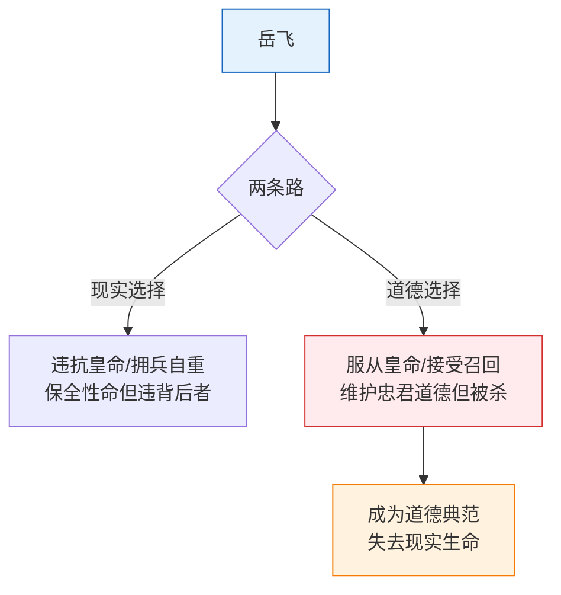

# 第04课：圣人逻辑

> **圣人逻辑**：社会或家庭强制要求一个人成为「圣人」——没有欲望、只有道德。这是一种对生命活力的系统压制，也是全能自恋在道德领域的特殊表现。

## 什么是圣人？

在圣人逻辑下，「圣人」被定义为：

| 圣人的特征 | 具体含义 | 心理代价 |
|-----------|----------|----------|
| **无欲** | 不能有私欲，特别是性欲、贪欲、享受欲 | 欲望被压抑，导致生命力枯竭 |
| **纯善** | 不能有任何「坏」的想法和行为 | 必须完美，不能犯错 |
| **牺牲** | 必须为他人、为集体牺牲自己 | 自我价值被否定 |
| **高尚** | 动机必须纯洁，不能计较个人得失 | 真实情感被否定 |

> [!WARNING] 圣人逻辑的本质
> 圣人逻辑的本质是对人真实欲望的否定。**人不是圣人也不需要成为圣人**——承认自己有欲望、有私心、有弱点，反而是心理健康的表现。

### 道德资本的积累

圣人逻辑的核心运作机制是**道德资本**的积累：

> [!NOTE] 道德资本的悖论
> 道德资本积累得越多，人就越不快乐——因为所有真实的欲望都被压抑了。而且，宣称自己「无私」的人，往往最需要别人承认他的「无私」。

## 被强加的圣人身份

圣人身份往往不是自己选择的，而是被社会和家庭强制赋予的：

### 家庭中的「圣化」要求

| 家庭角色 | 被要求的圣人标准 | 真实代价 |
|----------|-----------------|----------|
| **长子/长女** | 必须懂事、谦让、照顾弟妹 | 自己的需求被忽视 |
| **「别人家的孩子」** | 必须优秀、听话、不给父母添麻烦 | 真实的自己不被看见 |
| **父母离异中的孩子** | 必须理解父母、不能表现出痛苦 | 情绪被否定 |
| **「懂事」的孩子** | 不能任性、不能要求、不能表达不满 | 自我被过早压抑 |

> [!QUESTION] 反思
> 你是否曾经被要求「做一个好孩子」「懂事一点」「别给大人添麻烦」？——这些要求本身不一定错，但当它们成为**强制性的圣人标准**时，就是在压制你的真实生命力。

### 被镇压的圣婴能量

「圣婴能量」指的是孩子天然的生命活力——好奇心、探索欲、调皮、任性、哭闹、玩闹。

> [!WARNING] 懂事可能是创伤
> 过度「懂事」的孩子，往往不是真的成熟，而是活力被过早镇压的结果。**每一个过于懂事的孩子背后，可能都有一个被压抑的真实自我。**

## 文化意象中的投射

武志红分析了中国传统文化中几种典型的人物意象，揭示了圣人逻辑下的欲望投射：

### 女鬼与女妖

| 意象 | 特征 | 心理投射 |
|------|------|----------|
| **女鬼** | 美丽、哀怨、死后仍执着于人间情感 | 对真实情感的渴望被压抑到「阴间」 |
| **女妖** | 魅惑、主动、诱惑男性堕落 | 对性欲望的恐惧和妖魔化 |
| **狐狸精** | 聪明、美丽、扰乱正常秩序 | 对女性力量和魅力的矛盾态度 |

> 这些意象的共同点：**女性力量被放在了「非人」的位置上**——女性不能同时既是有欲望的、又是正常人。

### 无欲男

与「女鬼女妖」对应的，是「无欲男」的文化理想：

- **柳下惠**：坐怀不乱被传颂千年
- **唐僧**：面对女妖毫无欲望，是修行者的最高境界
- **清官**：不贪财不好色，成为道德典范

> [!NOTE]
> 「无欲男」的理想本身并没有错，问题在于把「有欲望」等同于「不道德」。**人有欲望是正常的，关键是如何与欲望相处，而不是否定欲望的存在。**

## 岳飞的自毁

武志红用岳飞作为「圣人逻辑牺牲品」的典型案例。岳飞在忠君与现实的矛盾中，最终选择了忠于自己的道德理想——即使这意味着自我毁灭。

### 从岳飞案例中学习的

| 维度 | 岳飞的表现 | 启示 |
|------|-----------|------|
| **忠诚** | 忠于道德理想超过忠于生命 | 道德理想不能替代对自身生命的尊重 |
| **选择** | 面对两难选择，选了道德完美 | 现实选择很少是「完美 vs 不完美」，而是「不利 vs 更不利」 |
| **后果** | 自己被处死，南宋失去屏障 | 圣人的自我牺牲有时反而伤害了想要保护的东西 |
| **评价** | 千年后他也被争议 | 过于绝对化的道德立场会让人失去灵活性 |

> [!WARNING]
> 岳飞的故事提醒我们：**当一个人被放在「圣人」的位置上时，他就不再被允许做「人」会做的事——妥协、权衡、保护自己。** 圣人逻辑看似推崇道德，实则是通过否定人性来实现对个人的控制。

## 走出圣人逻辑

| 方向 | 圣人逻辑下的反应 | 健康反应 |
|------|-----------------|----------|
| **对待欲望** | 否认、压抑、感到羞耻 | 承认、理解、负责任地表达 |
| **对待错误** | 不能犯错，犯了就是道德破产 | 犯错是学习过程的一部分 |
| **对待需求** | 不能有需求，有需求就是自私 | 需求是正常的，可以协商满足 |
| **对待他人** | 用道德标准评判别人 | 理解人性的复杂性 |
| **对待自己** | 严苛的超我，不放过自己 | 对自己保持善意的理解 |

## 自我检查

1. 什么是圣人逻辑？它的核心否定是什么？

圣人逻辑是社会或家庭强制要求一个人成为「圣人」——没有欲望、只有道德。它的核心是对**真实欲望的否定**，要求人做到「无欲则刚」，但实际上是在压制生命力。

2. 什么是道德资本？为什么越积累反而不快乐？

道德资本是通过压抑自我、做出牺牲来积累的「道德优越感」，可以用来要求他人回报或控制他人。越积累越不快乐，因为积累的过程就是不断否定真实欲望的过程，且当别人不承认你的道德资本时，会产生强烈的怨恨。（相关概念已在[[reference/glossary|术语表]]中定义）

3. 什么是「圣婴能量」？活力被镇压后会有哪些表现？

「圣婴能量」是孩子天然的生命活力。被镇压后可能表现为：抑郁/讨好/过度懂事（向内压抑）、叛逆/破坏行为（压抑后反弹）、空洞乖巧（彻底压制导致活力丧失）。

4. 女鬼女妖意象和无欲男意象反映了什么样的文化心理？

反映了对欲望的矛盾态度：一方面把有欲望的女性妖魔化（鬼/妖），另一方面把无欲望的男性理想化（柳下惠、唐僧）。本质是逃避面对真实的人性欲望。

5. 岳飞案例如何说明了圣人逻辑的破坏性？

岳飞被道德理想（忠君）束缚，在面对现实的复杂选择时，选择了道德完美的选项——即使这意味着被处死。圣人逻辑让人失去现实灵活性，无法做出「不够完美但更有利」的选择。

## 实践练习

1. **圣人模式觉察**：本周注意自己是否在用圣人标准要求自己或他人——「我应该做得更好」「他怎么能这么自私」。记录下来。

2. **欲望承认练习**：每天承认一个你有但通常不好意思承认的「自私」欲望（比如想多睡一会儿、不想帮助别人、想吃好吃的）。告诉自己：这很正常。

3. **道德负担检查**：检查自己是否有「我付出了这么多，你应该感恩/回报我」的想法。尝试不用道德资本去要求别人。

## 本课要点

- 圣人逻辑否认人的真实欲望，要求人做「圣人」
- 道德资本积累越多，越容易陷入怨恨
- 圣婴能量被镇压导致生命活力丧失
- 文化意象（女鬼、女妖、无欲男）反映了对欲望的回避
- 岳飞案例展示了圣人逻辑的自我毁灭性

## 下一步

[[0005-zhuo-yue-qiang-da-kong-ju|下一课：卓越与强大恐惧症 →]]

深入分析卓越强迫症和强大恐惧症的两难处境，探讨辅导作业、权威恐惧症和状态幻觉。

---

[[reference/glossary|查看术语表]] | [[reference/human-coordinate-system|查看人性坐标体系速查]]
