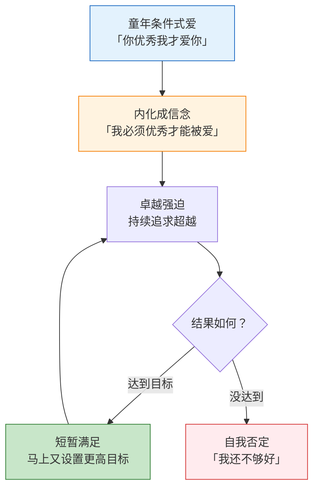
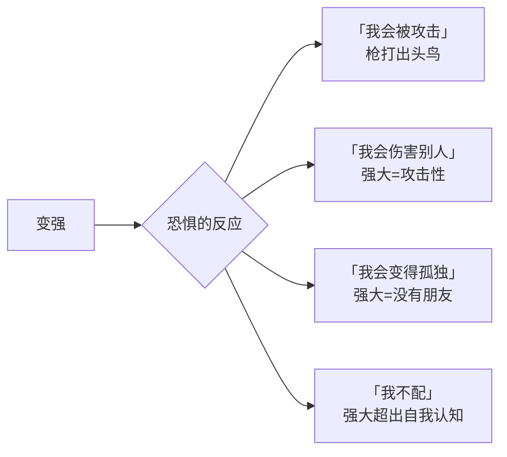
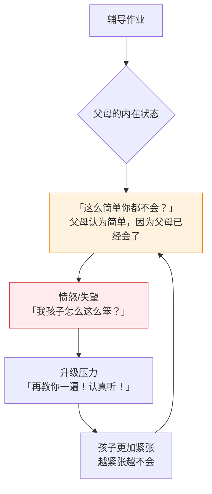
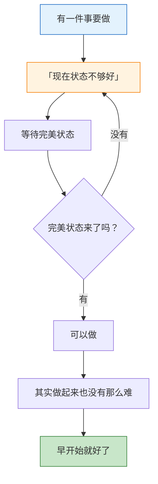

# 第05课：卓越与强大恐惧症

> **「不卓越不配活」的驱动力，和「枪打出头鸟」的恐惧，在同一个人身上同时存在——这就是现代人的心理两难处境。**

## 卓越强迫症的深层分析

> [!NOTE] 定义
> 卓越强迫症（也可称为卓越强迫）指一个人被「必须做到最好、必须出类拔萃」的内心声音持续驱动，任何低于卓越的表现都被体验为失败。

### 内心独白

卓越强迫症患者的内心通常回荡着这样的声音：

```
「如果我不是第一名，这一切就没有意义。」
「别人会怎么看我？他们一定会觉得我很差。」
「普通就是失败，平凡就是堕落。」
「我必须证明自己——对所有人。」
```

### 卓越强迫的根源



### 卓越强迫 vs 健康的追求卓越

| 维度 | 卓越强迫 | 健康追求 |
|------|----------|----------|
| **驱动力** | 恐惧——不卓越就不被爱 | 热爱——享受成长和挑战 |
| **对失败的态度** | 灾难化——失败=自我价值破产 | 学习性——从失败中获取反馈 |
| **对成功的体验** | 短暂的缓解，马上进入下一轮焦虑 | 真实的满足和成就感 |
| **与他人的比较** | 必须比过别人 | 以前面的自己为参照 |
| **休息和放松** | 休息=堕落，无法安放 | 休息是必要的恢复 |

> [!TIP]
> 区分的关键在于：**你是在「追逐」卓越，还是在「享受」卓越？** 前者是被恐惧驱动的强迫行为，后者是被热爱驱动的自然结果。

## 强大恐惧症

> [!WARNING] 一个矛盾的存在
> 和卓越强迫症看似相反，却常常同时存在——**一方面被驱使着要变得强大，一方面又恐惧变得强大。**

### 「枪打出头鸟」的心理根源

强大恐惧症并非简单的「低调做人」，而是内心深处对「变得强大后会发生什么」的恐惧：



| 恐惧类型 | 具体表现 | 可能的来源 |
|----------|----------|------------|
| **被攻击恐惧** | 不敢表现突出、不敢做出头的事 | 成长经历中因为优秀被嫉妒或被打击 |
| **伤害他人恐惧** | 觉得自己变强会碾压别人、让别人难堪 | 过度认同「强者=坏人」的观念 |
| **孤独恐惧** | 害怕变强后被群体疏远 | 对归属感的强烈需求 |
| **不配得恐惧** | 觉得「我不配拥有这么多」 | 低自尊或内化了贬低信息 |

### 两难处境

卓越强迫症和强大恐惧症同时存在时，人陷入一个不可能的两难：

> [!QUESTION] 两难处境
> **我不能不卓越，但我也不能太卓越。**
>
> - 左边是「不卓越不配活」——普通是不够的
> - 右边是「枪打出头鸟」——太卓越会被攻击
>
> 人被困在中间，既无法安心做一个普通人，也无法顺利走向强大。

## 辅导作业为什么这么难

武志红用辅导孩子作业的场景，生动展示了父母的全能自恋如何投射到孩子身上：



### 全能自恋在辅导作业中的表现

| 父母的心理 | 对应的全能自恋 |
|-----------|---------------|
| 「这么简单你都不会？」 | 忘记了自己学习时的过程，用已成年的全能标准要求孩子 |
| 「我教了你这么多遍！」 | 觉得「我教了你就应该会」——不接受学习的自然过程 |
| 「别人都会就你不会！」 | 用比较来激将——不能接受孩子不是最优秀的 |
| 「你是不是故意的？」 | 诛心论——把学不会归因为态度问题 |

> [!WARNING]
> 辅导作业的真正难题不是孩子的智商，而是**父母无法接受「我的孩子很普通」**——这也是父母卓越强迫症的投射。孩子的普通触动了父母自己「不卓越不配活」的恐惧。

### 健康的辅导方式

1. **放下全能期待**：孩子不需要是天才，学习是一个过程
2. **共情孩子的困难**：回忆自己学习时的挣扎
3. **分离课题**：学习是孩子的事，父母是支持者不是控制者
4. **保持耐心**：允许孩子以自己的节奏成长

## 权威恐惧症

> [!NOTE]
> 权威恐惧症不是简单的「怕领导」，而是对权威（师长、领导、任何有权力的人）的过度恐惧，甚至在对方没有表现出恶意时也会感到紧张。

### 权威恐惧症的根源

权威恐惧症同样源于全能自恋的反面——对权威的过度恐惧，实际上是对自己内在全能暴怒的恐惧：


> [!WARNING]
> **对权威的恐惧越大，往往意味着内在堆积的愤怒越多。** 你害怕的不是权威这个人，而是他可能激活你内在的暴怒。

### 权威恐惧的表现

| 情境 | 表现 | 改善方向 |
|------|------|----------|
| 面对领导/老师 | 紧张、不敢表达不同意见 | 练习温和而坚定地表达 |
| 被批评时 | 过度恐慌、灾难化解读 | 区分建设性批评和攻击 |
| 需要提请求时 | 觉得「会不会太麻烦别人」 | 认识到合理请求是可以的 |
| 面对冲突 | 要么过度顺从，要么暴发 | 学会在中间地带沟通 |

## 状态幻觉

> [!TIP] 定义
> **状态幻觉**：等待一个「完美状态」才行动的心理倾向——「等我状态好了，我就能全力以赴，然后完美地完成这件事。」

### 状态幻觉的运作机制



### 状态幻觉的本质

状态幻觉本质上是**保护全能想象**的机制：

- 「我不是做不到，只是状态还没到」
- 「如果我在完美状态下开始，我一定能做到最好」
- 「所以现在的我不行动，不是因为能力不足，而是因为时机未到」

> [!WARNING] 状态幻觉的代价
> - 持续拖延，事情永远「等状态好了再做」
> - 从未真正检验过自己的能力边界
> - 失去大量实践和成长的机会
> - 陷入「等待——内疚——继续等待」的恶性循环

### 打破状态幻觉

| 策略 | 具体做法 | 心理原理 |
|------|----------|----------|
| **5分钟原则** | 告诉自己「只做5分钟」 | 降低启动的心理门槛 |
| **接受不完美** | 允许自己做出「60分」的成果 | 打破完美主义的幻象 |
| **行动优先** | 状态跟着行动走，而不是反过来 | 行动本身会创造动力 |
| **过程记录** | 记录每次「状态不好但做了」的经历 | 用经验反驳幻觉 |

## 自我检查

<details>
<summary>1. 卓越强迫症和健康的追求卓越有什么区别？</summary>

卓越强迫症被**恐惧驱动**（不卓越就不被爱），对失败的体验是灾难性的，即使达到了目标也只能获得短暂的满足。健康的追求卓越被**热爱驱动**，享受成长过程，能从失败中学习，成就带来真实的满足感。
</details>

<details>
<summary>2. 什么是强大恐惧症？卓越强迫症和强大恐惧症如何同时存在？</summary>

强大恐惧症是在走向强大时出现恐惧和抗拒，害怕「枪打出头鸟」。它们同时存在造成两难处境：一边被「不卓越不配活」驱动，一边被「太卓越会被攻击」拉住，人被困在「不能普通」和「不能太优秀」之间。
</details>

<details>
<summary>3. 辅导作业的困难反映了什么样的心理机制？</summary>

核心是父母的全能自恋投射——用自己已成年的标准衡量孩子，不能接受孩子学习过程的自然缓慢。孩子的「普通」触动了父母「不卓越不配活」的内在恐惧。（相关概念参考[[reference/glossary|术语表]]中「卓越强迫症」定义）
</details>

<details>
<summary>4. 权威恐惧症的真正根源是什么？</summary>

不是对权威本身的恐惧，而是对**自己内在全能暴怒被激活**的恐惧。越害怕权威，往往意味着内在积累了越多的愤怒。权威只是触发了对「毁灭性情绪」的恐惧。
</details>

<details>
<summary>5. 什么是状态幻觉？如何打破它？</summary>

状态幻觉是等待完美状态才行动的心理倾向，本质是保护全能想象——「我不是做不到，只是状态还没到」。打破方法：5分钟原则、接受不完美、行动优先（状态跟着行动走，而不是等待状态）、用过去的成功经验反驳幻觉。
</details>

## 实践练习

1. **两难觉察**：本周观察自己在哪些场景中同时感到「必须做好」和「害怕做好」。把具体的场景和感受写下来。

2. **5分钟启动法**：选一件你一直拖延的事，告诉自己「只做5分钟，可以随时停下」。注意5分钟后你的状态如何变化。

3. **权威沟通练习**：找一个机会向权威人物（老师、领导、长辈）表达一个看似「不同意见」的观点——注意自己的紧张程度，以及实际发生了什么。

4. **状态实验**：选一件你一直在等「状态合适」再做的事，不管状态如何，直接开始做。对比实际体验和想象中的差异。

## 本课要点

- 卓越强迫症和强大恐惧症往往同时存在，造成两难处境
- 辅导作业的困难是父母全能自恋的投射
- 权威恐惧症源于对内在暴怒的恐惧
- 状态幻觉是保护全能想象的拖延机制
- 行动优先于状态——做起来，状态自然会来

## 下一步

[[00-course-map|查看课程地图 →]]

你已经完成了第一模块前五课的学习。下一模块将继续深入：[[0006-sheng-mu-ju-ying|第06课：圣母与巨婴]]，探讨圣母与巨婴的共生关系。

---

[[reference/glossary|查看术语表]] | [[reference/human-coordinate-system|查看人性坐标体系速查]]
