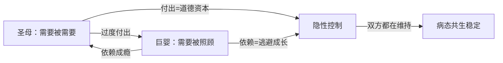
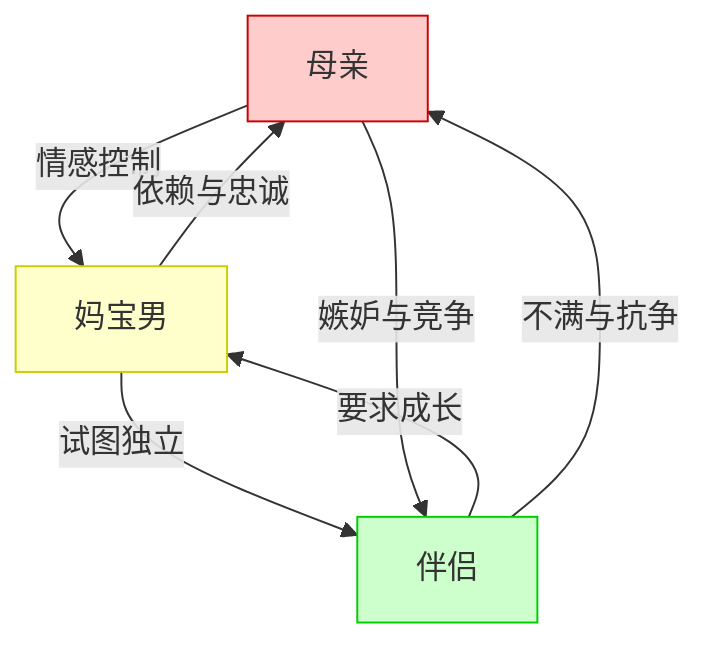

# 第06课：圣母与巨婴

> [!QUOTE] 核心洞见
> 巨婴在恋爱中找的不是伴侣，而是第二个妈。而圣母需要的也不是伴侣，而是一个可以被自己付出所控制的对象。两者一拍即合，形成病态共生。

## 知识覆盖

| KP 编号 | 知识点 | 掌握程度 |
|---------|--------|---------|
| KP-601 | 圣母与巨婴的共生关系 | 理解并识别 |
| KP-602 | 巨婴的恋爱心理——找妈模式 | 理解并应用 |
| KP-603 | 妈宝男的致命冲突 | 分析并识别 |
| KP-604 | 绝配男女的情感模式 | 理解模式 |
| KP-605 | 圣母的严重性——用付出控制 | 深入分析 |

---

## 一、圣母与巨婴的共生关系

### 何为「圣母」与「巨婴」

- **圣母**：过度付出、自我牺牲的女性。她通过不断地付出、忍让、包容来获得道德优越感。「圣母」并非褒义，而是指一种用付出来控制他人的心理模式。
- **巨婴**：心理上停留在婴儿阶段的男性。他要求被无条件照顾，缺乏承担责任的能力，对伴侣有「母亲式」的期待。

### 病态共生的形成机制

圣母需要「被需要」来确认自己的价值，巨婴需要「被照顾」来维持自己的舒适区。两个人的「需要」完美咬合，形成一个封闭的共生系统。

> [!WARNING] 病态共生的代价
> 这种关系看似稳定，实则双方都没有成长。圣母越来越疲惫，巨婴越来越无能。一旦平衡被打破（如巨婴试图独立、圣母停止付出），关系就会剧烈动荡。

---

## 二、巨婴的恋爱像在找妈

### 找妈模式的三个特征

| 特征 | 表现 | 案例 |
|------|------|------|
| **生活依赖** | 要求伴侣打理生活起居，像母亲一样照顾自己 | 成年男性不会做家务、不会理财，等待伴侣安排 |
| **情绪索取** | 把伴侣当作情绪容器，要求无限包容自己的坏脾气 | 工作中受挫，回家对伴侣发泄，期待对方无条件接纳 |
| **决策外包** | 重大决定依赖伴侣，逃避责任 | 买房、换工作等大事让伴侣做决定，出了问题推卸责任 |

### 为什么不是找伴侣而是找妈

巨婴的心理结构中，没有完成从「母子关系」到「伴侣关系」的心理转化。他在亲密关系中退行到婴儿状态——需要的是**照料者**，而非**平等的伴侣**。

> [!NOTE] 关键区分
> 健康的伴侣关系是「我-你」关系——两个独立的人相互选择、相互支持。
> 巨婴的「找妈」模式是「我-它」关系——对方不是一个人，而是一个满足自己需求的「工具」。

---

## 三、妈宝男的致命冲突

### 撕扯的三角关系

妈宝男的核心冲突在于：**对母亲的忠诚**与**对伴侣的爱**无法兼容。他既无法背叛母亲（心理上等同于「杀死母亲」），又无法真正与伴侣建立亲密关系。

### 妈宝男的心理困境

1. **忠诚冲突**：满足伴侣 = 背叛母亲，满足母亲 = 失去伴侣
2. **成长恐惧**：独立意味着离开母亲的保护，这让他感到恐惧
3. **内疚感**：但凡让母亲不开心，就会产生强烈的内疚
4. **无力感**：在两个女人之间疲于奔命，无法做出真正选择

> [!QUESTION] 思考
> 妈宝男真正需要解决的是什么？是选择母亲还是伴侣？还是需要完成心理上的「断乳」——从对母亲的依恋中独立出来，成为一个能够为自己负责的成年人？

---

## 四、绝配男女的情感模式

### 控制与被控制的配对

| 女性角色 | 男性角色 | 互动模式 |
|----------|----------|---------|
| **圣母**（过度付出） | **巨婴**（依赖成瘾） | 付出-依赖-控制 |
| **控制型**（事无巨细） | **顺从型**（放弃主见） | 指挥-服从-稳定 |
| **拯救者**（纠正对方） | **问题者**（制造问题） | 拯救-犯错-循环 |

### 为什么是「绝配」

这种配对之所以「绝配」，不是因为健康，而是因为**完美地满足了彼此的病态需求**：

- 圣母需要「被需要」的感觉，巨婴正好需要被照顾
- 控制者需要「掌控感」，顺从者正好不想负责
- 拯救者需要通过「帮助他人」来证明自己的价值，问题者正好不断制造被帮助的机会

> [!WARNING] 绝配的陷阱
> 「绝配」不等于「好配」。这种配对让双方都停滞在心理的舒适区，无法成长。一段健康的关系应该让两个人都变得更好，而不是让两个人一起沉沦。

---

## 五、圣母 vs 巨婴：谁更严重

### 重新审视圣母

通常人们会把矛头指向巨婴（妈宝男、依赖男），但武志红指出：**圣母可能是更严重的一方**。

圣母的问题在于：

1. **用付出控制**：表面上她在付出、在牺牲，实际上她在用道德资本控制对方
2. **占据道德高地**：因为她在付出，所以她永远是对的，对方永远欠她的
3. **拒绝承认需求**：圣母不敢承认自己也有需求、也有欲望，把这些都压抑在「无私奉献」的外壳下
4. **付出成瘾**：付出不是为了对方好，而是为了满足自己「被需要」的需求

> [!TIP] 识别圣母
> 如果你听到一个人常说以下的话，注意她可能处于圣母模式：
> - 「我为这个家付出了这么多……」
> - 「我什么都不求，只求你……」
> - 「我这么辛苦都是为了你……」
> - 「你为什么不体谅我……」

### 圣母 vs 巨婴对比

| 维度 | 圣母 | 巨婴 |
|------|------|------|
| 表面表现 | 过度付出、自我牺牲 | 依赖成瘾、逃避责任 |
| 潜在动机 | 通过付出来控制 | 通过依赖来获取照顾 |
| 心理位置 | 道德优势方 | 能力劣势方 |
| 问题核心 | 不敢要、不敢为自己活 | 不敢承担、不敢长大 |
| 改变难度 | 更难——因为付出被社会赞美 | 较容易被识别和批评 |

### 两者的共同点

圣母和巨婴看似对立，实则共享同一个核心问题：**没有完成心理上的独立**。圣母通过付出来获得存在感，巨婴通过依赖来获得安全感——两者都逃避了「作为一个独立的人面对世界」的课题。

---

## 自我检查

点击展开自我检查问题

### 问题 1：什么是「圣母与巨婴」的病态共生？

**参考答案**：圣母（过度付出的女性）通过付出来控制对方，巨婴（依赖成瘾的男性）通过依赖来获取照顾。双方的需要完美咬合，形成一个封闭的共生系统——这种关系看似稳定，实则双方都没有成长。

### 问题 2：巨婴的「找妈」模式有哪些特征？

**参考答案**：三个特征——（1）生活依赖：要求伴侣像母亲一样打理生活；（2）情绪索取：把伴侣当作无限包容的情绪容器；（3）决策外包：逃避责任，把重大决定推给伴侣。

### 问题 3：妈宝男的核心冲突是什么？为什么难以解决？

**参考答案**：核心冲突是对母亲的忠诚与对伴侣的爱无法兼容。难以解决是因为：妈宝男在心理上没有完成「断乳」，独立对他来说意味着「背叛」和「杀死母亲」，这会产生巨大的内疚和恐惧。

### 问题 4：为什么说圣母可能比巨婴更严重？

**参考答案**：因为（1）圣母用付出来控制，占据了道德高地，很难被批评；（2）圣母拒绝承认自己的需求，活在「无私奉献」的假象中；（3）圣母的付出成瘾让整个系统更加稳固和难以打破；（4）改变难度更大——因为她的付出行为被社会所赞美。

### 问题 5：圣母和巨婴的共同核心问题是什么？

**参考答案**：两者都没有完成心理上的独立。圣母通过付出来获得存在感，巨婴通过依赖来获得安全感——都逃避了「作为一个独立的人面对世界」的课题。

---

## 下一步

[[0007-gou-tong-di-yi|下一课：第07课 - 沟通中的全能自恋 →]]

当我们在关系中开始觉察「圣母」或「巨婴」的模式，下一步需要思考的是：**沟通**本身又如何被全能自恋所绑架？下一课将探讨沟通中隐藏的权力较量——为什么「听话」和「道歉」会变成你死我活的战场。

---

> **本课术语**：[[reference/glossary|圣母、巨婴、共生关系、道德资本、自体客体]]