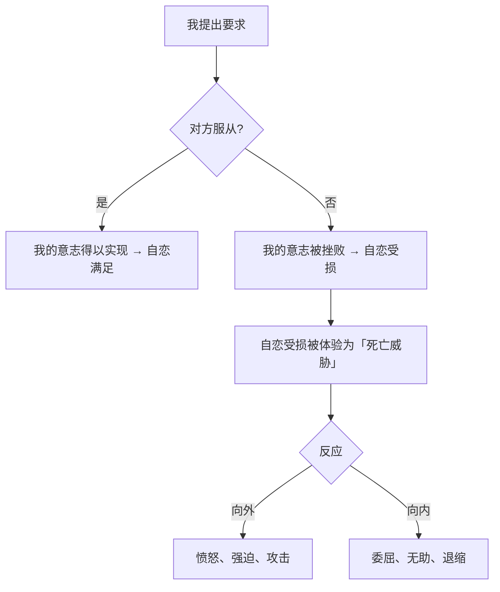
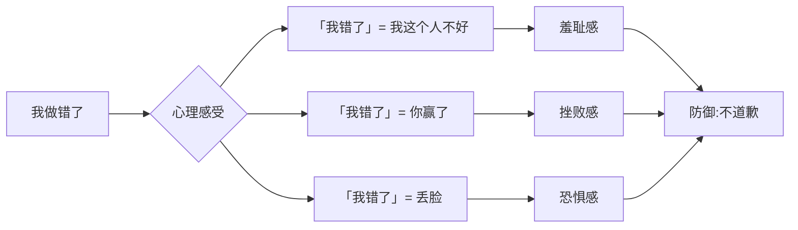
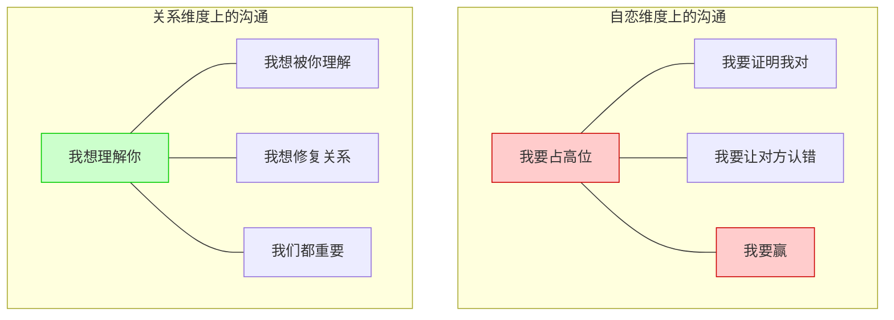
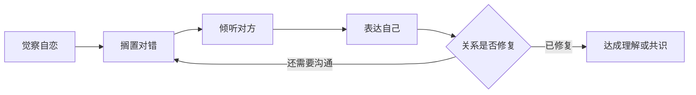

# 第07课：沟通中的全能自恋

> [!QUOTE] 核心洞见
> 你死我活的沟通背后，是两个人同时处于全能自恋的状态——谁都不愿意「死」。当沟通变成权力的较量，话语不再是表达的工具，而是攻击的武器。

## 知识覆盖

| KP 编号 | 知识点 | 掌握程度 |
|---------|--------|---------|
| KP-701 | 听话哲学中的「你死我活」 | 理解并识别 |
| KP-702 | 道歉里的生死较量 | 深入分析并觉察 |

---

## 一、听话哲学中的「你死我活」

### 听话逻辑的底层代码

「你为什么不听我的？」——这句话背后隐藏的并不是沟通的需求，而是**权力游戏**。

在「听话哲学」中，沟通不是双向的信息交换，而是**单向的意志碾压**。对方的不服从被体验为对自己存在的否定，进而引发强烈的情绪反应。

### 几种常见的听话模式

| 模式 | 话语特征 | 深层心理 |
|------|----------|---------|
| **命令式** | 「你必须……」「你给我……」 | 我是权威，你必须服从 |
| **道德绑架式** | 「我为你好才这么说」 | 用道德资本压制对方 |
| **情绪勒索式** | 「你这样做让我很难过」 | 用情绪反应操控对方 |
| **讲道理式** | 「你听我说，道理是这样的」 | 用逻辑碾压对方感受 |

> [!WARNING] 沟通中的自恋陷阱
> 当你发现自己在沟通中越来越用力——提高音量、重复观点、使用绝对化词汇（「永远」「绝对」「必须」）——这往往不是对方听不懂，而是你的全能自恋正在被挑战。

### 「你死我活」的心理根源

为什么一句「不」能引发如此剧烈的反应？因为在全能自恋的框架下：

- **我的意志 = 我**。你否定了我的意志，就是在否定我这个人
- **否定 = 杀死**。我的要求被拒绝，就是我被消灭
- **输赢 = 生死**。沟通中的让步，被体验为死亡

> [!NOTE]
> 健康的沟通建立在「我们是两个人」的基础上。你有你的意志，我有我的意志，两者可以不同，不需要其中一个消失。而全能自恋的沟通是「只能有一个人的意志存活」。

---

## 二、道歉里的生死较量

### 为什么道歉这么难

道歉的本质是**承认错误**。但在全能自恋的框架下，承认错误被体验为：

- **认输**：「我错了」=「你对了」=「我输了」
- **死亡**：错误的我被否定，我需要「死去」才能被原谅
- **羞耻**：承认错误意味着暴露自己的不完美，这是巨大的羞耻

### 真假道歉的区别

| 维度 | 假道歉 | 真道歉 |
|------|--------|--------|
| **出发点** | 为了结束冲突（快点翻篇） | 为了修复关系（真诚面对） |
| **对错** | 「就算我错了，你也……」 | 「我做错了，对不起」 |
| **态度** | 敷衍、防御、辩解 | 开放、接受、负责 |
| **自我状态** | 自恋受损，试图挽回面子 | 自恋暂时搁置，关注对方感受 |
| **效果** | 对方更生气 | 关系真正修复 |

### 道歉的真正能力

一个人能够真诚道歉，需要具备两个心理条件：

1. **自恋足够稳固**：承认错误不会摧毁我的自我价值——我在某个事情上错了，不代表我整个人是糟糕的
2. **在乎关系超过在乎对错**：修复关系比证明自己正确更重要

> [!TIP] 练习道歉
> 如果你发现道歉很难，可以尝试以下步骤：
> 1. 深呼吸，告诉自己「承认错误不代表我是失败者」
> 2. 把关注点从「我怎么错了」转移到「对方受到了什么影响」
> 3. 用简单的语言说：「对不起，我做错了。我能理解你为什么会生气。」
> 4. 不要附加「但是」——「但是」后面的内容会抵消前面的道歉

---

## 三、沟通中的自恋维度

### 自恋维度在沟通中的表现

每次沟通，除了表面的信息交换，还有一层隐含的较量：**谁高谁低，谁对谁错**。

### 从自恋维度切换到关系维度

| 自恋维度的沟通 | 关系维度的沟通 |
|---------------|---------------|
| 关注对错 | 关注感受 |
| 我要赢 | 我们都重要 |
| 证明自己正确 | 理解对方视角 |
| 让对方闭嘴 | 让对方说话 |
| 害怕认输 | 不怕认错 |
| 语言是武器 | 语言是桥梁 |

### 如何觉察自己在自恋维度上

当你处于以下状态时，你可能正被自恋维度主导：

- 强烈地想要「说赢」对方
- 无法忍受对方「错误」的观点
- 感到自己的价值观被攻击
- 心跳加速、脸发烫、声音变大
- 开始翻旧账、举反例
- 脑子里不断盘旋「他怎么可以这样」

> [!QUESTION] 反思
> 回顾最近一次让你感到愤怒的沟通冲突：你愤怒的，到底是对方「做错了」，还是对方「挑战了你的意志」？

---

## 四、平等沟通的可能性

### 平等沟通的前提

平等沟通不是没有冲突，而是在冲突中保持两个基本前提：

1. **我们是平等的**：你的感受和我的感受同样重要
2. **我们可以不同**：我们的观点不必一致，但我们可以共存

### 平等沟通的实践框架

**具体步骤**：

1. **觉察**：意识到自己正在自恋维度上挣扎（心跳加速、想要反驳）
2. **暂停**：给自己一个呼吸的空间，「我先不反驳，先听一听」
3. **倾听**：不评判地听对方把话说完，尝试理解他的感受
4. **验证**：「我理解你的感受是……对吗？」
5. **表达**：「我的感受是……我的需要是……」
6. **协商**：「在这个基础上，我们能不能找到一个两个人都能接受的方式」

### 一个重要的区分

> [!NOTE] 平等 ≠ 意见一致
> 平等沟通的目标不是达成一致，而是**在差异中保持连接**。即使我们意见不同，我们仍然可以在关系中保持尊重。这种「和而不同」的能力，是成熟关系的标志。

---

## 自我检查

点击展开自我检查问题

### 问题 1：为什么「听话」要求背后隐藏着权力较量？

**参考答案**：在全能自恋的框架下，「听话」不是信息交换而是意志碾压。对方的不服从被体验为对「我」的否定——否定我的意志就等于否定我这个人。因此，「不听我的」被感知为一种「死亡威胁」，引发强烈的自恋暴怒。

### 问题 2：为什么真诚的道歉这么难？

**参考答案**：因为道歉=承认错误=认输，在全能自恋的框架下，认输被体验为「死亡」。此外，承认错误还会触发羞耻感——「我错了意味着我这个人不好」。真诚道歉需要自恋足够稳固（承认错误不会摧毁自我价值），并且在乎关系超过在乎对错。

### 问题 3：如何区分真假道歉？

**参考答案**：假道歉是为了结束冲突（敷衍、辩解、加「但是」），真道歉是为了修复关系（真诚面对、不附加条件）。假道歉出发点是自恋维护，真道歉出发点是关系修复。

### 问题 4：什么是沟通中的「自恋维度」和「关系维度」？

**参考答案**：自恋维度的沟通关注谁对谁错、谁高谁低、谁输谁赢；关系维度的沟通关注理解对方、表达自己、修复关系。健康沟通需要从自恋维度切换到关系维度。

### 问题 5：平等沟通的前提是什么？目标是什么？

**参考答案**：前提是两个基本信念——（1）我们是平等的，双方感受同样重要；（2）我们可以不同。目标不是达成意见一致，而是在差异中保持连接——「和而不同」。

---

## 下一步

[[0008-xiang-xiang-di-yi|下一课：第08课 - 想象敌意游戏 →]]

沟通中的权力较量让我们看到，全能自恋如何渗透到最日常的互动中。下一课将深入一个更隐蔽的心理机制——我们如何在想象中预演别人的敌意，以及如何用善意想象来改变关系。

---

> **本课术语**：[[reference/glossary|全能自恋、全能暴怒、自恋维度、关系维度]]