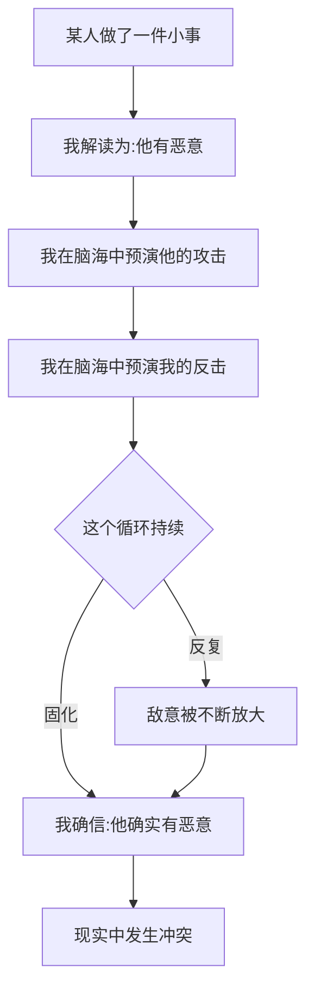
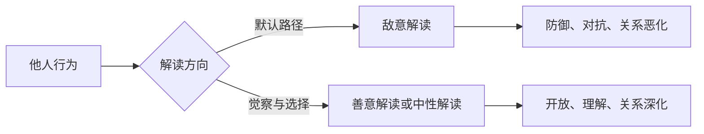
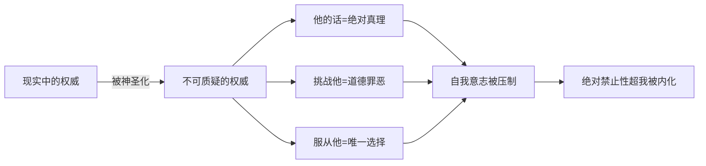
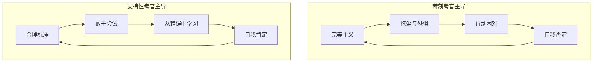

# 第08课：想象敌意游戏

> [!QUOTE] 核心洞见
> 我们活在两个世界里：一个是我们头脑中想象的世界，一个是真实的客观世界。而全能自恋的人，常常把想象中的敌意当作已经发生的事实来反应。

## 知识覆盖

| KP 编号 | 知识点 | 掌握程度 |
|---------|--------|---------|
| KP-801 | 全能自恋的基本逻辑 | 理解并掌握 |
| KP-802 | 认识敌意的想象游戏 | 识别并觉察 |
| KP-803 | 转变你的敌意想象游戏 | 练习并应用 |
| KP-804 | 绝对禁止性超我 | 理解并分析 |
| KP-805 | 神圣权威 = 绝对禁止 | 深入分析 |
| KP-806 | 两种考官：苛刻 vs 支持性 | 区分并内化 |

---

## 一、全能自恋的基本逻辑

### 核心公式

> **「我一动念头，世界就该配合。」** ——全能自恋的最底层逻辑

这个公式包含三个要素：

1. **发起者**：我（我的意志、念头、需求）
2. **时间差**：立即——我的念头和世界的回应之间不应该有延迟
3. **结果**：应该——世界必须按照我的意愿运转

### 全能自恋在现实中的变形

| 场景 | 全能自恋的期待 | 现实的挫败 |
|------|---------------|-----------|
| 工作 | 我稍微努力就应该成功 | 努力了但没结果，感到愤怒 |
| 关系 | 我不用说，对方就该懂 | 对方不懂，感到失望和委屈 |
| 沟通 | 我表达一次，对方就该接受 | 对方有不同意见，感到被攻击 |
| 生活 | 事情应该按我的计划走 | 计划被打乱，感到世界在针对自己 |

> [!WARNING]
> 全能自恋不是「坏」的，它是人类心理发展的起点。婴儿需要这种全能感来存活。问题出在：成年人仍然用婴儿的逻辑来理解世界和他人。

---

## 二、认识敌意的想象游戏

### 什么是「想象敌意游戏」

想象敌意游戏，是指在心中**预演他人的敌意**的一种心理活动。就像在脑海里演了一场电影——对方是加害者，你是受害者。

### 常见的敌意想象场景

- 同事没有及时回复消息 → 他是不是对我不满 → 他是不是在联合别人排挤我
- 朋友没有主动约我 → 她是不是讨厌我了 → 我是不是做错了什么
- 伴侣回家脸色不好 → 他是不是在生我的气 → 他是不是不爱我了

> [!NOTE] 想象 vs 现实
> 敌意想象游戏的核心问题不是「别人是否真的有敌意」，而是**我们在没有证据的情况下，先在心中把敌意当作事实来反应**。我们的情绪和行动已经在回应这个「想象中的敌意」。

### 敌意想象游戏的代价

1. **消耗大量心理能量**：为尚未发生的冲突做准备
2. **扭曲关系**：你对一个人的态度，受你心中想象的影响，而非真实的互动
3. **自我实现的预言**：因为预判对方有敌意，你的防御姿态真的引发了对方的敌意
4. **错过善意**：当真实的善意来临时，你无法识别和接受

---

## 三、转变你的敌意想象游戏

### 从敌意想象到善意想象

转变不是否定所有警惕，而是**觉察到自己在做敌意想象，并主动选择另一种可能性**。

### 转变四步法

| 步骤 | 行动 | 语言示例 |
|------|------|---------|
| **1. 暂停** | 觉察到自己在做敌意想象，先停下来 | 「等等，我在想什么？」 |
| **2. 质疑** | 问自己：这是事实还是我的想象？ | 「他真的这么想吗？还是有其他可能？」 |
| **3. 替代** | 主动想一个善意的可能性 | 「也许他太忙了，不是故意不理我。」 |
| **4. 验证** | 在现实中确认，而不是在心中确认 | 「我可以问问他真实的想法。」 |

> [!TIP] 日常练习
> 每天选一个让你感到「被冒犯」的小事，刻意练习转变四步法。开始时可能感到「我在骗自己」，但坚持练习会发现——很多敌意确实只存在于你的想象中。

---

## 四、绝对禁止性超我

### 什么是「绝对禁止性超我」

超我（Superego）是精神分析中人格结构的一部分，代表内在的道德标准和理想。**绝对禁止性超我**是一个特别苛刻的内在批判者——它不允许任何「不该有」的念头和行为存在。

- 你想偷懒 → 超我：「你怎么可以偷懒，你这个懒虫！」
- 你犯了一个小错 → 超我：「你太蠢了，这点事都做不好！」
- 你有一个「不好」的念头 → 超我：「你竟然会这么想，你真坏！」

### 绝对禁止性超我的特征

| 特征 | 表现 | 影响 |
|------|------|------|
| **零容忍** | 不允许任何错误和缺点 | 活在高度的紧张中 |
| **诛心论** | 连念头都要被审判 | 压抑真实想法和感受 |
| **无差别攻击** | 不管大事小事，攻击力度一样 | 内耗严重，丧失行动力 |
| **永恒在场** | 即使在休息，超我仍在监督 | 无法真正放松 |

> [!WARNING] 绝对禁止的代价
> 一个内心住着苛刻审判官的人，表面上可能看起来很「自律」「优秀」，但内在的代价是巨大的——创造力被扼杀、活力被压抑、真实的自我被隐藏。你不是因为自律而优秀，而是因为恐惧惩罚而勉强维持。

---

## 五、神圣权威 = 绝对禁止

### 权威的神圣化过程

当一个权威（父母、老师、领导、甚至想象中的神）被神圣化时，他/她就变成了**不可质疑的存在**。

### 神圣权威的心理后果

1. **丧失批判性思维**：权威说的就是对的，不需要思考
2. **恐惧取代信任**：不服从的后果太可怕，所以必须服从
3. **内在的暴政**：外在的权威被内化，变成自己对自己的暴政
4. **自我阉割**：在权威面前，放弃自己的意志和判断

---

## 六、两种考官

### 苛刻考官 vs 支持性考官

我们内心有两种不同的声音，像是两个完全不同的考官：

| 维度 | 苛刻考官 | 支持性考官 |
|------|---------|-----------|
| **态度** | 挑剔、否定、批评 | 鼓励、包容、肯定 |
| **标准** | 完美主义，零容错 | 现实的，允许犯错 |
| **犯错时** | 「你真差劲」 | 「没关系，下次会更好」 |
| **成功时** | 「这还不够，继续努力」 | 「做得好，你值得骄傲」 |
| **出发点** | 恐惧——怕你变坏 | 爱——希望你成长 |
| **效果** | 焦虑、压抑、内耗 | 自信、开放、有动力 |
| **来源** | 早期严苛的抚养者 | 早期包容的抚养者 |

### 如何内化支持性考官

> [!TIP] 练习内化支持性考官
> 1. **识别批判的声音**：当你听到内心的批判时，先觉察到它
> 2. **给批判者命名**：可以给它取名，比如「老批评」，与它拉开距离
> 3. **引入支持的声音**：问自己「如果是我最好的朋友遇到同样的事，我会对他说什么？」
> 4. **练习自我对话**：用温和而坚定的语气对自己说「你已经很努力了」「犯错是可以的」
> 5. **寻找现实中的支持性权威**：找到能够鼓励你、包容你的导师和朋友

### 两种考官在生活中的影响

> [!QUESTION] 反思
> 你的内在考官主要是哪种类型？回想一下，当你犯错或失败时，你内心第一个声音是「你怎么又搞砸了」（苛刻考官），还是「没关系，看看能从中学到什么」（支持性考官）？

---

## 自我检查

点击展开自我检查问题

### 问题 1：全能自恋的基本逻辑是什么？

**参考答案**：「我一动念头，世界就该配合。」——发起者是我，要求是立即回应，结果是世界必须按我的意愿运转。这是婴儿的心理起点，但成年人仍然用这个逻辑来理解世界就会产生问题。

### 问题 2：什么是「想象敌意游戏」？

**参考答案**：在内心预演他人敌意的心理活动——在没有证据的情况下，先在心中把别人的行为解读为「有恶意」，并以这份想象中的敌意为依据来做出情绪和行动反应。

### 问题 3：如何转变敌意想象游戏？

**参考答案**：四步法：（1）暂停——觉察到自己在做敌意想象；（2）质疑——这是事实还是我的想象；（3）替代——主动想一个善意的可能性；（4）验证——在现实中确认。

### 问题 4：什么是「绝对禁止性超我」？

**参考答案**：一个特别苛刻的内在批判者，不允许任何「不该有」的念头和行为存在。特征是零容忍、诛心论、无差别攻击、永恒在场。它导致创造力被扼杀、活力被压抑。

### 问题 5：两种考官有什么区别，如何内化支持性考官？

**参考答案**：苛刻考官挑剔、否定、完美主义，导致焦虑和内耗；支持性考官鼓励、包容、现实标准，促进自信和成长。内化支持性考官需要：识别批判声、与批判者拉开距离、引入支持声音、用温和语气自我对话、寻找现实中的支持性权威。

---

## 下一步

[[0009-ji-du-bao-nu|下一课：第09课 - 极端全能暴怒 →]]

理解了内心的敌意游戏和苛刻考官后，下一课将讨论全能自恋最极端的表现——当暴怒无法被控制时，它如何演变为嫉恨、反社会人格和恶性自恋。

---

> **本课术语**：[[reference/glossary|全能自恋、绝对禁止性超我、诛心论、头脑暴政]]