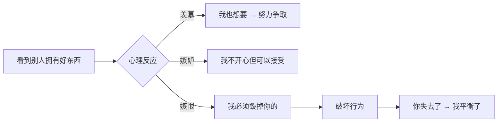
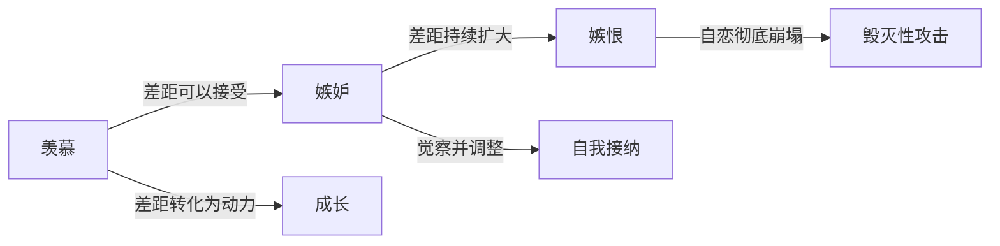
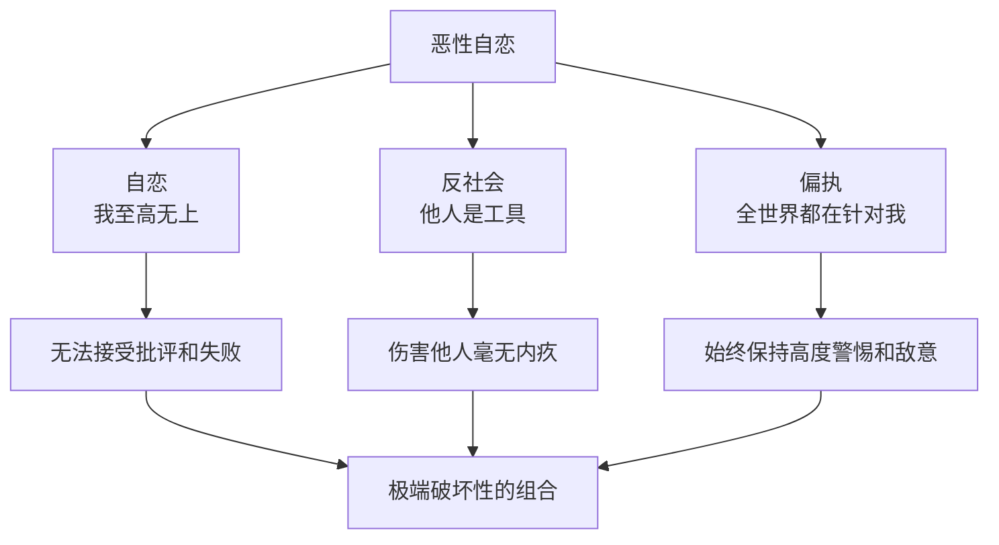

# 第09课：极端全能暴怒

> [!QUOTE] 核心洞见
> 嫉恨的本质是：你过得好，就映照出我的不好。如果我不能拥有好的，那么我也不允许你拥有。这不是因为恨你，而是因为无法面对自己的失败感。

## 知识覆盖

| KP 编号 | 知识点 | 掌握程度 |
|---------|--------|---------|
| KP-901 | 嫉恨的本质 | 理解并识别 |
| KP-902 | 反社会人格特征 | 识别特征 |
| KP-903 | 恶性自恋（Malignant Narcissism） | 理解概念 |
| — | 嫉恨 vs 嫉妒 vs 羡慕 | 区分三者 |

---

## 一、嫉恨的本质

### 嫉恨的心理学定义

嫉恨，是全能暴怒的一种极端表现。它与嫉妒不同——嫉妒是「我想要你所拥有的」，而嫉恨是「我不允许你拥有我所没有的」。

### 嫉恨的心理机制

1. **比较**：别人的好触发了我与他的比较
2. **自恋受损**：比较的结果是我「不如他」，自恋受到损伤
3. **无法承受**：这种「不如感」对全能自恋者来说是毁灭性的
4. **攻击转移**：我无法承受自己的不好，所以我要毁掉那个「好」
5. **恢复自恋**：当他变得和我一样（甚至更糟），我的自恋得以恢复

> [!WARNING] 嫉恨的破坏性
> 嫉恨不仅破坏他人，更破坏自己。嫉恨的人把大量能量花在「阻止别人变好」上，而不是「让自己变好」上。这是一种双输的心理模式。

### 嫉恨的三个层次

| 层次 | 表现 | 严重程度 |
|------|------|---------|
| **轻度** | 冷言冷语、阴阳怪气、背后说坏话 | 常见，可觉察 |
| **中度** | 暗中破坏、传播谣言、挑拨离间 | 具有实际破坏力 |
| **重度** | 直接攻击、毁坏对方名誉或成果 | 极端破坏性 |

---

## 二、嫉恨 vs 嫉妒 vs 羡慕

### 三者对比

| 维度 | 羡慕 | 嫉妒 | 嫉恨 |
|------|------|------|------|
| **核心感受** | 「你真棒，我也想这样」 | 「我不开心你拥有这个」 | 「你不能拥有这个」 |
| **对对方的态度** | 欣赏、向往 | 酸涩、不平衡 | 敌意、破坏欲 |
| **对己的态度** | 激励自己努力 | 感到自己不如 | 无法面对自己的不如 |
| **行为倾向** | 学习、模仿 | 回避、疏远 | 攻击、破坏 |
| **善意指数** | 高 | 中 | 零 |
| **自恋受损程度** | 无或低 | 中等 | 极高 |

### 从羡慕到嫉恨的连续谱

> [!NOTE]
> 羡慕和嫉妒是人之常情，它们可以被转化为成长的动力。而嫉恨跨越了一个关键边界——从「想要」变成了「要毁掉」。这个边界就是：**能否承受别人的好而不感到自我被摧毁**。

---

## 三、反社会人格特征

### 核心特征

反社会人格最显著的特征不是「暴力」，而是**缺乏共情能力**——无法真正感受到他人的痛苦和情感。

| 特征 | 表现 | 心理机制 |
|------|------|---------|
| **缺乏共情** | 无法理解他人的感受 | 他人只是工具，不是有情感的人 |
| **无视规则** | 不遵守社会规范和道德 | 规则是别人定的，与我无关 |
| **操纵他人** | 熟练利用他人达到目的 | 人际关系是游戏 |
| **无责任感** | 不为自己的行为负责 | 错永远是别人的 |
| **无内疚感** | 伤害他人不会感到不安 | 在「加害者-受害者」框架之外 |

### 反社会人格眼中的世界

对于反社会人格者来说，世界是一个**零和游戏**：

- 人分为两种：操控者和被操控者
- 情感是弱者的表现
- 道德和规则是约束别人的工具
- 我的需要高于一切

> [!WARNING]
> 不是所有反社会人格者都是罪犯。许多「成功」的反社会人格者活跃在需要冷酷决策的领域。但他们的共同问题是：**无法建立真实的深度关系**，因为他们从未把他人当作和自己一样的人。

---

## 四、恶性自恋

### 什么是恶性自恋

**恶性自恋（Malignant Narcissism）** 是心理学家埃里希·弗洛姆提出的概念，指自恋、反社会人格、偏执三种特质组合在一起的最危险的心理结构。

### 三种特质的相互作用

| 特质 | 单独存在 | 组合后的效果 |
|------|---------|-------------|
| **自恋** | 自我中心，需要不断被认可 | 被批评时不是难过，而是暴怒 |
| **反社会** | 不关心他人感受 | 暴怒时没有道德约束，可以伤害任何人 |
| **偏执** | 怀疑他人有恶意 | 把别人的正常行为解读为攻击，提前反击 |

三种特质叠加在一起，形成了最具破坏性的心理结构——**自恋提供动机，反社会提供工具，偏执提供理由**。

### 恶性自恋的危险性

> [!WARNING] 为什么恶性自恋最危险
> - 自恋让 TA 无法接受任何批评和挫折
> - 反社会让 TA 伤害他人时毫无内疚
> - 偏执让 TA 始终觉得世界在针对自己，随时准备反击
> - 这三种组合在一起，让 TA 可以在「合理」的框架下（偏执提供的理由）做出极端残忍的行为

---

## 五、识别与自我保护

### 如何识别高自恋/反社会倾向的人

| 警告信号 | 具体表现 |
|---------|---------|
| **极端自我中心** | 谈话永远围绕自己，不关心他人 |
| **缺乏共情反应** | 他人痛苦时无动于衷，甚至表现出厌恶 |
| **习惯性撒谎** | 即使没必要也撒谎，撒谎是一种习惯 |
| **剥削感强烈** | 把人分成「有用的」和「没用的」 |
| **无法接受批评** | 任何批评都会引发暴怒或报复 |
| **从不道歉** | 即使证据确凿也不认错 |

### 对极端情况的清醒认识

> [!NOTE] 认识但不妖魔化
> 理解反社会人格和恶性自恋，不是为了给某些人贴标签，而是为了：
> 1. 在关系中保持清醒的判断力
> 2. 保护自己不被过度消耗
> 3. 停止幻想「用爱感化」极端自恋的人
> 4. 在必要时做出离开的决定

---

## 自我检查

点击展开自我检查问题

### 问题 1：嫉恨的本质是什么？它与嫉妒有什么区别？

**参考答案**：嫉恨的本质是「我不能拥有好的，你也不能拥有」。核心心理机制是：别人的好映照出我的不好，我无法承受这种「不如感」，于是要毁掉那个「好」。嫉妒是「我不开心你拥有」，嫉恨是「你必须失去」。

### 问题 2：羡慕、嫉妒、嫉恨三者有什么不同？

**参考答案**：羡慕是欣赏和向往，能转化为学习动力；嫉妒是酸涩和不平衡，但可以接受现实；嫉恨是对他人好处的敌意和破坏欲。三者的分界线在于：能否承受别人的好而不感到自我被摧毁。

### 问题 3：反社会人格的核心特征是什么？

**参考答案**：核心特征是缺乏共情能力——无法真正感受到他人的痛苦和情感。其他特征包括无视规则、操纵他人、无责任感、无内疚感。反社会人格者眼中的世界是零和游戏，他人只是工具。

### 问题 4：什么是恶性自恋（Malignant Narcissism）？

**参考答案**：自恋、反社会人格、偏执三种特质组合在一起的最危险心理结构。自恋提供动机（不能输），反社会提供工具（没有道德约束），偏执提供理由（他先攻击我）。

### 问题 5：面对有极端自恋或反社会倾向的人，我们应该怎么做？

**参考答案**：（1）保持清醒的判断力，不把剥削当作「个性」；（2）保护自己的边界，不被情感消耗；（3）停止「用爱感化」的幻想；（4）在必要时做出离开的决定。理解这些不是为了贴标签，而是为了保护自己。

---

## 下一步

[[0010-dong-shi-cui-ruo|下一课：第10课 - 懂事、脆弱与生命力缺失 →]]

极端全能暴怒让我们看到了全能自恋最黑暗的一面。下一课将转向另一个看似相反但实际相通的心理状态——为什么过度懂事和脆弱背后，潜藏着同样的全能自恋逻辑。

---

> **本课术语**：[[reference/glossary|全能暴怒、嫉恨、反社会人格、恶性自恋、戏剧三角、被害妄想]]