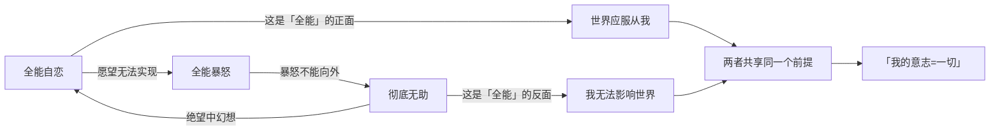
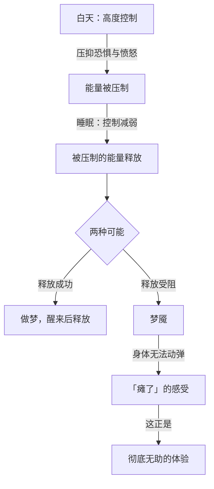
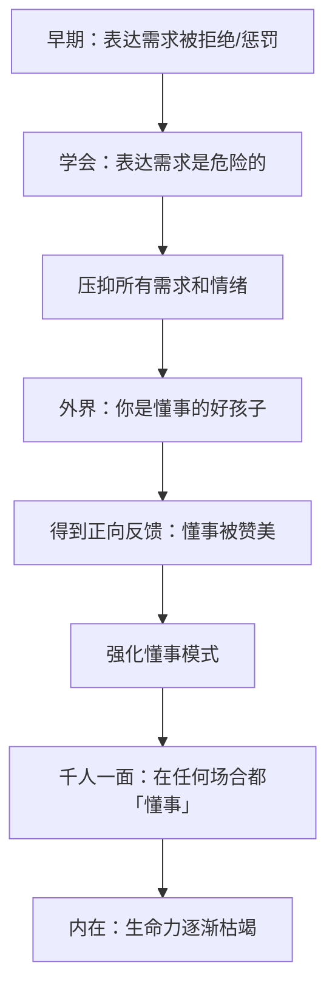
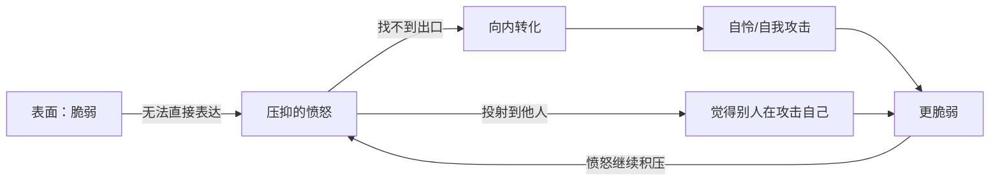
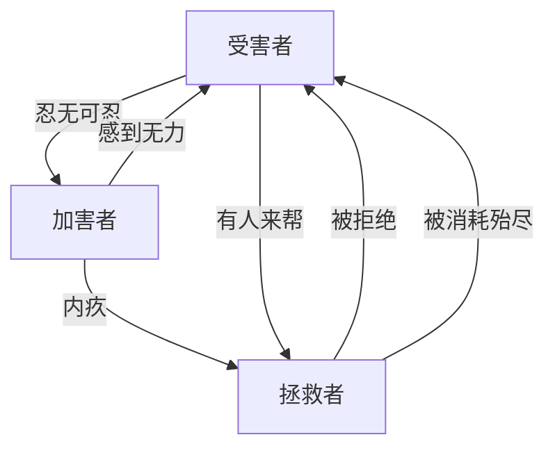
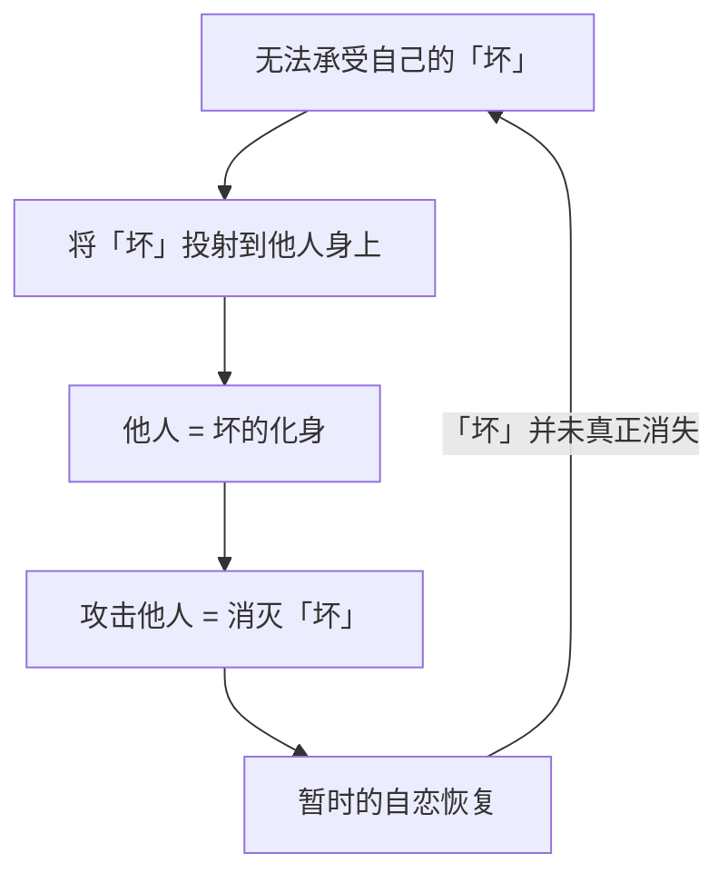

# 第10课：懂事、脆弱与生命力缺失

> [!QUOTE] 核心洞见
> 当「懂事」成为唯一被允许的存在方式，孩子失去的不仅是任性的权利，更是全部的生命活力。一个人越「懂事」，越可能处于深度无助之中。而那个看似脆弱的人，内心可能正燃烧着熊熊怒火。

## 知识覆盖

| KP 编号 | 知识点 | 掌握程度 |
|---------|--------|---------|
| KP-1001 | 全能自恋与彻底无助的一体两面 | 理解并掌握 |
| KP-1002 | 梦魇的心理机制 | 理解原理 |
| KP-1003 | 小偷意象和尸体意象 | 识别象征意义 |
| KP-1004 | 千人一面——过度懂事是深度无助 | 分析并觉察 |
| KP-1005 | 脆弱的真相是暴怒 | 深入分析 |
| KP-1006 | 戏剧三角 | 识别与应用 |
| KP-1007 | 替死鬼心理 | 理解机制 |

---

## 一、全能自恋与彻底无助：一体两面

### 看似矛盾，实则相通

全能自恋（「我无所不能」）和彻底无助（「我什么都做不了」）看似两个极端，实际上是同一枚硬币的两面。

### 为什么会从全能变成无助

| 阶段 | 心理状态 | 内在逻辑 |
|------|---------|---------|
| **起点** | 全能自恋 | 我的意志应该实现 |
| **受挫** | 全能暴怒 | 为什么实现不了！我要毁灭阻碍 |
| **暴怒受阻** | 转向自己 | 如果暴怒不能向外，就会向内攻击 |
| **终点** | 彻底无助 | 我什么都做不了，我是无力的 |

> [!NOTE]
> 深刻理解这个转化过程很重要：彻底无助不是因为真的没有能力，而是因为**只能用「全有或全无」的标准来衡量自己**——如果不能拥有一切，那我就什么都没有。不能控制一切，那我就完全失控。

---

## 二、梦魇的心理机制

### 梦魇与全能感的关系

梦魇（噩梦）在心理学上具有特殊意义：**睡眠时自我控制减弱，被压抑的能量就会浮现**。

### 梦魇的心理意义

- **身体的复盘**：那种「想动动不了」的感觉，正是彻底无助的身体化体验
- **被压制的能量**：梦魇中出现的恐怖形象（怪物、追赶者），往往是被压抑的情绪的象征性表达
- **释放的受阻**：梦魇是能量释放的半失败状态——能量已经开始释放，但又被部分压制了回去

> [!TIP] 梦到梦魇时
> 醒来后，不要急于逃离那个感受。在安全的环境中，体会那种「无助感」——它可能在告诉你有未被处理的情绪需要面对。

---

## 三、小偷意象和尸体意象

### 内在世界的象征表达

当一个人的内在世界无法用语言直接表达时，它就会以**意象**（images）的形式在梦境、幻想中浮现。

### 小偷意象

| 维度 | 解读 |
|------|------|
| **象征** | 内在的「偷窃者」——偷走了你的能量、活力、创造力 |
| **心理对应** | 被压抑的欲望和需求，它们不被允许存在，所以只能「偷」着来 |
| **现实来源** | 早期抚养者对你的「不允许」——不允许你太开心、太活跃、太有主见 |
| **疗愈方向** | 承认那些被「偷走」的部分也是你的，允许它们光明正大地存在 |

### 尸体意象

| 维度 | 解读 |
|------|------|
| **象征** | 内在世界中的「死亡」——失去活力的部分 |
| **心理对应** | 被过度规训而「死掉」的生命力，过度懂事后的情感麻木 |
| **现实来源** | 当一个人被要求「听话」「懂事」「不要乱动」时，生命活力被杀死 |
| **疗愈方向** | 让被压抑的生命力「复活」——允许自己活过来 |

> [!WARNING] 尸体的隐喻
> 一个过度「懂事」的孩子，表面上看是让父母省心的好孩子，但内在可能已经是一具「尸体」——他/她的活力、创造力、自我意志都被杀死了。这就是「懂事」的代价。

---

## 四、千人一面——过度懂事是深度无助

### 什么是「千人一面」

「千人一面」是指：一个人在不同的场合、面对不同的人，都表现出同样的模式——**过度顺从、过度懂事、从不表达自己的需求和情绪**。

这不是「性格好」，而是**深度无助的表现**——因为已经放弃了做自己的可能性。

### 懂事 vs 成熟

| 维度 | 过度懂事 | 真正成熟 |
|------|---------|---------|
| **出发点** | 恐惧——不这样做会被惩罚 | 选择——我选择体贴 |
| **对自我** | 压抑自己的需求和情绪 | 了解并适当表达自己的需求 |
| **对他人** | 讨好、迎合、不敢拒绝 | 尊重对方，也守住边界 |
| **弹性** | 在所有场合都「懂事」 | 该懂事时懂事，该表达时表达 |
| **代价** | 生命力枯竭，内在空洞 | 能量流动，关系真实 |
| **深层心理** | 深度无助——做自己是不可能的 | 自我效能——我有能力影响关系 |

### 千人一面的形成路径

> [!QUESTION] 反思
> 你是否在不同的关系中表现出「同一种性格」？你在所有人面前都差不多「好说话」吗？如果是，这未必是「性格稳定」，可能是千人一面的表现——你已经放弃了在不同关系中做不同自己的可能性。

---

## 五、脆弱的真相是暴怒

### 表面的脆弱 vs 内在的愤怒

这是本课最重要的洞见之一：**那些表面看起来特别脆弱、特别敏感、特别容易受伤的人，内在往往积压着巨大的愤怒。**

### 为什么脆弱的人不敢愤怒

1. **愤怒是「坏」的**：在早期的经验中，愤怒是不被允许的——「好孩子不发脾气」
2. **愤怒会破坏关系**：害怕表达愤怒后，对方会离开、会不爱自己
3. **愤怒是强大的**：脆弱的人不敢承认自己是强大的，愤怒是一种力量
4. **愤怒的后果太可怕**：在全能自恋的框架下，愤怒=毁灭——如果让愤怒出来，会把一切都毁掉

> [!WARNING] 脆弱的武器化
> 脆弱有时也被当作一种隐性的控制方式——「我都这么脆弱了，你还好意思对我发火？」「我都哭了，你还不安慰我？」这不是在说所有脆弱都是假的，而是要觉察：脆弱是否被用来规避冲突、操控他人。

---

## 六、戏剧三角

### 什么是戏剧三角

戏剧三角（Drama Triangle）由心理学家斯蒂芬·卡普曼提出，描述三种在人际冲突中不断轮换的角色：

| 角色 | 核心体验 | 典型话语 |
|------|---------|---------|
| **受害者** | 「都是我的错」「我好惨」「我没办法」 | 无力、自责、被动 |
| **加害者** | 「都是你的错」「你不行」「你要负责」 | 攻击、指责、控制 |
| **拯救者** | 「我来帮你」「我来解决」「没有我不行」 | 过度承担、干涉、控制 |

### 角色的转换

戏剧三角最精妙的地方在于：**这三个角色不是固定的，而是不断轮换的。**

**一个典型的转换例子**：
1. 妻子长期处于受害者角色（「我为你付出这么多，你却……」）
2. 某天爆发，变成加害者（「你太让我失望了！」）
3. 看到丈夫痛苦，又变成拯救者（「好了好了，我来处理，你不用管了」）
4. 发现自己又被消耗，回到受害者（「为什么总是我一个人扛……」）

### 如何跳出戏剧三角

跳出戏剧三角的关键是：**拒绝进入任何一个角色**。

| 诱惑角色 | 如何跳出 |
|---------|---------|
| 对方要你当受害者 | 「我有能力为自己负责」 |
| 对方要你当加害者 | 「我不需要指责你，但我会保护自己」 |
| 对方要你当拯救者 | 「我可以支持你，但我不替你解决问题」 |

> [!TIP] 跳出三角的三句话
> 1. 对拯救者的诱惑说：**「我相信你有能力解决自己的问题。」**
> 2. 对受害者的召唤说：**「我可以为自己负责。」**
> 3. 对加害者的角色说：**「我表达感受，但不攻击你。」**

---

## 七、替死鬼心理

### 什么是替死鬼心理

替死鬼心理，是指**将自己无法承受的「坏」投射到另一个人身上，然后攻击这个人**的心理机制。

### 替死鬼的常见场景

| 场景 | 投射的「坏」 | 被选中的替死鬼 |
|------|------------|---------------|
| 家庭 | 无能感、失败感 | 「不争气」的孩子 |
| 职场 | 无力感、不公平感 | 「不靠谱」的同事 |
| 社会 | 焦虑、不安 | 「有问题」的群体 |
| 网络 | 压抑的愤怒 | 「该被骂」的公众人物 |

### 替死鬼心理的社会意义

当一个人或一个群体被选为「替死鬼」时，攻击他/他们可以获得：
- **道德优越感**：「我是正义的，我在惩罚坏人」
- **群体凝聚力**：「我们」一起对抗「他们」
- **释放压抑的攻击性**：把压抑的愤怒转移到安全的目标上
- **回避真实问题**：不需要面对真正的问题（如自己的无能、系统的缺陷）

> [!WARNING] 替死鬼的代价
> 替死鬼机制给攻击者带来暂时的释放，但真正的「坏」从未被面对和解决。它不仅让被攻击者受伤，也让攻击者失去了真正成长的机会。

---

## 八、模块一小结：从全能自恋到生命力

随着第10课的完成，模块一「全能自恋及其变化」到此结束。回顾整个模块，可以看到一条清晰的主线：

| 课程 | 核心议题 | 代表了什么 |
|------|---------|-----------|
| 第01-04课 | 全能自恋的四个变化 | 问题的展示 |
| 第05课 | 卓越与强大恐惧症 | 能力的困境 |
| **第06课** | **圣母与巨婴** | **关系的病态** |
| **第07课** | **沟通中的全能自恋** | **互动的障碍** |
| **第08课** | **想象敌意游戏** | **内心的审判** |
| **第09课** | **极端全能暴怒** | **最黑暗的出口** |
| **第10课** | **懂事、脆弱与生命力缺失** | **生命的枯萎** |

### 最关键的认识

全能自恋的对立面不是「不自恋」，而是 **「活在关系中」**。当一个人能够：

- 容忍自己的不完美（放下全能幻想）
- 接纳别人的不同（放弃意志碾压）
- 在脆弱中承认愤怒（不把脆弱当作武器）
- 走出戏剧三角（不扮演任何角色）

他/她才开始从全能自恋的孤独城堡中走出来，进入真实的关系世界。

---

## 自我检查

点击展开自我检查问题

### 问题 1：全能自恋和彻底无助为什么是一体两面？

**参考答案**：它们共享同一个前提——「我的意志应当决定一切」。全能自恋认为「世界应服从我」，彻底无助认为「我无法影响世界」。当全能自恋受挫且暴怒无法向外表达时，暴怒转向自身，就变成了彻底无助。两者是同一心理结构的正面和反面。

### 问题 2：梦魇的心理机制是什么？

**参考答案**：白天高度控制时，恐惧和愤怒等情绪能量被压制。睡眠时自我控制减弱，这些被压制的能量释放出来。如果释放受阻（仍在部分控制中），就会形成梦魇——那种「想动动不了」的感觉正是彻底无助的身体化体验。

### 问题 3：「小偷意象」和「尸体意象」分别代表什么？

**参考答案**：小偷意象代表被压抑的欲望和需求，它们不被允许光明正大地存在，只能以「偷窃」的方式出现。尸体意象代表被过度规训而「死掉」的生命力——一个过度懂事的孩子，内在可能已经是一具情感麻木的「尸体」。

### 问题 4：什么是「千人一面」？它和真正的成熟有什么区别？

**参考答案**：「千人一面」是指在所有场合都表现出过度顺从和懂事，是深度无助的表现——已经放弃了做自己的可能性。真正成熟的人能根据情境灵活调整行为，既能体谅他人也能守住边界，既有顺应有拒绝。

### 问题 5：为什么说「脆弱的真相是暴怒」？

**参考答案**：表面脆弱的人内心往往积压着巨大的愤怒，但这些愤怒被压抑了——因为愤怒在早期经验中被定义为「坏」的，或者害怕愤怒会破坏关系，或者在全能自恋框架下愤怒等于毁灭。愤怒无法向外，就向内转化为自怜和自我攻击，表现为「脆弱」。

### 问题 6：戏剧三角中三个角色如何转换？如何跳出三角？

**参考答案**：三个角色（受害者、加害者、拯救者）不断轮换。例如：受害者忍无可忍变成加害者，加害者内疚变成拯救者，拯救者被拒绝变回受害者。跳出三角的关键是拒绝进入任何一个角色——不扮演受害者（为自己负责）、不扮演加害者（表达感受但不攻击）、不扮演拯救者（相信对方能解决自己的问题）。

### 问题 7：什么是「替死鬼心理」？

**参考答案**：将自己无法承受的「坏」投射到他人身上，然后攻击这个人。攻击替死鬼可以获得道德优越感、群体凝聚力、释放压抑的攻击性，但真正的「坏」从未被面对和解决。

---

## 下一步

[[../00-course-map|返回课程地图 →]] | [[../reference/glossary|查阅术语表]]

模块一的学习已经完成，你已经建立了对「全能自恋及其变化」的全面理解。接下来进入模块二——**人性坐标体系**，探索自恋维度与关系维度如何帮助我们更精确地理解自己和他人在关系中的位置。

---

> **本课术语**：[[reference/glossary|全能自恋、彻底无助、戏剧三角、道德资本、绝对禁止性超我、自体客体]]