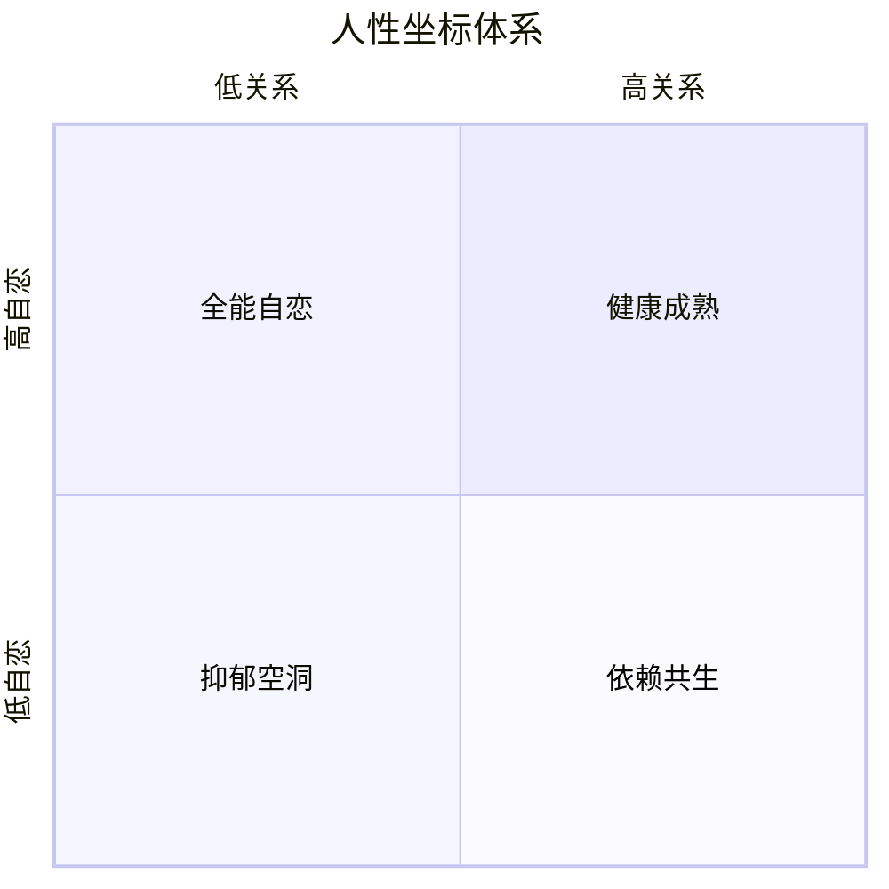

> **课程速览**：人性坐标体系不是抽象理论，而是理解自己和他人的实用地图。它帮助我们定位自己的心灵状态，看清成长的路径。

---

## 一、坐标体系的结构

### 完整框架

人性坐标体系由两个核心维度构成：



**纵轴：自恋维度（力量/权力维度）**

- 本质：地位高低、力量强弱、生死感
- 表现：追求卓越、渴望被看见、害怕被碾压
- 核心动力：向上攀登、证明自己存在

**横轴：关系维度（情感/道德维度）**

- 本质：情感的平等与连接
- 表现：共情能力、亲密需求、道德感
- 核心动力：渴望被理解、渴望深度联结

> [!info] 维度名称对照
> | 维度 | 别名 | 核心问题 |
> |------|------|----------|
> | 纵轴 | 自恋维度 / 力量维度 / 权力维度 | 我是否足够强大？ |
> | 横轴 | 关系维度 / 情感维度 / 道德维度 | 我是否被真正看见？ |

### 心灵空间的四个象限

| 象限 | 自恋水平 | 关系水平 | 心灵状态 |
|------|----------|----------|----------|
| 抑郁空洞 | 低 | 低 | 既没有力量也没有关系，退缩、虚无 |
| 全能自恋 | 高 | 低 | 有力量但缺乏真实关系，孤独、控制 |
| 依赖共生 | 低 | 高 | 有关系但失去自我，讨好、依附 |
| 健康成熟 | 高 | 高 | 既有强大力量又有深度关系，整合、灵活 |

---

## 二、自恋维度的健康发展

### 从「不卓越不配活」到「我可以强大也可以弱小」

在自恋维度上，不健康的状态是非黑即白的：

- 只有「卓越」才有价值
- 如果不能爬到顶端，就感觉自己跌入谷底
- 无法接受平凡和脆弱

健康的发展是**从二元对立走向整合**：

> 真正的强大不是永远强大，而是敢于承认自己的弱小。

### 关键转变

1. 认识到「我可以输，但我依然有价值」
2. 在失败中不被击垮，反而获得韧性
3. 从「我必须赢」到「我可以享受过程」

---

## 三、关系维度的展开

### 从二元对立走向整合

关系维度的核心障碍是「二元对立」思维：

- 好 vs 坏
- 对 vs 错
- 道德 vs 不道德

真正的成熟是在关系中容纳复杂性：

> [!tip] 关系成熟的表现
> - 能同时看见对方的优点和缺点
> - 不被单一事件定义一段关系
> - 理解「好人也会做坏事，坏人也有善意」
> - 能处理冲突而不破坏关系

---

## 四、心灵空间的层级演进

人的心理成长是一个逐步扩展的过程：

```
层级1：低自恋 + 低关系
  → 抑郁、空洞、退缩
    
层级2：高自恋 + 低关系  
  → 追求成功、孤独、控制
    
层级3：高自恋 + 高关系
  → 健康、整合、灵活
```

> [!note] 成长的关键
> 先需要在纵轴上获得足够的力量感，才能安心地在横轴上展开关系。一个没有力量的人，很难真正进入平等的关系——因为关系中他总在担心被吞噬。

---

## 自我检查

<details>
<summary>1. 人性坐标体系的纵轴和横轴分别代表什么？</summary>

纵轴是自恋维度（力量维度/权力维度），代表地位高低、力量强弱；横轴是关系维度（情感维度/道德维度），代表情感的平等与连接。
</details>

<details>
<summary>2. 哪个象限代表最健康的心灵状态？</summary>

右上角象限——高自恋 + 高关系，即「健康成熟」状态：既有强大的力量感，又能建立深度的人际关系。
</details>

<details>
<summary>3. 「不卓越不配活」反映了什么问题？</summary>

这是自恋维度上的不健康状态——只有卓越才有价值，无法接受平凡或失败。健康的发展是从这种二元对立走向整合，认识到「我可以强大也可以弱小」。
</details>

<details>
<summary>4. 为什么说没有力量就很难建立平等的关系？</summary>

因为一个没有力量感的人在关系中总是担心被吞噬、被控制。只有在纵轴上站稳了脚，获得一定的力量感之后，才能在横轴上与对方平等相处，建立起真实的关系。
</details>

---

## 延伸阅读

- [[0012-qing-gan-le-suo|第12课：情感勒索]]—— 当关系维度被扭曲时
- [[0013-zou-chu-gu-du|第13课：走出孤独]]—— 从孤独的自恋走向关系的世界
- [[0014-yi-lian-zi-lian|第14课：依恋与自恋]]—— 依恋的达成与自恋的整合
- [[reference/human-coordinate-system|人性坐标体系速查]]
- [[reference/glossary|术语表]]

---

> **练习**：画一张自己的人性坐标定位图。思考：你在纵轴和横轴上分别处于什么位置？你希望自己向哪个方向发展？注意，成长不是放弃一个维度去追求另一个，而是在两个维度上都持续扩展——既有力量，又有关系。