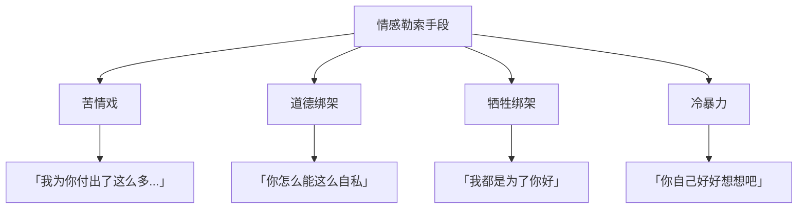

> **课程速览**：情感勒索比显性的控制更难识破，因为它披着「道德」「牺牲」「爱」的外衣。识别它的本质，才能摆脱无形的枷锁，建立平等真实的关系。

---

## 一、情感勒索的运作机制

### 核心公式

> **利用愧疚感 → 引发内疚 → 控制对方行为**

情感勒索者不是通过暴力强迫，而是通过让对方感觉「我不好」「我亏欠你」来达到目的。

### 常见手段



> [!warning] 辨识情感勒索的关键信号
> 当你在一段关系中经常感到愧疚、亏欠、或者觉得「我欠TA的」，就需要警惕——这可能不是爱，而是情感勒索。

---

## 二、道德资本：看不见的货币

### 道德资本的积累与兑现

道德资本理论揭示了一个隐蔽的心理机制：

| 阶段 | 表现 | 潜台词 |
|------|------|--------|
| 积累 | 做好事、付出、牺牲 | 「我在积累道德货币」 |
| 兑现 | 索取回报、控制对方 | 「你欠我的，该还了」 |
| 透支 | 翻旧账、强调付出 | 「我为你做了那么多」 |

> 道德资本的核心悖论：**真正的善意不求回报，求回报的善意本质是交易。**

### 典型场景

```
配偶说：「我为了这个家放弃了事业......」
潜台词：「所以你欠我的，你要听我的。」
```

```
父母说：「我含辛茹苦把你养大......」
潜台词：「所以你要按照我的意愿生活。」
```

> [!danger] 道德资本的危害
> 道德资本的积累机制会彻底扭曲关系——付出不再是爱的表达，而变成了一种投资和交易。被控制的一方感到窒息，却又无法反驳，因为对方「确实付出了很多」。

---

## 三、苦情戏：用受苦获得控制权

### 苦情戏的逻辑

苦情戏是一种极端的情感勒索方式：

1. **主动受苦**：让自己陷入痛苦的境地
2. **展示受苦**：让对方看到自己的痛苦
3. **道德绑架**：因为我在受苦，所以你要听我的

> [!note] 苦情戏的本质
> 受苦本身不是目的，控制才是。苦情戏者通过让自己过得不好，来获得道德高位，从而控制对方。

---

## 四、泛道德化：当一切都被道德绑架

### 泛道德化的陷阱

**泛道德化**是指把一切问题都上升到道德层面，用道德标准去评判所有行为。

| 正常讨论 | 泛道德化 |
|----------|----------|
| 「这件事做得不对」 | 「你这个人太坏了」 |
| 「我不喜欢这种方式」 | 「你怎么这么不懂感恩」 |
| 「这里有更好的方案」 | 「你就是故意跟我作对」 |
| 「我需要一些个人空间」 | 「你太自私了」 |

> [!tip] 如何识别泛道德化
> 当讨论从具体事实和感受，转向对人格的评判时，就是泛道德化的信号。健康的沟通应该关注「事实和感受」，而不是「对错和善恶」。

---

## 五、接纳自恋与自私

### 健康的自恋

自恋本身不是问题——**问题是不能接纳自恋**。

| 不健康的自恋观 | 健康的自恋观 |
|---------------|-------------|
| 否认自己有自恋需求 | 承认需要被看见、被认可 |
| 把自恋投射到别人身上批判 | 接纳自己的自恋冲动 |
| 用道德压制自恋 | 在关系中适度表达自恋 |
| 产生虚假的谦卑 | 真实的自信 |

### 必要的自私

同样，自私也需要被接纳：

> 完全不为自己考虑不是美德，而是自我背叛。在照顾别人之前，先照顾好自己是合理的、必要的。

> [!info] 平衡之道
> 接纳自己的自恋和自私，是建立真实关系的前提。当我们不敢承认自己有需求时，就会用道德资本的方式迂回索取——而这恰恰是最破坏关系的。

---

## 六、平等感：关系的基石

### 没有平等就没有真实的关系

平等感是健康关系的基础：

- **权力平等**：没有人永远处于高位或低位
- **情感平等**：双方的需求都值得被看见
- **表达平等**：双方都有说出真实想法的权利

> 情感勒索的本质就是在打破这种平等——勒索者占据道德高位，而被勒索者被迫处于低位。

---

## 自我检查

<details>
<summary>1. 什么是情感勒索？它和最明显的区别是什么？</summary>

情感勒索是利用对方的愧疚感来控制对方的行为模式。它与显性控制的不同在于：它披着道德和爱的外衣，让对方在不知不觉中被控制。
</details>

<details>
<summary>2. 解释「道德资本」的概念。</summary>

道德资本是指一个人通过做好事、付出、牺牲来积累的「道德货币」。积累道德资本的人会在未来某个时候「兑现」这些资本，索取回报或控制对方。真正的善意不求回报，求回报的善意本质是交易。
</details>

<details>
<summary>3. 什么是泛道德化？为什么它有害？</summary>

泛道德化是指把一切问题都上升到道德层面，用道德标准去评判所有行为。它之所以有害，是因为它忽略了事实和感受，把所有分歧都变成了善恶之争，使得正常的沟通无法进行。
</details>

<details>
<summary>4. 为什么接纳自恋和自私是建立真实关系的前提？</summary>

因为我们不敢承认自己有需求时，就会用道德资本的方式迂回索取。只有接纳自己的自恋和自私，才能在关系中真实地表达自己，而不是用道德化来掩饰或控制。
</details>

<details>
<summary>5. 平等感为什么是关系的基石？</summary>

没有平等就没有真实的关系。只有在双方权力、情感、表达都平等的前提下，关系才能建立在真实之上。情感勒索的本质就是打破这种平等——勒索者占据道德高位，被勒索者处于低位。
</details>

---

## 延伸阅读

- [[0011-ren-xing-zuo-biao|第11课：人性坐标体系]] —— 理解关系维度的框架
- [[0013-zou-chu-gu-du|第13课：走出孤独]] —— 从控制走向真实的关系
- [[0014-yi-lian-zi-lian|第14课：依恋与自恋]] —— 放下控制，找到真爱
- [[reference/human-coordinate-system|人性坐标体系速查]]
- [[reference/glossary|术语表]]

---

> **练习**：回顾你身边的重要关系，是否存在情感勒索的模式？试着用三个问题自检：
> 1. 在这段关系中，我是否经常感到愧疚？
> 2. 对方是否经常强调TA的付出？
> 3. 我是否因为「欠TA」而做了一些不想做的事？
>
> 如果答案都是「是」，那么这段关系可能已经被情感勒索渗透了。思考如何在保护自己的前提下，重新建立平等的边界。