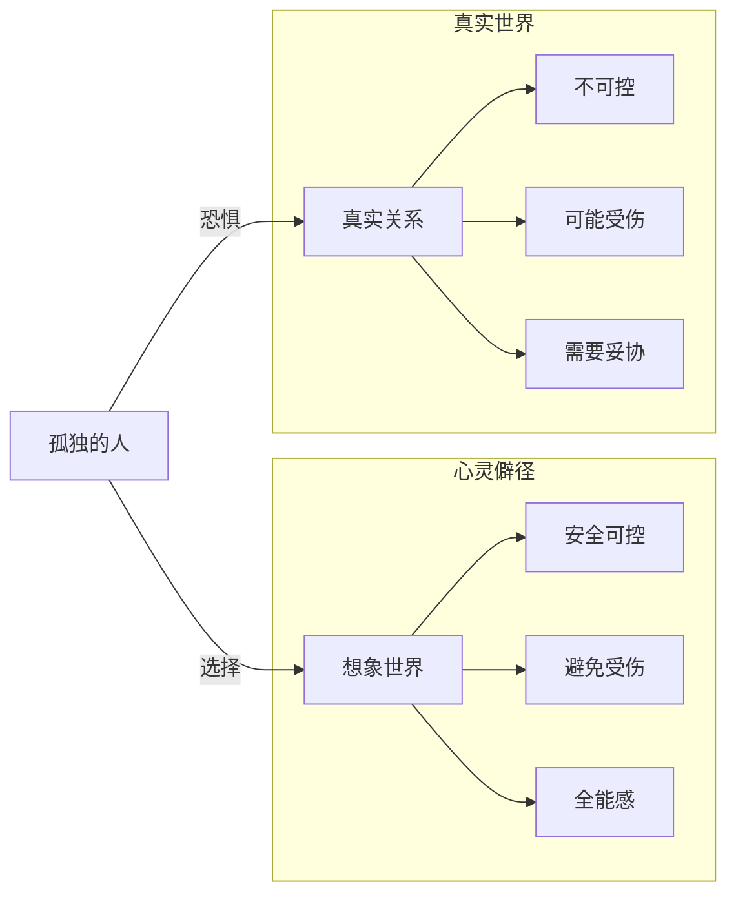

> **课程速览**：孤独是一个深刻的哲学问题，但也是一个非常现实的心理问题。当代社会越来越「原子化」，每个人都像漂浮的孤岛。然而，人的本质是在关系中存在的——离开关系，自体无法真正存活。

---

## 一、孤独的本质：心灵僻径

### 什么是心灵僻径？

心灵僻径是指：**一个人活在自己的想象世界里，与真实的外界隔绝。**

这不是简单的内向或喜欢独处，而是一种对关系的恐惧和回避。



### 心灵僻径的代价

| 表面上 | 实际上 |
|--------|--------|
| 安全、不受伤害 | 失去了成长的土壤 |
| 自由、不受限制 | 失去了真实的反馈 |
| 平静、没有冲突 | 失去了情感的深度 |
| 自给自足 | 失去了被看见的体验 |

> [!info] 关键洞察
> 孤独的人不是不需要关系，而是太害怕关系中可能出现的伤害。他们在想象中构建了一个完美的世界，但这个完美世界是虚假的。

---

## 二、人类最本质的需求：关系

### 关系不是锦上添花

传统观念认为：关系是好的，但如果没有关系，一个人也可以活得很好。

武志红提出相反的论点：

> **关系不是锦上添花，而是根本需求。**

就像鱼需要水一样，人的存在本身就需要关系来支撑。

### 自体只有在关系中才能存在

```
孤独的自体（缺乏关系的滋养）
  → 逐渐枯萎、虚无、空洞
  → 想象越来越脱离现实
  → 最终走向偏执或抑郁

在关系中的自体（接受关系的滋养）
  → 不断被「看见」和「确认」
  → 自体越来越坚实、真实
  → 能承受挫折，有韧性
```

> [!tip] 关系的核心功能
> 关系给我们的不是表面的陪伴，而是深层的「存在确认」。在另一个人眼中被看见的那一刻，我们才真正感受到自己的存在。

---

## 三、孤独与黑暗

### 孤独制造最大的黑暗

这是一条令人警醒的观察：

> 极端的邪恶往往来自孤独的全能自恋。

没有真实关系的「矫正」，人的想象会越来越极端：

| 阶段 | 状态 | 危险信号 |
|------|------|----------|
| 轻度孤独 | 享受独处，有少量关系 | 尚可自愈 |
| 中度孤独 | 回避关系，社交恐惧 | 想象开始脱离现实 |
| 重度孤独 | 完全隔绝，活在自己的世界 | 全能自恋膨胀 |
| 极端孤独 | 偏执状态 | 可能产生攻击性 |

> [!danger] 为什么孤独会导向黑暗？
> 因为真实关系是矫正我们想象的唯一途径。在关系中，我们不断接收到来自外界的反馈：「你这样想是偏颇的」「你那样做会伤害别人」——没有这些反馈，想象就会失控。

---

## 四、关系拓宽心灵的尺度

### 在关系中变得丰富

孤独让人的心灵变得狭窄——只有自己的视角、自己的逻辑、自己的标准。

关系让人的心灵变得宽广——我们必须容纳另一个人的视角、逻辑和标准。

| 孤独中的心灵 | 关系中的心灵 |
|-------------|-------------|
| 单一视角 | 多视角共存 |
| 固执、刻板 | 灵活、有弹性 |
| 非黑即白 | 能容纳灰色地带 |
| 对挫折敏感 | 有承受力 |
| 自恋容易受伤 | 自恋被适度挫败，变得真实 |

### 关系中的弹性

> 一个人想在关系中保持稳定，必须变得有弹性。而弹性只能在关系中锻炼出来——就像肌肉只能在运动中生长一样。

```
孤独 → 僵硬 → 一碰就碎
关系 → 弹性 → 能屈能伸
```

---

## 五、走出孤独的路径

### 第一步：承认需要关系

孤独者最大的障碍不是没有机会建立关系，而是不承认自己需要关系。

### 第二步：从小的冒险开始

不需要一步到位——从最微小的真实接触开始：

1. 对身边的人多说一句真实的话
2. 表达一个真实的感受（哪怕只是「我今天不太开心」）
3. 接受别人表达出来的关心
4. 在关系中尝试做自己

### 第三步：忍受不确定性

关系中一定会有伤害、误解和失望。这是关系的代价，也是关系之所以有价值的理由。

> [!note] 走出孤独不是放弃独处
> 健康的独处和孤独的心灵僻径是不同的。前者是在关系滋养的基础上的自我空间，后者是彻底放弃关系。真正的成熟是在「独立」和「联结」之间找到平衡。

---

## 自我检查

<details>
<summary>1. 什么是「心灵僻径」？</summary>

心灵僻径是指一个人活在自己的想象世界里，与真实的外界隔绝的状态。这不是简单的内向或喜欢独处，而是一种对关系的恐惧和回避。
</details>

<details>
<summary>2. 为什么说「关系不是锦上添花，而是根本需求」？</summary>

因为自体只有在关系中才能存在。缺乏关系的滋养，个体会逐渐枯萎、虚无，走向空洞。就像鱼需要水一样，人的存在本身就依赖关系。
</details>

<details>
<summary>3. 为什么孤独会制造最大的黑暗？</summary>

因为真实关系是矫正我们想象的唯一途径。没有关系的反馈，全能自恋会不受约束地膨胀，想象会越来越脱离现实，最终可能走向偏执和极端。
</details>

<details>
<summary>4. 关系如何让心灵变得有弹性？</summary>

关系中我们必须容纳另一个人的视角、逻辑和标准，这迫使我们从单一视角走向多视角共存。在反复的碰撞中，心灵变得灵活、有承受力，就像肌肉在运动中生长一样。
</details>

<details>
<summary>5. 走出孤独的第一步是什么？</summary>

承认自己需要关系。孤独者最大的障碍不是没有机会建立关系，而是不承认自己需要关系。只有先承认需求，才能真正走向关系。
</details>

---

## 延伸阅读

- [[0011-ren-xing-zuo-biao|第11课：人性坐标体系]] —— 在坐标系中定位孤独与关系
- [[0012-qing-gan-le-suo|第12课：情感勒索]] —— 关系中的扭曲与控制
- [[0014-yi-lian-zi-lian|第14课：依恋与自恋]] —— 从孤独的自恋走向安全的依恋
- [[reference/human-coordinate-system|人性坐标体系速查]]
- [[reference/glossary|术语表]]

---

> **练习**：给自己的人际关系做一个「温度检测」——过去一周里：
> 1. 你有没有和任何人进行过让你感到「被看见」的对话？
> 2. 你有没有回避某个本可以建立更深关系的机会？
> 3. 你多久没有向别人表达自己的真实感受了？
>
> 下一步行动：尝试在安全的关系中，分享一个你平时不会说出口的真实感受。观察对方的反应，以及你内心的变化。