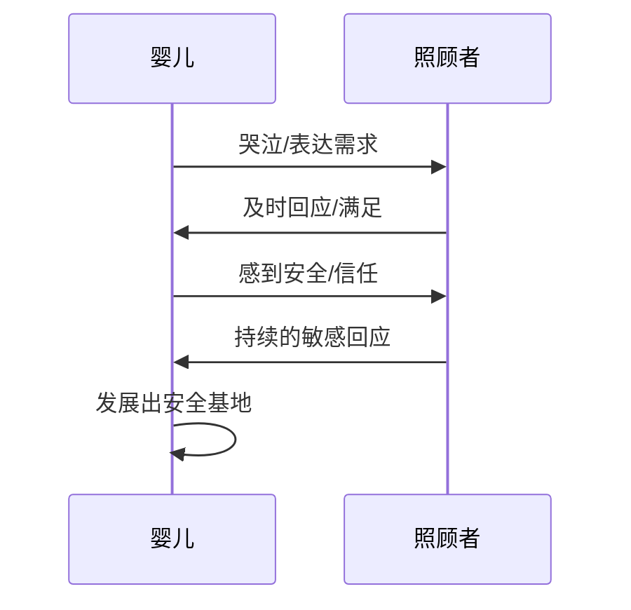
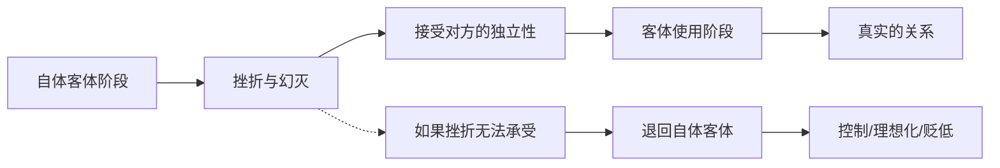
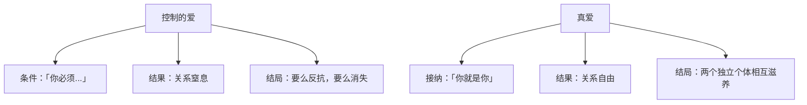

> **课程速览**：依恋与自恋是一对永恒的张力。依恋让我们渴望靠近，自恋让我们害怕失控。成熟的标志不是消灭自恋，而是在依恋中容纳自恋——既能依赖，又能独立。

---

## 一、依恋的达成

### 安全依恋的形成

婴儿与照顾者之间安全依恋的形成过程：



| 依恋类型 | 形成原因 | 成年后表现 |
|----------|----------|-----------|
| 安全型依恋 | 照顾者敏感回应 | 能建立深度关系，不惧依赖 |
| 焦虑型依恋 | 回应不一致 | 过度渴求关注，害怕被抛弃 |
| 回避型依恋 | 回应被拒绝 | 回避亲密，难以信任别人 |
| 混乱型依恋 | 回应创伤性 | 既渴望又恐惧关系 |

> [!info] 依恋理论的核心观点
> 安全依恋不是溺爱，而是「敏感回应」——照顾者能准确感知婴儿的需求，并及时满足。这种回应让婴儿相信：世界是可靠的，我是值得被爱的。

---

## 二、自体客体与客体使用

### 温尼科特的理论框架

这是理解关系发展的关键框架：

| 阶段 | 他人被当作什么 | 关系模式 |
|------|---------------|---------|
| 自体客体 | 满足自我的工具 | 我需要你，所以你是好的 |
| 过渡阶段 | 开始意识到差异 | 你不是我的一部分？ |
| 客体使用 | 真实的独立个体 | 你是你，我是我，我们选择在一起 |

### 从自体客体到客体使用的跨越



> 关键转折点在于：是否能承受「对方不是为我而存在的」这个事实。

### 所谓「客体使用」

温尼科特的「客体使用」不是利用对方，而是：

- 把对方当作一个**独立的、真实的人**
- 承认对方有自己的意志和选择
- 在关系中既能表达自己，也能容纳对方
- 不因为对方不符合自己的期待就否定对方

> [!tip] 检验标准
> 当对方说「不」的时候，你的反应是什么？
> - 如果是愤怒、受伤、想报复 → 你还停留在自体客体阶段
> - 如果是理解、接受、尊重 → 你已经到达客体使用阶段

---

## 三、溺爱的真相

### 溺爱不是爱太多

这是一个颠覆性的观点：

> **溺爱不是爱太多，而是用溺爱控制孩子。**

| 真正的爱 | 溺爱 |
|----------|------|
| 尊重孩子的独立性 | 剥夺孩子的独立性 |
| 允许孩子自主探索 | 用满足代替引导 |
| 能承受孩子的失望 | 害怕孩子不高兴 |
| 帮助孩子面对现实 | 帮孩子逃避现实 |

### 溺爱的本质是控制

溺爱的逻辑：

```
我满足你的一切需求 → 你依赖我 → 你就得听我的
```

溺爱者看似在付出，实际上在通过过度满足来维持对孩子的控制。被溺爱的孩子不是得到了太多爱，而是**没有得到真正的爱**——因为真正的爱是尊重对方的独立性，而不是把对方变成自己的附属品。

---

## 四、容器功能

### 什么是容器功能？

**容器功能**是指：一方容纳另一方的情绪，处理后以可接受的形式返还。

```
对方投射强烈情绪（愤怒/悲伤/焦虑）
    → 你接收、容纳、理解
    → 转化处理
    → 以安稳的方式返还
    → 对方感到被理解、情绪得到平复
```

> [!note] 容器的本质
> 容器功能不是压抑自己的感受去讨好对方，而是用自己的稳定去承接对方的波动。这需要自己有足够的心理空间——一个自己都支离破碎的人，无法容纳别人的情绪。

### 容器功能在生活中的应用

| 场景 | 非容器回应 | 容器回应 |
|------|-----------|---------|
| 对方愤怒 | 「你发什么脾气」 | 「我知道你现在很生气」 |
| 对方哭泣 | 「别哭了，有什么好哭的」 | 「我在这里陪着你」 |
| 对方焦虑 | 「你想太多了」 | 「这件事确实让人担心」 |

> [!warning] 注意
> 容器功能不能无限使用。健康的容器需要边界——容纳情绪不等于接受攻击。如果对方长期把情绪垃圾投射给你，你需要设置边界，而不是一味容纳。

---

## 五、我们为什么惧怕失败

### 失败威胁全能自恋

对失败的恐惧，本质上是对自恋受挫的恐惧：

```
失败 → 全能感被击碎 → 我不好/我不行/我无能 → 存在感受到威胁
```

### 从惧怕失败到接纳失败

| 不健康的心态 | 健康的心态 |
|-------------|-----------|
| 失败 = 我这个人不行 | 失败 = 这件事没做成 |
| 失败证明我是废物 | 失败是成长的反馈 |
| 我必须永远正确 | 我可以犯错 |
| 不能接受批评 | 批评帮我看到盲点 |

> 克服对失败的恐惧，不是靠说服自己「失败没关系」，而是靠建立足够稳定的自体——一个在关系中被充分看见和确认的自体，不会因为一次失败就崩塌。

---

## 六、放下控制，找到真爱

### 控制是自恋的表达

控制的本质是：**我不允许你脱离我的预期。**

- 「你应该这样做」
- 「你为什么不能......」
- 「如果你爱我，你就会......」

这些表达的共通点是：拒绝接受对方的真实样貌。

### 真爱需要放下控制

真爱的公式不是控制，而是：

> 我看见真实的你，我接受真实的你，我选择和你在一起——不是因为你能满足我的期待，而是因为你是你。



> [!danger] 关键区分
> 放下控制不等于放弃底线。爱一个人是接纳他的真实，而不是接受他的一切行为。真正的爱包含边界——「我接纳你这个人，但我不接受你伤害我的行为。」

---

## 自我检查

<details>
<summary>1. 什么是安全型依恋？它是如何形成的？</summary>

安全型依恋是指婴儿相信照顾者是可靠的、世界是安全的依恋模式。它形成于照顾者对婴儿需求的敏感回应——能准确感知并及时满足婴儿的需求。
</details>

<details>
<summary>2. 「自体客体」和「客体使用」有什么区别？</summary>

自体客体阶段：他人被当作满足自我的工具，还没有被当作独立的个体。客体使用阶段：承认对方是独立的、真实的人，有自己的意志和选择。从自体客体到客体使用的跨越，需要承受「对方不是为我而存在的」这个事实带来的幻灭感。
</details>

<details>
<summary>3. 溺爱是真的爱太多吗？</summary>

不是。溺爱不是爱太多，而是用溺爱控制孩子。溺爱者通过过度满足来维持对孩子的控制，剥夺了孩子的独立性。被溺爱的孩子不是得到了太多爱，而是没有得到真正的爱。
</details>

<details>
<summary>4. 什么是容器功能？它为什么重要？</summary>

容器功能是指一方容纳另一方的情绪，处理后以可接受的形式返还。它之所以重要，是因为一个人在情绪波动时，需要另一个稳定的存在来帮助他平复和整理。容器功能是深度关系的重要标志。
</details>

<details>
<summary>5. 为什么说真爱需要放下控制？</summary>

控制的本质是不允许对方脱离自己的预期，而真爱是接纳对方的真实样貌。控制让关系窒息，让对方要么反抗要么消失。真爱不是「你必须符合我的期待我才爱你」，而是「我看见真实的你，我接受真实的你，我选择和你在一起」。
</details>

<details>
<summary>6. 放下控制是否等于放弃底线？</summary>

不是。放下控制不等于放弃底线。爱一个人是接纳他的真实（存在层面的接纳），而不是接受他的一切行为（行为层面的纵容）。真正的爱包含边界——「我接纳你这个人，但我不接受你伤害我的行为。」
</details>

---

## 延伸阅读

- [[0011-ren-xing-zuo-biao|第11课：人性坐标体系]] —— 依恋与自恋在坐标上的定位
- [[0012-qing-gan-le-suo|第12课：情感勒索]] —— 当控制披上道德的外衣
- [[0013-zou-chu-gu-du|第13课：走出孤独]] —— 从孤独的自恋走向关系
- [[reference/human-coordinate-system|人性坐标体系速查]]
- [[reference/glossary|术语表]]

---

> **练习**：选一段对你来说重要的人际关系（伴侣、亲子或密友），诚实地问自己：
> 1. 在这段关系中，我更多是把对方当作「自体客体」（满足我的需求），还是当作「独立的他者」？
> 2. 当对方说「不」的时候，我的第一反应是什么？
> 3. 我有哪些「放下控制」的空间？
> 4. 我能否在接纳对方的同时，也保护好自己的边界？
>
> 在真实的关系中，这正是每一天都在进行的内在功课。