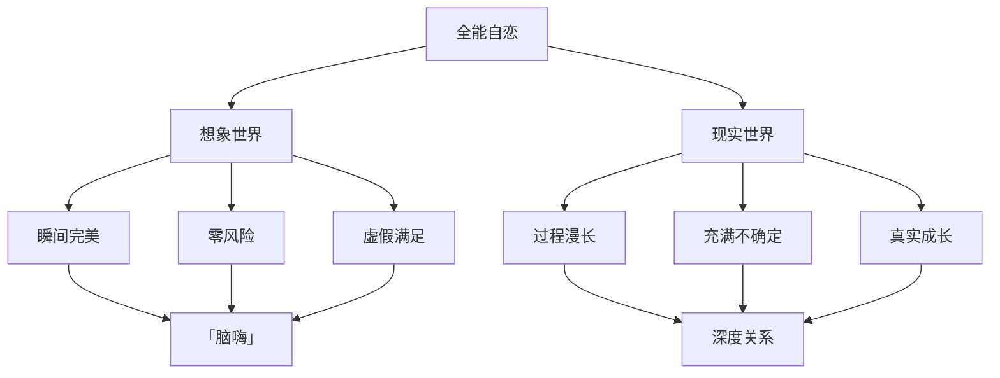
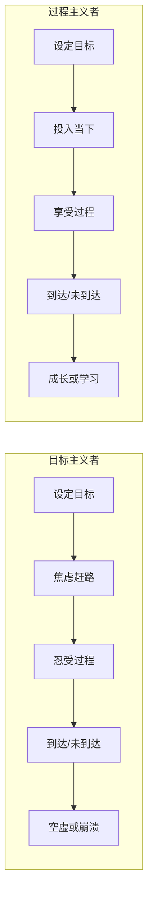
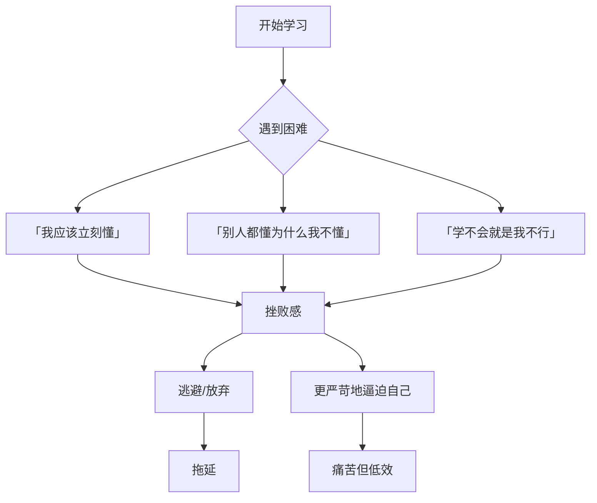

# 第15课：头脑暴政与拖延

> 头脑是好的仆人，却是坏的主人。当头脑从工具变成暴君，拖延与急切就成了它的左右手。

---

## 本节课要点

- 理解「想象与现实」的根本对立
- 区分「过程主义者」与「目标主义者」
- 看清拖延与急切的一体两面
- 认识头脑暴政如何导致学习障碍
- 体会「当我开始爱自己」的转变意义

**覆盖知识点：** `KP-005` `KP-006` `KP-1501` `KP-1502` `KP-1503`

---

## 一、想象与现实的对立

### 1.1 两个截然不同的世界

| 维度 | 想象世界 | 现实世界 |
|------|---------|---------|
| 时间 | 瞬间完成 | 需要过程 |
| 阻力 | 没有阻力 | 充满阻力 |
| 完美度 | 可以完美 | 必然不完美 |
| 控制感 | 完全可控 | 不可控 |
| 反馈 | 即时满足 | 延迟满足 |

> 在想象中，你可以瞬间成为任何你想成为的人；在现实中，每一步都需要时间、耐心和坚持。

### 1.2 想象世界的诱惑

头脑的想象世界之所以如此诱人，是因为它**避开了现实的所有痛苦**：

- 不需要面对失败的风险
- 不需要经历漫长的等待
- 不需要接受自己不完美的现实
- 不需要承受他人的评价

但这恰恰是它的陷阱——**生活在想象中的人，永远无法真正活过**。

---

## 二、过程主义者 vs 目标主义者

### 2.1 两种生命态度

> 「目标主义者」——人为了目标而活，如果目标没有实现，生命就没有意义。
>
> 「过程主义者」——人是为了活着本身而活，目标只是生命旅程中的里程碑。

### 2.2 目标主义者的困境

目标主义者看似上进，实则被[[reference/glossary|全能自恋]]驱动：

- **终点焦虑**：只有到达终点才感到安心
- **过程厌恶**：任何过程中的挫折都难以忍受
- **成功空虚**：达到目标后很快感到虚无，因为没有享受过程
- **永不满足**：完成一个目标后立刻奔向下一个

### 2.3 过程主义者的自由

过程主义者享受的是**生命的流动**：

- 每个当下都有意义，不只是通往终点的工具
- 挫折是体验的一部分，不是失败的证据
- 努力本身就是回报，不只是达成目标的手段
- 对结果保持开放，对过程保持投入

> [!quote]
> 目标主义是头脑的暴政，过程主义是心灵的解放。

### 2.4 两种主义的对比

---

## 三、拖延与急切：一体两面

### 3.1 看似相反，实则同源

这是一个关键洞见：**拖延和急切看似对立，但根源完全相同——都不能接受现实的过程**。

| 表现 | 内心声音 | 真相 |
|------|---------|------|
| 拖延 | 「我还没准备好」 | 害怕做了也做不好 |
| 急切 | 「我必须马上完成」 | 不能容忍过程的漫长 |

### 3.2 拖延的心理机制

拖延不是懒，而是**恐惧**：

- **完美主义的恐惧**：如果做了但不完美，不如不做
- **评价的恐惧**：做了就会被评判，不做就可以逃避
- **失败恐惧**：拖延为失败提供了合理的借口——「不是我不行，是我没做」
- **成功的恐惧**：［[0010-sheng-nv-yu-ju-ying|强大恐惧症］］的延伸——成功了会面临更高期待

### 3.3 急切的心理机制

急切的本质是**全能自恋的不耐受**：

- 不能等待——等待意味着我不是全能的
- 不能忍受不确定——过程充满不确定，所以必须快速跨越
- 不能接受笨拙——初学者的笨拙是对自恋的直接打击

> [!note] 拖延与急切都是对现实的拒绝
> 拖延说：「现实太可怕了，我躲起来。」
> 急切说：「现实太可怕了，我赶紧冲过去。」
> 两者都没有说：「现实就是这样，我接受它，与它共处。」

---

## 四、头脑暴政与学习障碍

### 4.1 学习中的头脑暴政

学习是最容易被头脑暴政侵害的领域：

1. **完美标准**：要求自己立即理解、立即掌握
2. **比较心理**：和别人的结果比较，而不是和自己的过去比较
3. **结果导向**：只关注考试分数、证书，不关注真正的理解
4. **自我攻击**：学不会就攻击自己笨、不行

### 4.2 学习者的常见误区

### 4.3 疗愈性的学习态度

- **允许自己不懂**：不理解是学习过程的一部分，不是失败的标志
- **尊重过程**：任何技能都需要时间积累，没有捷径
- **关注理解而非表现**：学习的目的是理解世界，不是证明自己
- **接受笨拙**：所有高手都曾笨拙，这是必经之路

---

## 五、「当我开始爱自己」——从暴政到自爱

### 5.1 转变的核心

头脑暴政的根源是**不爱自己**——用苛刻的标准对待自己，像一个暴虐的君主对待臣民。

「当我开始爱自己」意味着：

- 不再用完美标准苛责自己
- 接受自己的局限和不完美
- 像对待朋友一样对待自己
- 允许自己慢慢来

### 5.2 从全能自恋到真实自爱

| 全能自恋 | 真实自爱 |
|---------|---------|
| 我必须完美 | 我可以不完美 |
| 我不能失败 | 失败是成长的必经之路 |
| 我必须立刻做到 | 我可以慢慢成长 |
| 做不到就是我不行 | 做不到说明还需要练习 |
| 我的价值取决于成就 | 我的存在本身就是价值 |

> [!important]
> 爱自己不是放纵，而是不再用理想的完美标准虐待现实的自己。真正的爱包括：接纳、耐心、允许犯错、相信成长。

### 5.3 实践练习

**面对拖延时，问自己三个问题：**

1. 我在害怕什么？（识别恐惧）
2. 如果允许自己不完美，我是否愿意开始？（降低标准）
3. 完成比完美更重要，这句话对我意味着什么？（重新定义目标）

---

## 自我检查

1. 拖延和急切有什么共同根源？

两者都源于**不能接受现实的过程**。拖延是「害怕做了也做不好」而逃避，急确是「不能容忍过程的漫长」而冲刺。根子上都是全能自恋在作祟——不愿接受现实世界需要时间、充满不确定的本质。

2. 目标主义者和过程主义者最大的区别是什么？

目标主义者为**结果**而活，如果目标没有实现就感到生命无意义，容易陷入焦虑和空虚；过程主义者为**活着本身**而活，享受每一个当下的体验，目标只是旅程中的里程碑。

3. 学习中的「头脑暴政」有哪些表现？

- 要求自己立即理解、立即掌握
- 和别人的结果比较而非与自己的过去比较
- 只关注分数和证书，不关注真正的理解
- 学不会就攻击自己笨、不行

4. 「当我开始爱自己」在克服拖延中意味着什么？

意味着不再用完美标准苛责自己，接受自己的不完美和局限，允许自己慢慢来。爱自己不是放纵，而是停止用理想的完美标准虐待现实的自己，用耐心和接纳替代苛刻和自我攻击。

---

## 课后练习

1. **观察练习**：这一周注意自己在什么情况下会拖延，什么情况下会急切。记录下来，看看背后的恐惧是什么。
2. **过程记录**：选择一件你一直在拖延的事，规定自己每天只做10分钟，不追求结果，只体验过程。记录你的感受。
3. **对话练习**：当你发现自己又开始自我攻击时，停下来，用对待朋友的方式对自己说一句话。

---

## 相关课程

- [[0011-ren-xing-zuo-biao|第11课：人性坐标体系]] — 理解自恋维度与关系维度
- [[0005-zhuo-yue-qiang-da-kong-ju|第05课：卓越与强大恐惧症]] — 深入全能自恋的常规表现
- [[reference/glossary|术语表]]
- [[00-course-map|课程地图]]