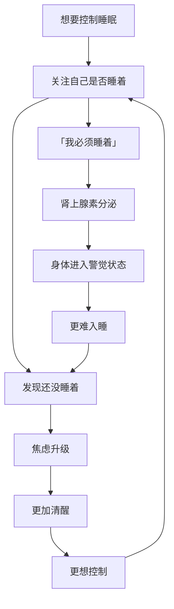
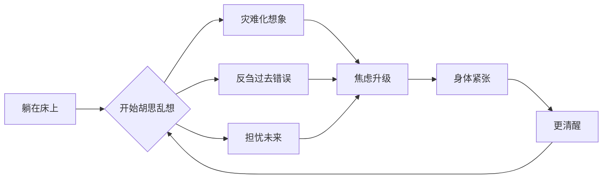

# 第16课：失眠心理学

> 当你试图控制睡眠的那一刻，你就已经失去了它。

---

## 本节课要点

- 理解失眠中的全能自恋机制
- 识别失眠中的思维陷阱
- 探索睡眠与死亡的隐喻关系
- 学习放下控制的疗愈之道

**覆盖知识点：** `KP-1601` `KP-1602` `KP-1603`

---

## 一、失眠与全能自恋

### 1.1 睡眠的双重悖论

睡眠是一个奇特的领域——它**必须是在你放弃控制之后才能发生的事情**。

> 你可以做很多事情来增加入睡的概率，但你无法「命令」自己入睡。

这就带来了一个根本悖论：

| 心理状态 | 对睡眠的态度 | 结果 |
|---------|-------------|------|
| 全能自恋 | 「我必须控制睡眠」 | 越控制越睡不着 |
| 健康心态 | 「我邀请睡眠到来」 | 放松后自然入睡 |

### 1.2 失眠中的全能自恋表现

失眠时的典型内心独白：

- 「怎么还没睡着？我必须马上睡着！」
- 「明天有重要的事，今晚必须睡好！」
- 「我已经躺了半小时了，这太不正常了！」
- 「别人都能倒头就睡，为什么我不行？」

这些想法的共同特点——**把睡眠当成了需要完成的任务**。

### 1.3 控制的反噬

睡眠是最典型的「越控制越失控」的领域。这与[[0015-tou-nao-bao-zheng|第15课中讲的拖延]]类似——都是头脑想要控制那些不能控制的东西：

- 你不能控制自己的心跳
- 你不能控制自己的消化
- 你同样不能控制自己的睡眠

这些是**自主神经系统**的领地，意识的介入只会扰乱它们。

---

## 二、失眠中的思维陷阱

### 2.1 夜间大脑的失控

晚上躺在床上时，大脑为何会不受控制地胡思乱想？

- **白天的压抑释放**：白天被压制的情绪和想法在夜晚浮现
- **缺乏外部刺激**：没有外界事物分散注意力，注意力全回到内心
- **身体静止，头脑活跃**：身体安静了，头脑反而更活跃

### 2.2 常见的思维陷阱

| 陷阱类型 | 典型表现 | 真相 |
|---------|---------|------|
| 灾难化 | 「睡不好明天就完蛋了」 | 偶尔睡眠不足不会带来灾难 |
| 完美主义 | 「我必须睡够8小时」 | 很多人的睡眠需求低于8小时 |
| 时间监控 | 反复看时间，计算还剩几个小时 | 看时间只会增加焦虑 |
| 反刍思维 | 反复回想白天的失误 | 晚上不是解决问题的最佳时间 |
| 预期焦虑 | 「今晚会不会又失眠」 | 担心失眠本身就会导致失眠 |

### 2.3 思维陷阱的恶性循环

### 2.4 应对思维陷阱的方法

> [!tip] STOP 技术
> - **S**top — 停下来，意识到自己在陷入思维陷阱
> - **T**ake a breath — 深呼吸，回到身体感受
> - **O**bserve — 观察自己的想法，不评判
> - **P**roceed — 继续放松，接受现状

---

## 三、睡眠与生死隐喻

### 3.1 入睡即「小死」

在精神分析的视角中，睡眠有着深刻的隐喻意义：

> 入睡 = 放下自我 = 小死一次

这解释了为什么很多失眠者其实是在**害怕死亡**：

- 入睡意味着放弃控制
- 入睡意味着意识暂时消融
- 入睡意味着「我」的暂时消失

对于全能自恋的人来说，「放下自我」是最可怕的事情。所以他们在入睡前会本能地抵抗，即使意识层面上很想睡。

### 3.2 不同心理状态的睡眠模式

| 心理状态 | 睡眠模式 | 隐喻 |
|---------|---------|------|
| 健康自恋 | 自然入睡，安心醒来 | 能够放下自我，也能重新找回自我 |
| 全能自恋 | 难以入睡，或睡眠浅 | 害怕失去控制，无法放下 |
| 抑郁 | 嗜睡或早醒 | 不愿面对现实，或过早「醒来」面对痛苦 |

### 3.3 失眠的疗愈：放下控制

失眠的疗愈之道与[[0017-nei-hua-wai-hua|内化与外化]]的疗愈逻辑相通——都需要在真实中放下想象的控制。

**放下控制的几个步骤：**

1. **承认你无法控制睡眠**——这是最重要的一步
2. **允许自己睡不着**——当不把睡眠当成任务时，反而容易入睡
3. **关注身体而非想法**——感受呼吸、身体的触感，从头脑回到身体
4. **接受最坏的结果**——即使今晚完全没睡，天也不会塌下来

### 3.4 一个悖论式的疗愈练习

> [!note] 矛盾意向法
> 这是一种悖论疗愈技术：**努力保持清醒**。
>
> 当你尝试保持清醒时，反而会放松下来，因为「反抗控制」的张力消失了。
> 睡眠就像追蝴蝶——你追它，它飞走；你停下来，它落在你肩上。

---

## 四、失眠与深度关系

### 4.1 失眠与孤独

失眠常常伴随着深刻的孤独感。当整个世界都在沉睡，只有你一个人醒着时：

- 感觉自己被全世界抛弃了
- 孤独被放大到极致
- 负面想法更容易滋生

### 4.2 关系中的安眠

研究显示，**安全的关系是良好睡眠的基础**：

- 婴儿在母亲身边能安心入睡
- 成人在伴侣身边也更有安全感
- 关系越安全，睡眠质量越高

睡眠是一种最脆弱、最暴露的状态——需要足够的信任才能安然入睡。这本身就是[[0018-shen-du-guan-xi|深度关系]]的一种体现。

> [!quote]
> 睡眠是我们每天都要经历一次的「信任测试」——你相信这个世界在你失去意识后仍然是安全的地方。

---

## 自我检查

1. 为什么说失眠是全能自恋的表现？

失眠者试图「控制」睡眠，但睡眠本质上是一种无法控制的自发过程。越想控制（「我必须睡着」），焦虑越高，越睡不着。这种「必须」的心态正是全能自恋的体现——不接受自己无法控制的事情。

2. 睡眠中的「生死隐喻」是什么意思？

入睡意味着放下自我、失去意识，这类似一种「小死」。全能自恋强烈的人害怕失去控制、害怕「放下」，所以在入睡前会本能地抵抗。失眠者实际上是在恐惧「自我的暂时消亡」。

3. 「矛盾意向法」如何帮助失眠？

矛盾意向法要求失眠者**努力保持清醒**。当「必须睡着」的任务被替换为「保持清醒」时，控制的反抗张力消失了，身体反而会自然放松下来进入睡眠——因为睡眠是放松的结果，而非努力的结果。

4. 失眠的疗愈之道是什么？

核心是**放下控制**：承认无法控制睡眠，允许自己睡不着，关注身体感受而非头脑中的想法，接受最坏的结果。当不把睡眠当成任务时，反而更容易入睡。

---

## 课后练习

1. **睡前仪式**：建立固定的睡前放松程序（冥想、温水泡脚、阅读纸质书），让身体知道「该放松了」。
2. **观察练习**：当你发现自己失眠时，对自己说：「好的，我只是暂时睡不着。这很正常。」然后观察这个想法带来的变化。
3. **呼吸练习**：躺在床上时，将注意力放在呼吸上。每次走神就温柔地拉回来，不评判自己。

---

## 相关课程

- [[0015-tou-nao-bao-zheng|第15课：头脑暴政与拖延]] — 头脑的完美标准对睡眠的干扰
- [[0017-nei-hua-wai-hua|第17课：内化、外化与自我PUA]] — 内化的苛刻声音如何影响睡眠
- [[0018-shen-du-guan-xi|第18课：深度关系滋养生命]] — 安全的关系带来安眠
- [[00-course-map|课程地图]]
- [[reference/glossary|术语表]]