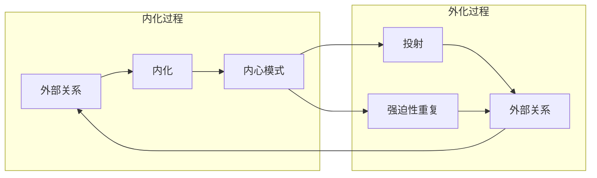
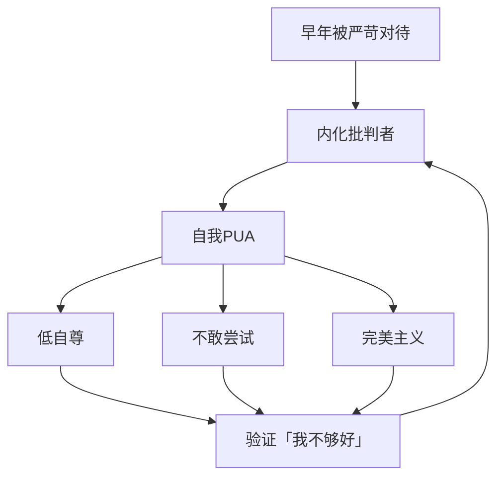
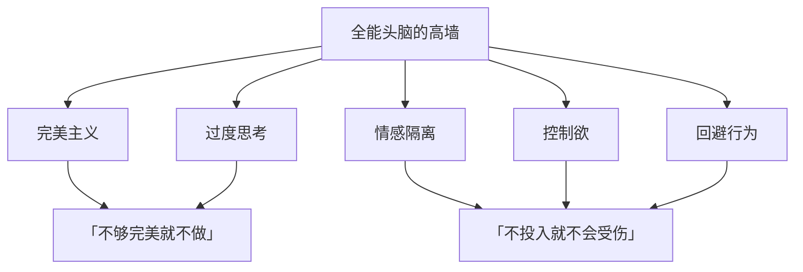

# 第17课：内化、外化与自我PUA

> 最可怕的监狱不是你身处其中，而是你把狱警内化到了心里。

---

## 本节课要点

- 理解内化与外化的心理机制
- 识别头脑暴政的「自我PUA」模式
- 认识现实世界对内在暴政的疗愈作用
- 探索「全能头脑的高墙」如何阻隔真实
- 理解错开的心理机制——躲闪与回避

**覆盖知识点：** `KP-1701` `KP-1702` `KP-1703` `KP-1704` `KP-1705`

---

## 一、内化与外化的机制

### 1.1 什么是内化

> **内化**：将外部世界的关系模式吸收到内心，成为内心的一部分。

内化是人类学习的基本方式——婴儿将母亲的态度内化，形成对自己的看法：

| 外部关系 | 内化结果 |
|---------|---------|
| 父母经常批评 | 「我不够好」的内心声音 |
| 父母无条件接纳 | 「我值得被爱」的内心声音 |
| 老师鼓励尝试 | 「犯错是可以的」的内心声音 |
| 权威的严苛标准 | 「必须完美」的内心标准 |

### 1.2 什么是外化

> **外化**：将内心的冲突、情感投射到外部世界，在外部上演内心的剧本。

外化是我们每天都在做的事情：

### 1.3 内化与外化的循环

内化和外化形成一个闭环：

1. 早年关系中**内化**了某种模式
2. 成年后在关系中**外化**这个模式
3. 外部关系的结果**强化**了内心的模式
4. 循环不断加强

这就是为什么很多人会**反复遇到相同类型的人或相同的关系困境**——他们在无意识中外化内心的剧本，然后验证这个剧本。

---

## 二、头脑暴政的自我PUA

### 2.1 什么是自我PUA

「PUA」原指搭讪技巧，现在常用来指**通过贬低、否定、操控来摧毁对方自信**的行为。

**自我PUA**则是——把这种模式用在自己身上：

> 内心有一个苛刻的批判者，不断否定、贬低、攻击自己。

### 2.2 自我PUA的典型表现

| 内心声音 | 潜台词 |
|---------|--------|
| 「你怎么这么笨，这都做不好」 | 我必须完美 |
| 「别人都比你强」 | 我必须是最优秀的 |
| 「你根本不配拥有这些」 | 我不值得 |
| 「别高兴太早，下次一定会失败」 | 幸福是不安全的 |
| 「要不是你……就不会……」 | 一切都是我的错 |

### 2.3 自我PUA与内化的关系

自我PUA本质上是一种**内化了的虐待关系**：

- 早年可能被重要的他人（父母、老师、伴侣）以类似的方式对待
- 这个关系模式被**内化**到心中
- 现在即使没有人批评你，你也会**自己批评自己**
- 那个苛刻的声音已经成了「你的一部分」

### 2.4 识别自我PUA的关键信号

- **对犯错极度敏感**：一个小错误会引发长时间的自我攻击
- **永远不满足**：即使做得好也觉得「还不够」
- **不配得感**：得到好事时第一反应是「我不配」
- **习惯性比较**：总是拿自己和别人比较，而且总是输
- **否定积极反馈**：别人夸你时，你会找出理由否定

> [!warning] 自我PUA特别善于伪装
> 它经常伪装成「自我反思」「严格要求自己」「追求进步」。但反思和攻击的区别在于：反思后有行动，攻击后只有羞愧。

---

## 三、现实世界的疗愈性

### 3.1 为什么内在暴政持续存在

头脑暴政之所以持续，是因为它**在想象的世界中运作**：

- 想象的世界没有反驳
- 想象的世界没有意外
- 想象的世界完全可控

但这也意味着——**在想象中永远无法被疗愈**。

### 3.2 现实世界的疗愈力量

> 只有在真实的关系和实践中，才能疗愈想象中的创伤。

现实世界具备三个疗愈性特征：

| 特征 | 含义 | 疗愈效果 |
|------|------|---------|
| **反馈性** | 现实会给你真实反馈 | 打破灾难化想象 |
| **关系性** | 真实的人会给你不同的回应 | 打破内化的批判模式 |
| **体验性** | 行动带来的体验超越头脑 | 让身体经验修正头脑认知 |

### 3.3 从内化到重新内化

疗愈不是消除内化，而是**重新内化**：

1. **接触**：接触到不同于早年模式的人和关系
2. **体验**：在真实关系中体验到被接纳、被理解
3. **内化**：将这个新的关系模式内化到心中
4. **替代**：新的内心声音逐渐替代旧的批判者

> [!note]
> 这就是为什么心理咨询有效的根本原因——咨询师提供了一个不同于早年关系的真实关系，来访者在内化这个新关系的过程中被疗愈。

---

## 四、全能头脑编织的高墙

### 4.1 头脑的防御功能

头脑的想象世界是一把双刃剑：

- **保护功能**：通过想象预演危险，避免真正的伤害
- **囚禁功能**：过度使用想象，会把自己封在虚构的世界里

### 4.2 高墙的构成

全能头脑编织的高墙由以下元素构成：

### 4.3 高墙的代价

这堵墙在「保护」你的同时，也**隔绝了真实**：

- **隔绝了真实的他人**——你无法进入深度关系
- **隔绝了真实的自己**——你无法感受到自己的情感
- **隔绝了真实的世界**——你用想象替代了体验
- **隔绝了成长的可能**——真实中的挫折恰恰是成长的土壤

### 4.4 拆墙的第一步

> 觉察本身就是拆墙。当你意识到自己在想象中避难时，你就已经开始回到现实。

---

## 五、错开的心理机制

### 5.1 什么是「错开」

「错开」是指**不敢直面真实的人和情境，总是下意识地躲闪、回避**。

这是一种微妙但普遍的心理机制：

- 遇到了喜欢的人——不敢直视、不敢接近
- 遇到了挑战——第一时间想逃避
- 被问及真实感受——顾左右而言他
- 被人真诚赞美——浑身不自在

### 5.2 错开的根源

错开的本质是**害怕真实**——真实意味着：

- **被看见**：真的被看见了，就无法隐藏自己的不完美
- **被评价**：真实地呈现自己，就可能被否定
- **被影响**：进入真实关系，就可能被改变
- **被拒绝**：靠近真实的他人，就可能被拒绝

### 5.3 错开与头脑暴政

错开是头脑暴政的**行为表现**：

| 头脑暴政的内在 | 错开的外在表现 |
|---------------|---------------|
| 「我不够好」 | 不敢展示自己 |
| 「别人会拒绝我」 | 先一步离开 |
| 「真实的我会被讨厌」 | 戴上面具做人 |
| 「太靠近会被伤害」 | 保持距离 |

### 5.4 应对错开

> [!tip] 三步法
> 1. **觉察**：意识到自己在「错开」——「啊，我又在躲了」
> 2. **暂停**：在想要躲闪的时候，给自己一个停顿
> 3. **选择**：可以选择继续躲，也可以选择试着面对——关键是这是你的选择，而不是本能的驱动

---

## 自我检查

1. 什么是「内化」？什么是「外化」？

**内化**：将外部世界的关系模式吸收到内心，成为内心的一部分——比如把父母的批评内化为内心的批判者。**外化**：将内心的冲突和情感投射到外部世界，在现实中重演内心的剧本——比如用对待父亲的方式对待权威人物。两者形成一个互相加强的循环。

2. 什么是「自我PUA」？它与内化有什么关系？

自我PUA是指内心有一个苛刻的批判者，不断否定、贬低、攻击自己。它是**早年严厉关系的内化结果**——早年被重要他人严苛对待，这个关系模式被内化到心中，现在即使没有人批评自己，也会自己批评自己。

3. 为什么说「现实世界具有疗愈性」？

因为头脑暴政只在想象世界中运作——没有反驳、没有意外、完全可控。而现实世界有**真实反馈**（打破灾难化想象）、**真实关系**（打破内化的批判模式）、**真实体验**（让身体经验修正头脑认知）。只有在真实的关系和实践中才能疗愈想象中的创伤。

4. 「全能头脑的高墙」由哪些元素构成？代价是什么？

构成：完美主义、过度思考、情感隔离、控制欲、回避行为。代价：隔绝了真实的他人、真实的自己、真实的世界和成长的可能——这堵墙在「保护」你的同时，也把你关在了里面。

5. 「错开」的心理机制是什么？如何应对？

错开是害怕真实——害怕被看见、被评价、被影响、被拒绝，所以下意识地躲闪和回避。应对的三步法：**觉察**（意识到自己在躲）→ **暂停**（给自己一个停顿）→ **选择**（有意识地决定是否面对）。

---

## 课后练习

1. **识别练习**：这一周注意自己的内心对话，记录下那些「自我PUA」的声音。不要评判它们，只需要写下来。
2. **外界反馈**：当你发现自己陷入自我攻击时，找一个信任的人聊聊，看看对方对同一件事的看法是否和你想象的不同。
3. **觉察错开**：注意自己在什么情况下会「躲闪」——不敢看对方眼睛、想要逃避某个场合、含糊其词。试着在下次停下来，深呼吸，然后选择面对。

---

## 相关课程

- [[0015-tou-nao-bao-zheng|第15课：头脑暴政与拖延]] — 头脑暴政的全面表现
- [[0016-shi-mian|第16课：失眠心理学]] — 内化的焦虑在睡眠中的表现
- [[0018-shen-du-guan-xi|第18课：深度关系滋养生命]] — 深度关系如何提供修复性体验
- [[reference/glossary|术语表]]
- [[00-course-map|课程地图]]