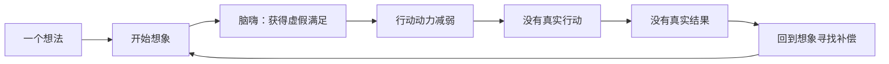
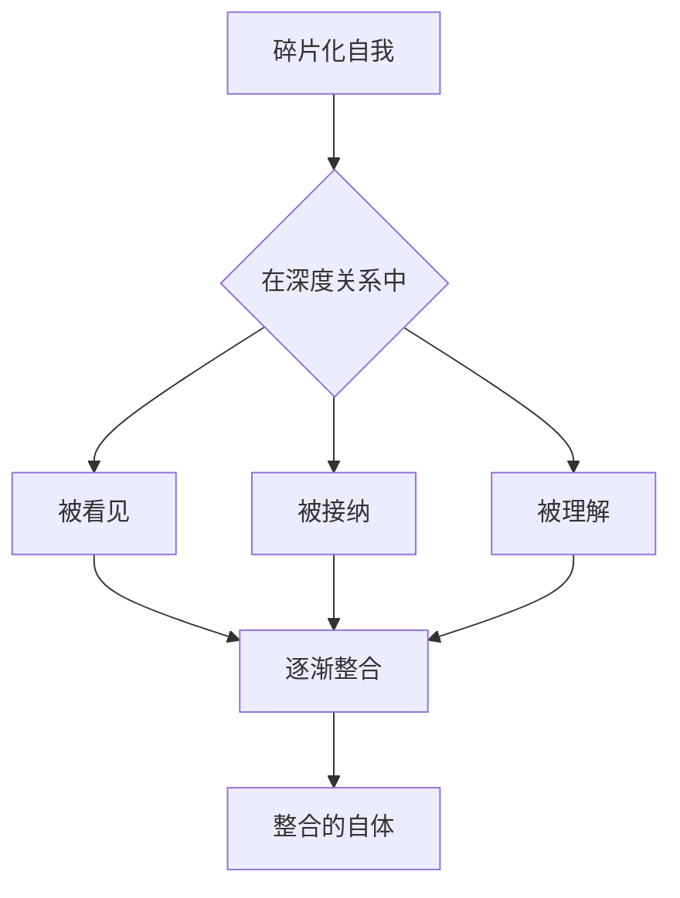
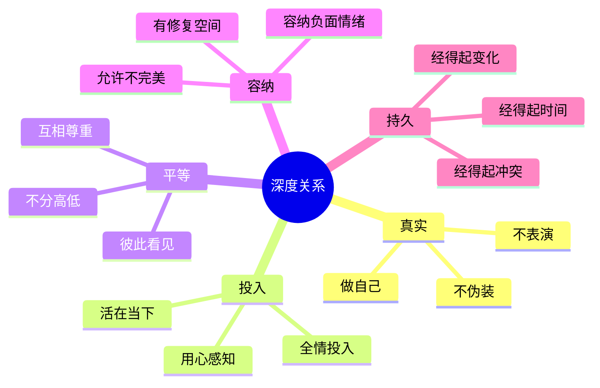

# 第18课：深度关系滋养生命

> 一切美好都是深度关系的产物。从全能自恋的孤岛出发，穿越头脑暴政的荒漠，最终抵达的是深度关系的绿洲。

---

## 本节课要点

- 理解「脑补」与「脑嗨」——想象对真实体验的替代
- 认识自我的层级——从碎片化到整合
- 看清「只有目标综合征」如何消耗生命
- 建立健康的时间感和空间感
- 掌握深度关系的本质与五大特征
- 全书路径回顾：从全能自恋到深度关系

**覆盖知识点：** `KP-1801` `KP-1802` `KP-1803` `KP-1804` `KP-1805`

---

## 一、脑补与脑嗨

### 1.1 什么是「脑补」

> **脑补**：在想象中完成体验，用想象替代真实的行动和感受。

「脑补」的典型场景：

- 看了一本健身书，就感觉自己已经锻炼了
- 在脑海里预演了对话，就觉得已经说过了
- 看了一堆攻略，就觉得已经去过那个地方了
- 收藏了无数课程，就感觉自己已经学过了

### 1.2 什么是「脑嗨」

> **脑嗨**：在想象中获得的短暂兴奋和满足，像大脑的「精神鸦片」。

「脑嗨」的典型模式：

- 立下一个宏伟目标时，想象成功的那一刻——已经嗨了
- 但这个嗨是一种**虚假满足**——它消解了行动的动力
- 因为想象已经给了你「完成」的快感，你不再需要真的去做

### 1.3 脑补与脑嗨的陷阱



### 1.4 脑补与[[0015-tou-nao-bao-zheng|头脑暴政]]

脑补和脑嗨是头脑暴政的**享乐版本**——拖延是痛苦的逃避，脑嗨则是虚幻的满足：

| 模式 | 动力 | 结果 |
|------|------|------|
| 拖延 | 逃避现实的痛苦 | 什么都没做 |
| 脑补/脑嗨 | 追求想象的快感 | 用想象替代行动 |
| 健康模式 | 体验真实的快乐 | 在行动中成长 |

> [!important]
> 脑补和脑嗨最大的危害不是「没做事」，而是**让你误以为自己已经活过了**。想象的生活再精彩，也不是真实的人生。

---

## 二、自我的层级

### 2.1 从碎片到整合

自我不是生来完整的，而是沿着一个从碎片到整合的路径发展：

| 层级 | 状态 | 表现 |
|------|------|------|
| **碎片化** | 自我分裂、矛盾 | 在不同人面前是完全不同的样子 |
| **部分整合** | 有核心但仍有冲突 | 知道自己是谁，但经常内耗 |
| **整合的自体** | 稳定、连贯、真实 | 内外一致，在不同情境中保持核心自我 |

### 2.2 碎片化自我的特征

- **情境依赖**：在A面前是一个人，在B面前是另一个人
- **缺乏主见**：容易被他人的意见左右
- **情绪不稳定**：随着外界评价剧烈波动
- **身份困惑**：经常问自己「我到底是谁」

### 2.3 整合自体的特征

- **核心稳定**：有一个稳定的自我内核
- **情境灵活**：在不同情境中能够调整行为，但不丢失核心自我
- **情绪韧性**：能够容纳各种情绪而不被淹没
- **真实一致**：内外一致，不伪装、不表演

### 2.4 整合的路径

整合不是通过「想」完成的，而是在[[#五、深度关系的五大特征|深度关系]]中完成的：

> 只有在真实的关系中，你才能逐渐把各个碎片整合成一个完整的自体。



---

## 三、只有目标综合征

### 3.1 什么是「只有目标综合征」

> 一切为了目标，生命变成了赶路。目标之外的一切——过程、感受、关系——都被视为障碍或浪费。

这是一种极端的[[0015-tou-nao-bao-zheng#二、过程主义者 vs 目标主义者|目标主义]]：

```
出生 → 上学 → 考好成绩 → 上好大学 → 找好工作 → 升职加薪 → 结婚生子 → 退休 → 死亡
                                  ↑
                            只看这个箭头，不看沿途的风景
```

### 3.2 只有目标综合征的症状

| 症状 | 表现 | 代价 |
|------|------|------|
| 时刻焦虑 | 总觉得自己在浪费时间 | 无法享受当下 |
| 关系工具化 | 只和「有用」的人交往 | 没有真正的朋友 |
| 成就空虚 | 达到目标后很快感到虚无 | 永远不满足 |
| 恐惧休息 | 休息时感到愧疚 | 身心俱疲 |
| 忽视身体 | 忽略身体发出的疲惫信号 | 健康受损 |

### 3.3 如何走出目标综合征

走出目标综合征不是放弃目标，而是**把目标放回它应有的位置**：

1. **目标是指南针，不是终点线**——目标指引方向，但活着本身才是目的
2. **重视过程**——过程占据了生命的99%，如果只有结果是好的，那生命就是99%的痛苦
3. **允许休息**——休息不是浪费时间，而是生命的必要节律
4. **建立非功利的关系**——有些关系可以「没用」，但很滋养

---

## 四、时间感和空间感的建立

### 4.1 全能自恋中的时空扭曲

在全能自恋的状态下，时间和空间是扭曲的：

- **时间感**：只有「现在」和「立刻」——必须马上得到，不能等待
- **空间感**：只有「我」和「世界」——世界必须围着我转

### 4.2 健康的时间感

在深度关系中发展出的时间感：

| 不健康的时间感 | 健康的时间感 |
|---------------|-------------|
| 必须立刻得到 | 可以等待 |
| 过程是煎熬 | 过程是体验 |
| 过去无法释怀 | 过去是资源 |
| 未来令人焦虑 | 未来充满可能 |
| 时间不够用 | 时间刚刚好 |

### 4.3 健康的空间感

在深度关系中发展出的空间感：

- **心理空间**：内心有容纳不同想法和情感的空间
- **关系空间**：关系中允许彼此有自己的独立空间
- **思考空间**：在刺激和反应之间有空间让自己选择
- **容错空间**：允许自己犯错，犯错不等于完蛋

### 4.4 时空感与[[0016-shi-mian|失眠]]

注意，时间感和空间感的缺失与失眠密切相关——当一个人没有健康的时空感时，他无法「等待」睡眠，也无法在心理上「容纳」睡不着的不适。这是[[0016-shi-mian|第16课]]与本节课的深层联系。

---

## 五、深度关系的五大特征

### 5.1 五大特征总览

> 深度关系不是一种奢侈品，而是生命的必需品。它像空气和水一样滋养着我们的心灵。



### 5.2 真实

**不伪装、不表演、做自己。**

- 在关系中不需要戴面具
- 可以展示自己的脆弱而不用担心被攻击
- 真实的你一定有一部分「不好」，但那也被接纳
- 真实是深度关系的**入场券**

> 真实不是「把什么都说出来」，而是「不用刻意隐藏什么」。

### 5.3 投入

**全情投入，活在当下。**

- 和对方在一起时，身心都在
- 不是「人在心不在」的陪伴
- 投入让关系变得鲜活
- 投入本身就是一种滋养

### 5.4 平等

**不分高低，互相尊重。**

- 没有「我比你强」或「你比我强」的权力斗争
- 双方都能表达需求而不被轻视
- 平等意味着——两个人都很重要
- 这是对[[0011-ren-xing-zuo-biao|人性坐标体系]]中关系维度的实践

### 5.5 容纳

**能容纳彼此的负面情绪。**

- 你有情绪时，对方不会逃开
- 对方有情绪时，你不会觉得是负担
- 负面情绪被容纳后自然会消散
- 容纳的能力越大，关系的韧性越强

### 5.6 持久

**经得起时间考验。**

- 关系不会因为一次冲突就破裂
- 时间越久，关系越深
- 持久的本身就是一种治愈
- 持久的关系提供了一个安全的「基地」，让你可以去探索世界

---

## 六、全书路径回顾

### 6.1 从全能自恋到深度关系的完整路径

```mermaid
graph TD
    A[全能自恋] --> B[全能自恋的四种变化]
    B --> B1[卓越强迫症]
    B --> B2[强大恐惧症]
    B --> B3[行动困难]
    B --> B4[圣人逻辑]
    
    B --> C[人性坐标体系]
    C --> C1[自恋维度]
    C --> C2[关系维度]
    
    C --> D[头脑暴政]
    D --> D1[拖延与急切]
    D --> D2[失眠]
    D --> D3[自我PUA]
    
    D --> E[深度关系]
    E --> E1[真实]
    E --> E2[投入]
    E --> E3[平等]
    E --> E4[容纳]
    E --> E5[持久]
    
    E --> F[活出完整的自己]
```



### 6.2 全书核心图谱

| 模块 | 课程 | 核心概念 | 疗愈路径 |
|------|------|---------|---------|
| 模块一 | 第01-10课 | 全能自恋及其四种变化 | 认识自己的自恋模式 |
| 模块二 | 第11-14课 | 人性坐标体系 | 从自恋走向关系 |
| 模块三 | 第15-18课 | 头脑暴政与深度关系 | 从想象回到现实 |

### 6.3 核心信息

> [!quote]
> 全能自恋的对立面不是不自恋，而是**能活在关系中**。关系或情感才是人性中真正疗愈性的力量。
>
> 一切美好都是深度关系的产物。
>
> —— 武志红《深度关系》

---

## 全书总结

### 三句话记住全书

1. **全能自恋让你孤独**——活在自己的想象世界里，远离真实
2. **人性坐标让你看清**——自恋维度和关系维度，两个都重要
3. **深度关系让你完整**——只有在真实的关系中，才能活出真正的自己

### 最后的建议

- **不要追求完美**——追求完美是头脑暴政的陷阱
- **不要害怕不完美**——不完美才是真实，真实才能连接
- **不要独自承受**——在关系中才能被疗愈
- **不要放弃行动**——只有在现实中才能真正成长

---

## 自我检查

<details>
<summary>1. 「脑补」和「脑嗨」有什么区别？它们有什么共同问题？</summary>

**脑补**是用想象替代真实的行动和感受；**脑嗨**是在想象中获得的虚假满足。共同问题是：都让人在想象中获得了「完成」的快感，从而消解了真实行动的动力，让人误以为自己已经活过了。
</details>

<details>
<summary>2. 自我的三个层级是什么？如何从不完整走向整合？</summary>

三个层级：**碎片化**（分裂矛盾）→ **部分整合**（有核心但仍有冲突）→ **整合的自体**（稳定连贯真实）。整合不是在「想」中完成的，而是在**深度关系**中——通过被看见、被接纳和被理解，逐渐把各个碎片整合成一个完整的自体。
</details>

<details>
<summary>3. 「只有目标综合征」有哪些症状？如何走出？</summary>

症状：时刻焦虑、关系工具化、成就空虚、恐惧休息、忽视身体。走出方法：把目标当作指南针而非终点线，重视过程（过程占生命的99%），允许休息，建立非功利的关系。
</details>

<details>
<summary>4. 深度关系的五大特征是什么？</summary>

**真实**（不伪装、不表演）、**投入**（全情投入、活在当下）、**平等**（不分高低、互相尊重）、**容纳**（能容纳彼此的负面情绪）、**持久**（经得起时间和冲突的考验）。五个特征共同构成了滋养生命的深度关系。
</details>

<details>
<summary>5. 如果用三句话总结全书，你会说什么？</summary>

1. 全能自恋让你孤独——活在自己的想象世界里，远离真实
2. 人性坐标让你看清——自恋维度和关系维度，两个都重要
3. 深度关系让你完整——只有在真实的关系中，才能活出真正的自己
</details>

---

## 课后练习

1. **关系盘点**：回顾你生命中最重要的3段关系，用深度关系的五大特征（真实、投入、平等、容纳、持久）分别打分，看看哪些方面做得好，哪些方面可以改善。
2. **脑嗨觉察**：这一周注意自己什么时候在「脑嗨」——制定计划时的兴奋感、想象成功时的满足感。提醒自己：真正的满足来自行动和体验，不是想象。
3. **给自己写信**：学完这门课程，给自己写一封信。写下你学到了什么、你意识到了什么、以及你接下来想要改变什么。

---

## 相关课程

- [[0011-ren-xing-zuo-biao|第11课：人性坐标体系]] — 理解关系维度的理论基础
- [[0015-tou-nao-bao-zheng|第15课：头脑暴政与拖延]] — 头脑暴政的起点
- [[0016-shi-mian|第16课：失眠心理学]] — 控制与放下的功课
- [[0017-nei-hua-wai-hua|第17课：内化、外化与自我PUA]] — 从内化批判到重新内化
- [[reference/glossary|术语表]]
- [[00-course-map|课程地图]]