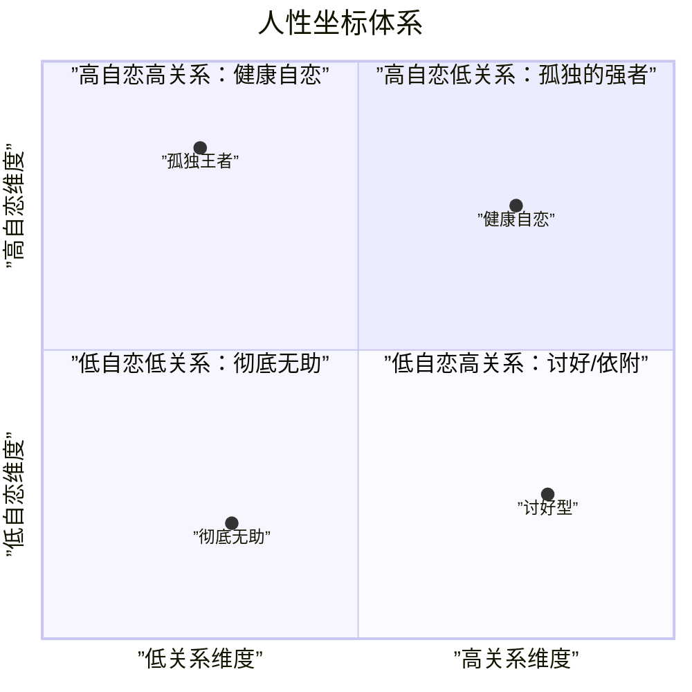

# 人性坐标体系速查

## 坐标结构

## 两个维度

| 维度 | 对应轴 | 核心特征 | 健康表现 | 极端表现 |
|------|--------|----------|----------|----------|
| **自恋维度** | 纵轴 | 权力、强弱、高低 | 自信、有力量感 | 全能自恋 / 彻底无助 |
| **关系维度** | 横轴 | 爱、平等、联结 | 热情、有共情力 | 讨好 / 情感隔离 |

## 四个象限

| 象限 | 自恋维度 | 关系维度 | 典型表现 |
|------|----------|----------|----------|
| 第一象限 | 高 | 高 | **健康自恋**——既有自信又能共情，能建立深度关系 |
| 第二象限 | 高 | 低 | **孤独强者**——能力强但无法建立亲密关系 |
| 第三象限 | 低 | 低 | **彻底无助**——既无力量也无联结，陷入抑郁 |
| 第四象限 | 低 | 高 | **讨好依附**——重视关系但失去自我 |

## 动态变化

- 心理健康的目标：在自恋维度上向上发展（自信），在关系维度上向右发展（热情）
- 科胡特标准：**自信** = 活力滋养自体；**热情** = 活力滋养客体
- 疗愈方向：从角落走向中心，同时发展两个维度

## 核心应用

1. **自我定位**：觉察自己当前在坐标系中的位置
2. **关系分析**：分析冲突双方在坐标中的位置差异
3. **成长方向**：明确需要提升的维度
4. **深度关系**：两个维度都达到高水平时，才可能建立深度关系

---

[[index|返回课程首页]]
