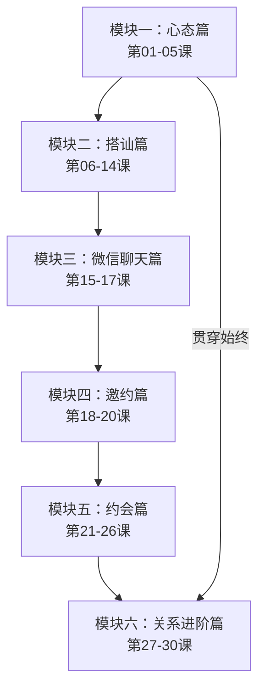

# 课程地图

## 学习路径

## 模块详情

### 模块一：心态篇（基础）
| 课号 | 标题 | 核心知识点 |
|------|------|-----------|
| 01 | 追女孩的正确心态 | 双赢原则：让自己快乐+让对方快乐 |
| 02 | 走出狭小社交圈 | 搭讪是扩大选择范围的最佳方法 |
| 03 | 天鹅肉理论 | 勇气先于方法 |
| 04 | 如何迈出第一步 | 先行动后优化 |
| 05 | 对自己勇敢、对对方真诚 | 真诚比幽默更重要 |

### 模块二：搭讪篇（核心技能）
| 课号 | 标题 | 核心知识点 |
|------|------|-----------|
| 06 | 分层升级 | 关系层级的分类与不可跳跃原则 |
| 07 | 少问多说 | 陌生社交的黄金法则 |
| 08 | 应对女孩问题 | 区分"为什么"和"有什么事" |
| 09 | 加微信技巧 | 3-5分钟交流后直接提出 |
| 10 | 即时约会 | 步步为营将搭讪变成约会 |
| 11 | 棘手情况 | 应对"你是推销的吗" |
| 12 | 追问应对 | 坚持不变的回答建立安全感 |
| 13 | 第一条微信时机 | 越早越好，利用社交惯性 |
| 14 | 第一条微信内容 | 根据关系阶段选择 |

### 模块三：微信聊天篇（过渡）
| 课号 | 标题 | 核心知识点 |
|------|------|-----------|
| 15 | 微信目标 | 聊天的目的是约出来见面 |
| 16 | 心态陷阱 | 顺其自然，不犯错比出彩重要 |
| 17 | 常见错误 | 情感过度与跪舔 |

### 模块四：邀约篇（关键转折）
| 课号 | 标题 | 核心知识点 |
|------|------|-----------|
| 18 | 提出邀约 | 层内聊好、升级直接 |
| 19 | 邀约细节 | 意向→确认时间→确认地点 |
| 20 | 目的性太强 | 两个判断标准 |

### 模块五：约会篇（实战）
| 课号 | 标题 | 核心知识点 |
|------|------|-----------|
| 21 | 话题的重要性 | 表情神态比话题内容更重要 |
| 22 | 首次约会错误 | 不宜看电影 |
| 23 | 电影选择 | 中后期选喜剧或恐怖片 |
| 24 | 成功关键 | 时间越长越好 |
| 25 | 活动安排 | 聊天是最好的活动 |
| 26 | 地点讲究 | 星级酒店好过商场 |

### 模块六：关系进阶篇（冲刺）
| 课号 | 标题 | 核心知识点 |
|------|------|-----------|
| 27 | 送礼方法 | 追上了节日送，没追上随机送 |
| 28 | 表白方式 | 情感/关系/理性三种方式 |
| 29 | 表白陷阱 | 表白是提交申请，需耐心 |
| 30 | 低安全感 | 享受当下，顺其自然 |

## 推荐学习方式

1. **顺序学习**：本课程从心态到实战层层递进，建议按顺序学习
2. **重点反复**：第06课（分层升级）是整个课程的理论核心，值得反复研读
3. **实践结合**：学完模块二（搭讪篇）即可开始尝试实践，边学边练效果最佳
4. **回顾第一课**：第30课呼应第01课的双赢心态，学完后再回顾会有更深理解

## 参考文档

- [[reference/glossary|术语表]]
- [[reference/technique-cheatsheet|技巧速查]]