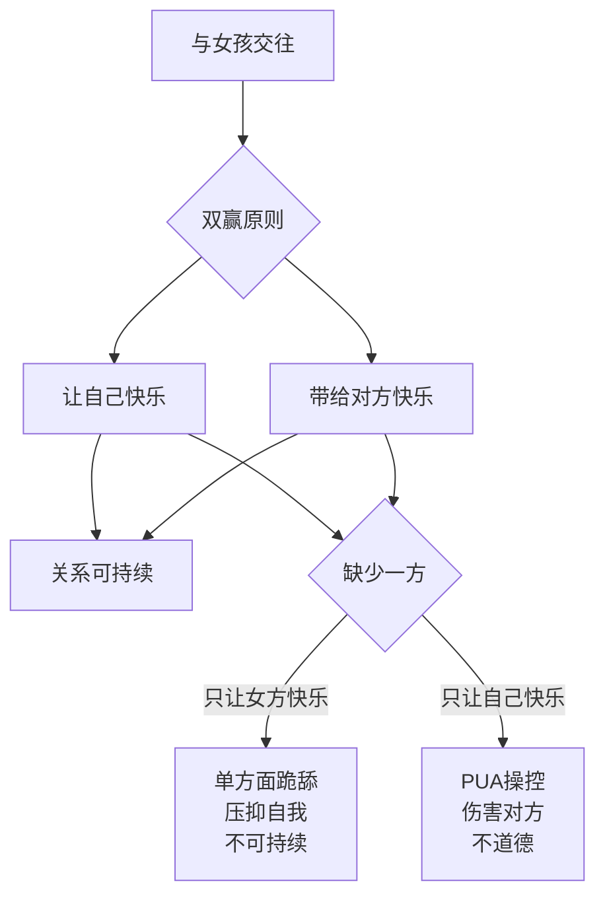

# 第01课：追女孩的正确心态

## Learning Objectives
- 能够用自己的话准确复述"双赢原则"的两个必要条件
- 能够区分健康追求与单方面跪舔、PUA操控的本质区别
- 在面对心仪对象时，能够用双赢原则自我评估每一次互动

## Core Idea

追女孩的正确心态可以概括为一条 **双赢原则**：**"带给对方快乐，同时也要让自己快乐。"** 这两个条件缺一不可。

这个原则是整门课程的总纲，后续所有的方法和技巧都建立在这个价值观基础之上。理解了这个原则，你就掌握了判断一切行为是否正确的标尺。

> [!WARNING] 两种极端需要避免
> **单方面付出型**：请客送礼、随叫随到，把自己活成工具人。看似"对她好"，实则是对自己的不尊重。这种关系无法持久，因为你在压抑自己的真实需求。
> 
> **PUA操控型**：通过打压、忽冷忽热等手段操控对方情绪。虽然满足了自己的控制欲，但建立在欺骗和伤害之上，既不道德，最终也会反噬自己。

真正的追求应该是双方都享受其中的过程。你展现真实的自己，对方感受到你的真诚和魅力；你在这个过程中获得愉悦，对方也因为你的存在而感到开心。

> [!TIP] Key Insight
> 双赢原则不仅是道德底线，更是判断是否"走对路"的实用工具。当你感到自己在委屈讨好时，说明偏离了原则；当你发现自己在算计操控时，说明走上了歧途。正确的状态是——你和她在一起时，两个人都自然而然地开心。

## Worked Example

**场景**：你约了一个女孩吃饭，结账时账单为300元。

**错误心态A（单方面付出）**：抢着买单，然后自己心疼钱，之后越想越不平衡："我为你花了这么多钱……"这种心态会让后续交往充满怨气。

**错误心态B（PUA操控）**：故意让她买单或者AA后贬低她："看来你经济条件不错啊，不差我这一顿饭。"通过打压来建立自己的优势地位。

**双赢心态**：自然地说"我来请客"，如果对方坚持AA或回请，欣然接受。你请客是因为你想这么做，而不是为了换取什么。如果对方对你的付出毫无回应，那说明你们不适合，及时止损即可。

> [!NOTE] 关键区别
> 双赢和跪舔的行为在表面上可能一模一样——同样是请客吃饭。区别在于**内心状态**：跪舔是你忍着不舒服在付出，双赢是你在享受付出的过程本身。

## Practice

> [!QUESTION] Self-check
> 你在追求一个女孩的过程中，发现自己越来越不开心，经常因为她的回复而情绪波动，甚至影响工作和睡眠。请问这违背了双赢原则中的哪一条？你应该怎么做？

Reveal answer

违背了"让自己快乐"这一条。双赢原则要求"带给对方快乐"和"让自己快乐"两者兼具。如果你的情绪完全被对方牵着走，已经到了影响正常生活的程度，说明这段关系已经让你不快乐了。

建议：退一步调整心态，把注意力放回自己的生活。健康的关系是锦上添花，不是雪中送炭。先让自己成为一个充实、快乐的人，才能带给别人快乐。

## Next Step

学习完正确心态后，下一课将探讨如何走出狭小的社交圈，扩大选择范围。在开始下一课前，请确保你已经能用双赢原则分析自己在过去交往中的行为。
