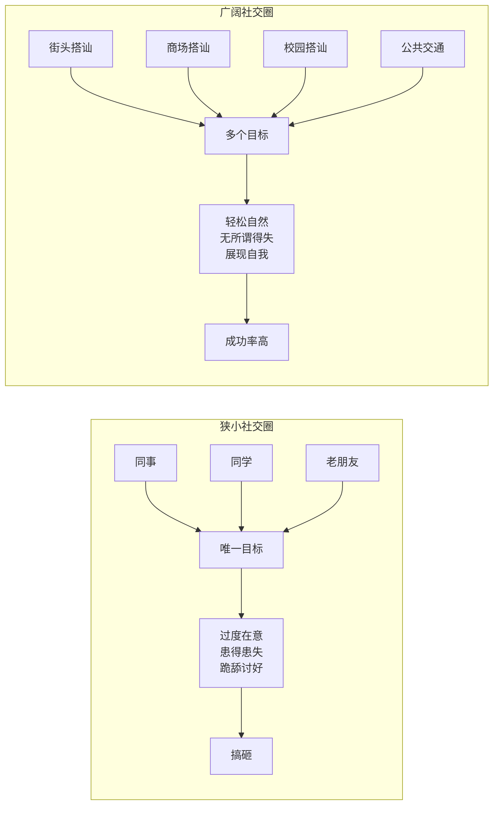

# 第02课：走出狭小社交圈

## Learning Objectives
- 能够识别自己当前社交圈的限制，列出至少3个可以扩大社交圈的场所
- 理解搭讪作为扩大选择范围的核心价值，不再将其视为"骚扰"
- 建立"数量是质量基础"的认知，为后续搭讪练习做好心理准备

## Core Idea

很多人单身多年，核心问题不是不会追女孩，而是**根本没有选择机会**。他们的社交圈极为狭窄——同事、同学、几个老朋友，翻来覆去就那么几个人。在这种圈子里看到一个合适的女孩，立刻像抓住救命稻草一样扑上去，结果往往因为过于紧张和迫切而搞砸。

脱单的第一步不是学习话术技巧，而是**扩大选择范围**。你需要让自己有更多选择，这样在面对任何一个女孩时才能保持平常心。

而扩大选择范围最快、最有效的方法就是——**搭讪**。街头、商场、校园、公交、地铁，到处都是陌生的女孩。90%的男人不敢或不会搭讪，这意味着只要你迈出这一步，就已经胜过了90%的竞争者。

> [!TIP] Key Insight
> 你之所以会在一个女孩面前紧张，往往不是因为"她太优秀"，而是因为"你只有这一个选择"。当你同时在接触多个女孩时，你对任何一个都不会过度紧张。扩大选择范围是克服紧张的治本之策。

> [!WARNING] 误区提醒
> 扩大选择范围不是让你同时交往多个对象，而是让你有足够的社交机会。就像找工作，多投几家公司是为了找到最合适的，而不是同时入职多家公司。

## Worked Example

**场景**：小明在公司暗恋女同事小美半年，不敢表白，每天患得患失。小美和别的男同事说句话就难受一整天。

**问题**：小明的问题出在哪里？

**分析**：小明把所有的情感期望都押在了一个人身上。他的社交圈只有公司，小美是他唯一的目标。这种"孤注一掷"的心态让他极度紧张，反而更不可能成功。

**解决方案**：小明应该在工作之余，每天花30分钟去商场或街头搭讪陌生女孩。不需要有结果，只需要练习和陌生人交流。当他认识了10个、20个女孩之后，再回头看小美，心态会完全不一样——他会变得轻松、自然，而这才是有吸引力的状态。

## Practice

> [!QUESTION] Self-check
> 请列举你目前生活中所有可能认识异性的渠道（工作、学习、兴趣爱好、社交活动等）。然后判断这些渠道的宽度——你每周能通过它们认识几个新的潜在交往对象？如果答案是"几乎为零"，你应该做什么改变？

Reveal answer

很多人的答案是"零"或"一个"，这正是需要改变的地方。

如果你的社交圈很窄，最直接的解决方案就是开始练习搭讪。搭讪的优势在于：
1. **无限供给**：任何时候出门，街上都有大量陌生女孩
2. **低成本**：不需要请客送礼，只需要勇气和几句话
3. **可练习**：从简单到复杂，可以逐步提升
4. **无后果**：被拒绝了也没关系，以后不会再见

建议行动：这个周末去市中心商业区，给自己定一个小目标——和3个陌生女孩说话。不要想结果，只说"你好"本身就已经是进步。

## Next Step

理解了扩大社交圈的重要性之后，下一课将探讨搭讪中最关键的因素——勇气。请记住：在开始下一课前，请先想好你可以去什么地方搭讪。
