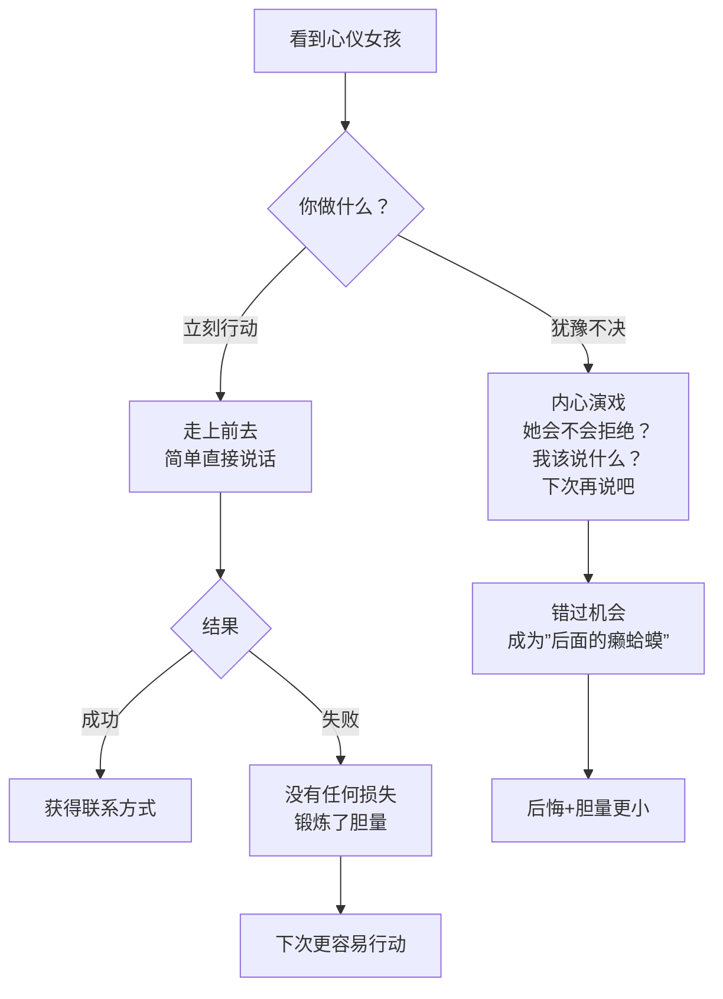

# 第03课：天鹅肉往往被第一只癞蛤蟆吃掉

## Learning Objectives
- 理解勇气在搭讪中优先于方法和技巧的核心逻辑
- 能够克服"等准备好了再行动"的心理拖延模式
- 在下次遇到心仪对象时，能够在3秒内做出行动决定

## Core Idea

"第一个想吃天鹅肉的癞蛤蟆说不定就真吃到了，吃不到的是后面的癞蛤蟆。"

这句话道出了搭讪和追求中最容易被忽视的因素——**勇气的时效性**。很多人以为追求女孩拼的是谁更有钱、谁更帅、谁更会说话，但在搭讪这个环节，拼的其实是**谁先行动**。

**勇敢的人先享受世界。** 当你看到心仪的女孩犹豫不决时，别人可能已经走上前去了。就算你的方法不完美、话术不熟练，只要你行动了，你就有了机会。而那个一直在旁边纠结"怎么说更好"的人，连机会都没有。

> [!TIP] Key Insight
> 方法可以学，技巧可以练，但勇气必须**先在行动中获得**。你不可能通过"想通了"就变勇敢，只能通过"做过了"才变勇敢。每一次犹豫都是在强化恐惧，每一次行动都是在积累勇气。

> [!NOTE] 关于"准备"
> 很多人说"等我准备好了再行动"。但搭讪这件事，你永远不可能完全准备好。就像学游泳，你不可能在岸上学会游泳。必须跳进水里，呛几口水，才能真正学会。搭讪也是一样——你要开口、被拒绝、再开口、再被拒绝，在这个过程中才能真正学会。

## Worked Example

**场景**：周末下午，你在书店看到一位正在翻书的女孩，气质很好，是你喜欢的类型。你站在旁边的书架前，内心开始纠结——

- "她现在正在看书，打扰她会不会不礼貌？"
- "我穿得是不是不够好看？"
- "第一句说什么比较好？"
- "要不先观察一下，等她走到下一个区域再说……"

**错误做法**：站在原地纠结了10分钟，最终女孩放下书离开了书店。你懊悔不已。

**正确做法**：看到她的那一刻，倒计时3-2-1，直接走过去说"你好"。不需要完美的开场白，甚至可以说得不太流利，这都没关系。关键是你行动了。

> [!WARNING] 关于"癞蛤蟆"的隐喻
> 这里的"癞蛤蟆"不是贬低自己，而是提醒你：不要因为对方看起来"高不可攀"就放弃行动。你对她的价值判断往往是被自己的恐惧放大的。你以为她是"天鹅"，但在别人眼里她可能只是一个普通女孩。

## Practice

> [!QUESTION] Self-check
> 回想你过去错过的一次机会——那个你很想认识但最终没有行动的女生。当时你在犹豫什么？如果用"先行动再优化"的思维重新来过，你会怎么做？

Reveal answer

大多数人错过的原因都类似：担心被拒绝后的尴尬、觉得自己还没准备好、想等一个"完美时机"。

如果重新来过，正确的做法是：看到她的3秒内就行动。不要说"等我数到10"，数到3就够了。你的第一句话是什么根本不重要，"你好，我想认识你"就已经足够了。被拒绝了又怎样？你和她今后大概率不会再见面。

记住：**勇气不是没有恐惧，而是带着恐惧依然行动。**

## Next Step

理解了勇气的重要性后，下一课会教你迈出第一步的具体话术——简单到让你无法再找借口。
