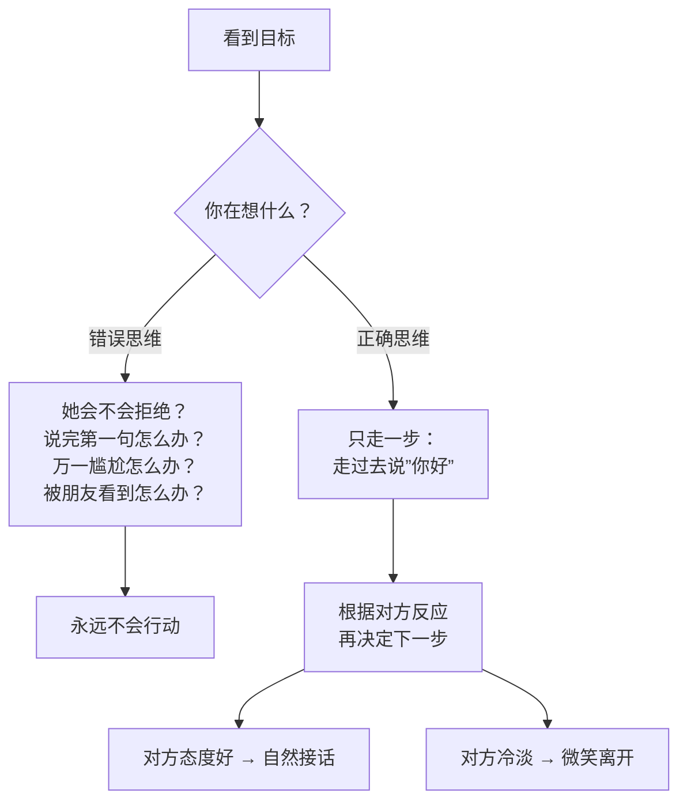

# 第04课：如何迈出第一步

## Learning Objectives
- 掌握迈出搭讪第一步的标准话术模板："你好，我想认识你，能不能加个微信"
- 理解"先行动后优化"的做事逻辑，不再追求完美开场
- 能够在搭讪时应对女孩可能的接话，不过度准备后续步骤

## Core Idea

迈出第一步的最大障碍不是"不知道该说什么"，而是"想太多"。你还没开口，已经在脑子里把从搭讪到结婚的全过程演了一遍。这正是问题所在——**你不需要想第二步第三步，只需要走到她面前说出第一句话。**

标准话术非常简单：**"你好，我想认识你，能不能加个微信？"**

虽然这句话不算完美，但它足够用了。而且这不是最终版本，只是起步。随着你经验的积累，你可以根据自己的风格优化话术。

> [!NOTE] 女孩可能会接话
> 有时候你说了"你好"之后，遇到态度好的女孩会主动接话："有什么事吗？"或者直接微笑着看你。这时候不需要紧张，实话实说就行。你越自然，对方越放松。

> [!TIP] Key Insight
> 不要追求"完美的开场"。在搭讪这个场景中，完美主义是你最大的敌人。哪怕你说得结结巴巴、声音发抖，只要你把话说出来了，你就赢了。**完成比完美重要。**

## Worked Example

**场景A——标准流程**：
你："你好，我想认识你，能不能加个微信？"
她："嗯……有什么事吗？"
你："没什么特别的，就是刚才看到你，觉得想认识一下。"
她：（微笑）"好吧。"
（扫码加微信，简单告别）

**场景B——对方主动接话**：
你："你好，我想认识你。"
她：（主动停下脚步）"你好，你是有什么事吗？"
你："没什么特别的事，就是在那边看到你，觉得不过来打个招呼会后悔。"
她：（笑）"哈哈，好吧。"

> [!WARNING] 不要过度准备
> 很多人会在搭讪前背一堆话术，结果开口的时候像在背课文，反而显得不自然。记住：你说什么不重要，你的状态和真诚才重要。

## Practice

> [!QUESTION] Self-check
> 假设你在咖啡店排队，前面站着一个你想认识的女孩。请用不超过10个字写出你对她说的第一句话。然后检查：你在写这句话的时候，是不是又陷入了"这样说不够好"的纠结中？

Reveal answer

标准答案就是："你好，我想认识你。"（7个字）

如果你在写的时候开始纠结"这样说不完美"、"是不是换一个说法更好"，那就说明你又陷入了完美主义的陷阱。记住：任何话术都比不行动强100倍。直接说"你好"就够了。

进阶练习：下次真的去咖啡店或商场，对着一个陌生女孩把这句话说出来。不要求结果，只说出口就算成功。

## Next Step

你已经学会了迈出第一步的话术。下一课将深入探讨搭讪中最重要的品质——真诚。请记住：先行动，再优化。不要等到"准备好了"再行动，现在就去练习。
