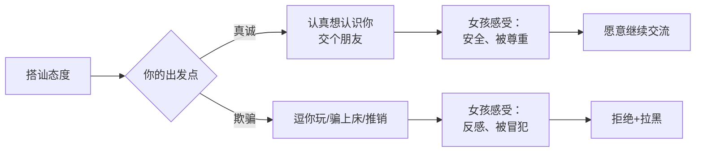

# 第05课：对自己勇敢、对对方要真诚

## Learning Objectives
- 理解真诚在搭讪中比幽默、魅力、话术更重要的底层逻辑
- 能够用"对自己勇敢，对对方真诚"两个标准衡量自己的搭讪行为
- 知道女孩在搭讪时最反感的三类行为，并能够主动避免

## Core Idea

搭讪的底层心法可以总结为八个字：**对自己勇敢，对对方真诚。**

很多人把搭讪理解为"展示魅力"——要幽默、要风趣、要有技巧。但实际上，在初次接触的短暂时间里，**真诚比什么都重要。**

为什么真诚如此重要？因为女孩在搭讪时的第一反应不是"喜不喜欢这个人"，而是"这个人安不安全"。只要她确认你是认真想认识她、想交朋友，她就不会太反感。她们真正反感的是以下三类人：

- **逗你玩的**：和哥们打赌来搭讪，态度轻佻
- **骗人上床的**：有目的地隐藏自己真实意图
- **推销的**：发传单、卖课程、拉会员

> [!TIP] Key Insight
> 真诚不是"掏心掏肺把所有想法都告诉对方"，而是"不隐瞒你的基本意图"。你不需要告诉对方"我想和你结婚"，但你需要让她知道"我是认真想认识你"，而不是在玩游戏或者有别的目的。

> [!WARNING] 真诚 ≠ 情感过度
> 真诚不意味着你可以刚认识就说"我觉得你就是我的真命天女"。这是情感过度，会让对方感到压力。真诚是态度上的坦率，不是程度上的夸张。下一课会详细讲解这个区别。

## Worked Example

**场景**：你在商场看到一个女孩，鼓起勇气走上去。

**不真诚的做法（显得套路化）**：
你："你好，我刚刚在那边看到你，觉得你很有气质。我有个朋友也在这附近，我们一起在玩一个游戏……"
（编造借口，用"游戏"掩饰真实意图）

**真诚的做法**：
你："你好，我刚才在那边看到你，觉得不过来认识一下会后悔。我叫XX，想认识你。"
（没有借口，没有掩饰，直接表达意图）

对比一下：同样是被搭讪，前者会让女孩觉得"这人鬼鬼祟祟的"，后者虽然直接但至少让人感到坦荡。大多数女孩更愿意给真诚的人一个机会。

## Practice

> [!QUESTION] Self-check
> 你准备去搭讪一个女孩，朋友给了一个建议："你别说你是专门去认识她的，就说你在找人问路，然后顺带聊上。"你会采用这个建议吗？为什么？

Reveal answer

不采用。因为这是典型的"不真诚"的做法——用一个借口来掩饰你的真实意图。

虽然看起来"问路"比"想认识你"更自然、更低压力，但它有一个致命问题：**你在用一个谎言开头。** 如果后续发展顺利，你要什么时候告诉她真相？更糟糕的是，如果她发现你是在骗她，你在她心中的信任度会直接归零。

真诚的开场即便被拒绝，也问心无愧。而用借口的开场即便成功了，也为以后的交往埋下了隐患。

记住：**真诚的拒绝好过欺骗的成功。**——这是对自己勇敢、对对方真诚的体现。

## Next Step

你已经理解了真诚的重要性。下一课将探讨一个重要的问题：真诚需要方法吗？答案是肯定的——关系需要分层升级。
