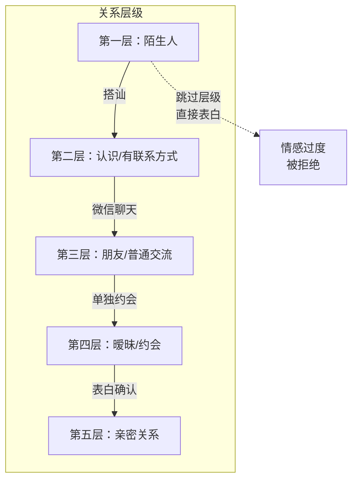

# 第06课：真诚也需要方法——分层升级

## Learning Objectives
- 能够描述"分层升级"理论中关系从低到高的各个层级
- 理解阿Q式"吴妈我想跟你困觉"为什么是真诚但错误的案例
- 能够在实际交往中判断当前关系处于哪个层级，并做相应的交流

## Core Idea

真诚也需要方法。阿Q对吴妈说"吴妈，我想跟你困觉"，这是真诚的，但结果是被打出去。这就是典型的**"情感过度"**——你的感受是真的，但表达方式越过了当前关系层级所能承受的范围。

**关键原则：你只能在当前层级交流好了，才能升级到下一层级。** 不能刚加上微信就发长篇情书，不能第一次约会就说"我离不开你"。

> [!TIP] Key Insight
> "真诚也需要方法"不是让你变得不真诚，而是让你的真诚以对方**能接受的方式**传递出去。就像一个不会说中文的人对你用中文说"我爱你"，即使他再真诚，你也感受不到——因为表达方式超出了你的接收能力。分层升级就是确保你的表达方式和你们的关系层级匹配。

**分层升级的实操规则：**

| 关系层级 | 可以做 | 不可以做 |
|---------|--------|---------|
| 陌生 | 打招呼、自我介绍 | 表白、送礼物 |
| 认识（有微信） | 简单聊天、朋友圈互动 | 写情书、频繁发消息 |
| 朋友 | 约出来玩、深入聊天 | 身体接触、谈婚论嫁 |
| 暧昧 | 适当肢体接触、暗示好感 | 逼对方确认关系 |
| 亲密 | 正式确立关系 | 回退到普通朋友模式 |

> [!WARNING] 常见错误
> 很多男生在加上微信后，第一件事就是"摊牌"——"其实我那天看到你就觉得你很特别，我喜欢你……"这就是典型的层级跳跃。你们的关系还处在"认识"阶段，你却说出了"暧昧"阶段才该说的话。对方只会觉得你有问题。

## Worked Example

**场景**：你在书店搭讪了一个女孩，成功加到了微信。

**错误做法（跳跃升级）**：
第一天就发微信："今天遇见你真的好开心，我感觉我们有缘分，希望能和你多了解……"（200字小作文）
对方回复："谢谢"（然后不再回复）

**正确做法（逐步升级）**：
第一天：简单问候——"你好，我是今天在书店那个XX。今天你后来买到那本书了吗？"
对方回复后，你可以围绕这个共同话题聊几句。
几天后：看到有趣的书相关内容可以分享给她。
一周后：如果聊天顺利，可以试探性邀约——"最近有个书店有讲座，你有兴趣一起去吗？"

每一步都建立在上一层级交流顺畅的基础上，不跳跃、不着急。

## Practice

> [!QUESTION] Self-check
> 你在一个兴趣活动上认识了一个女孩，互相加了微信。活动结束后你特别激动，想要告诉她"从见到你的第一眼就被你吸引了，你是我见过最特别的女孩……"请分析：这会有什么问题？正确的做法是什么？

Reveal answer

问题：这是典型的情感过度。你们的关系层级仅仅是"认识"（有联系方式），而你表达的内容属于"暧昧/表白"层级。这会让她感到莫名其妙，甚至觉得你不太正常——"我们才刚认识，你根本不了解我，怎么说得出这些话？"

正确的做法：先基于你们的共同兴趣（活动内容）展开聊天。聊几次后，如果双方都有回应，再考虑升级到"朋友"层级——约出来喝咖啡、吃饭。等她感受到你的真实魅力后，再逐步升温。不要跳过了解阶段，感情需要时间发酵。

## Next Step

下一课将学习陌生社交的具体原则——少问对方多说自己。在与人交流时，提问要适度，分享要主动。请先在本课的基础上，思考自己在交往中是否曾犯过"跳跃升级"的错误。
