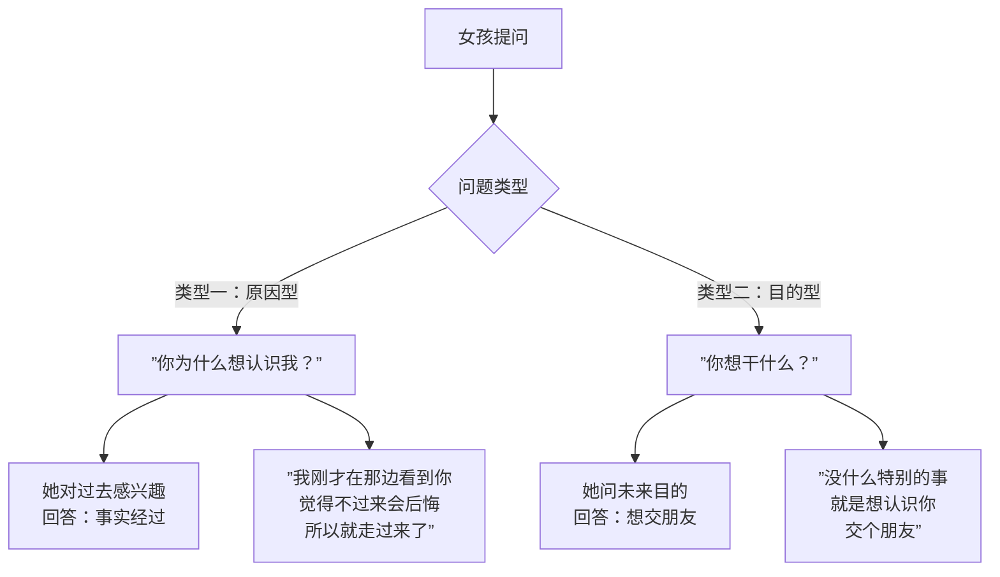

# 第08课：如何应对搭讪时女孩最常见的问题

## Learning Objectives
- 能够区分女孩在搭讪时提出的"原因型问题"和"目的型问题"
- 掌握两种问题的应对策略，能够根据问题类型做出正确回应
- 理解"女孩提问是好信号"这一核心认知，不再害怕被提问

## Core Idea

搭讪时，女孩会问你问题。**很多男人害怕被问问题，但实际上女孩愿意提问是极大的好信号**——说明她在考虑要不要理你，她在给你机会解释。

女孩的问题通常分为两类，你需要根据问题类型做出对应的回答：

**类型一：原因型问题 —— "你为什么想认识我？"**
- 这句话的意思是：她对你为什么选择她感到好奇
- 正确回应：讲事实经过。比如"我刚才在那边看到你，觉得你看起来挺友善的，就忍不住过来了"
- 不需要说"因为你漂亮"（太肤浅），也不需要说"因为你看起来像好人"（太奇怪）

**类型二：目的型问题 —— "你有什么事吗？"/"你想干什么？"**
- 这句话的意思是：她在确认你的意图是否安全
- 正确回应：直接告诉她想交朋友。比如"没什么特别的事，就是想认识你"
- 不要说"没事没事"（那你要干嘛），也不要说"想和你交个朋友不行吗"（有攻击性）

> [!TIP] Key Insight
> 有一种特殊情况：如果女孩用很严肃的表情问"你为什么想认识我"，那等同于在问目的（类型二）。她不是在好奇，而是在评估风险。这时候要把它当目的型问题处理，回答"想认识你，交个朋友"而不是讲事实经过。

> [!NOTE] 态度判断
> 问问题时女孩的态度也很重要：
> - 微笑好奇地问 = 真的是好奇 → 原因型
> - 表情严肃地问 = 在评估风险 → 目的型
> - 边走边问（不看你） = 想脱身 → 回答平和即可，不强求

## Worked Example

**场景A——原因型问题**：
你："你好，我想认识你。"
她：（微笑着好奇地）"哦？为什么想认识我？"
你：（讲事实）"我刚才在那边等车，看到你在看一本我很喜欢的书，觉得我们应该能聊得来，所以就过来了。"
她："是吗？你也看过这本？"（对话自然展开）✅

**场景B——目的型问题**：
你："你好，我想认识你。"
她：（表情平静地）"你有什么事吗？"
你：（直接说明目的）"没什么特别的大事，就是觉得很想认识你，交个朋友。如果能加个微信就太好了。"（坦诚直接）
她："行吧，加个微信吧。"（因为她感受到你的真诚）✅

**场景C——错误回应（把目的型当原因型）**：
她："你有什么事吗？"（目的型）
你："因为我在那边看到你觉得你很有气质……"（错误地讲了原因）
她："不用了谢谢。"（走开）❌

> [!WARNING] 不要背诵答案
> 不要把这套分类当成绕口令来背。关键是理解逻辑：她在问**"为什么是我"**（过去）还是**"你想怎样"**（未来），然后对症下药。

## Practice

> [!QUESTION] Self-check
> 你在搭讪一个女孩，她说："你为什么要过来搭讪我？"同时她脸上的表情是好奇且带着微笑的。请问这属于原因型还是目的型问题？你应该怎么回答？

Reveal answer

这是典型的原因型问题。她的表情是好奇且微笑的，说明她没有敌意，只是在好奇你为什么选择她。

正确回答："我刚才在那边看到你，觉得你看起来是一个很有趣的人，所以就过来了，不想错过认识你的机会。"

注意：不要说"因为你漂亮"——虽然这是真话，但这会让她觉得你只看外表。说"看起来有趣"或者"很有气质"会更让她觉得你是在认真关注她这个人。

## Next Step

学会了如何应对搭讪时的提问后，下一课将学习最关键的一步——如何加微信。这是搭讪从接触到建立联系的临门一脚。
