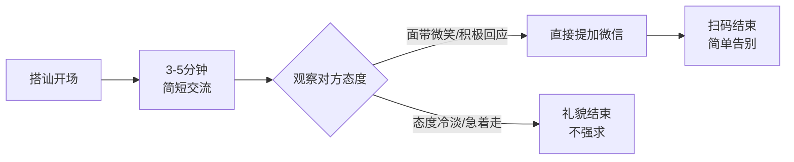

# 第09课：搭讪时如何加微信

## Learning Objectives
- 掌握搭讪中加微信的正确时机——3-5分钟简短交流后
- 学会以直接不兜圈子的方式提出加微信请求
- 理解"简单直接是男性魅力"的核心认知，不再找借口加微信

## Core Idea

加微信是搭讪的"临门一脚"。很多人在这一步前功尽弃——要么上来直接扫码（太突兀），要么兜圈子找借口（太猥琐）。正确的方法是：

**加微信的完整流程：**

1. **先交流，后加微信**——不要上来直接说要加微信。先通过3-5分钟的简短交流，双方有一个基本的了解。你没有必要聊到很深入，只需要让气氛轻松下来即可。
2. **观察态度**——如果女孩全程面带微笑、愿意接你的话，说明可以提出加微信了。如果她一直很冷淡或者急着走，就不要强求。
3. **直接提出，不兜圈子**——不要说"我给你推荐个东西加个微信吧"或者"我扫个码看看"。直接说："我们加个微信吧，以后可以联系。"简单直接是一种男性魅力。

> [!TIP] Key Insight
> **越直接越有魅力。** 尤其是外形不出众的男生，更需要用"直接"来赢得好感。因为当你直接说出"我想认识你，加个微信"时，你在传递一个信号——我很自信，我不需要用借口来掩饰我的意图。这种坦荡本身就是吸引人的品质。

> [!NOTE] 关于"不兜圈子"
> 有些人觉得找借口可以降低被拒绝的概率。实际上正好相反——借口会让你显得不自信、不坦诚。女孩每天都会遇到各种搭讪手段，你的借口她一眼就能看穿。与其被她看穿后再尴尬，不如一开始就直接坦荡。

## Worked Example

**场景**：在商场搭讪了一个女孩，聊了3分钟，双方感觉不错。

**错误做法A（上来就要微信）**：
你："你好，加个微信吧。"（没有任何铺垫，像个推销员）
她："啊？为什么？"（莫名其妙，大概率拒绝）❌

**错误做法B（找借口）**：
你："对了，我有个朋友也在做你这个行业，我推个名片给你……要不加个微信？"（明显的借口）
她：（心里已经看穿）"不用了谢谢。"❌

**正确做法**：
你：（简短交流后，自然地）"和你聊天挺开心的。我们加个微信吧，以后可以联系。"
她：（如果愿意）"好啊。"（扫码）
她：（如果不愿意）"算了，不太方便。"
你："没关系，那祝你开心。"（大方离开，保持风度）✅

> [!WARNING] 关于被拒绝
> 如果对方拒绝加微信，保持风度："没关系，祝你开心。"然后直接走开。千万不要纠缠、问"为什么"或者表现出失望。有风度地离开，至少你给对方留下了好印象。世界很大，下一个更好。

## Practice

> [!QUESTION] Self-check
> 你在书店搭讪了一个女孩，聊了5分钟，聊的是最近有什么好书推荐。气氛不错。现在你想加她的微信。请写出你要说的话——要求不超过15个字，不找任何借口，直接表达意愿。

Reveal answer

参考表达（任选其一）：
- "我们加个微信吧，以后有好书可以互相推荐。"
- "和你聊得很开心，加个微信保持联系？"
- "加个微信吧，下次书店有活动可以约一起。"

关键点：
1. 有交流基础（聊书）= 加了微信后有话可说
2. 直接不绕弯 = 展示自信
3. 附带相关理由（推荐书）= 自然不突兀

## Next Step

恭喜，你已经掌握了搭讪加微信的完整流程。下一课将学习一个更有趣的技巧——即时约会。当双方时间充裕时，如何把搭讪变成一次真正的约会。
