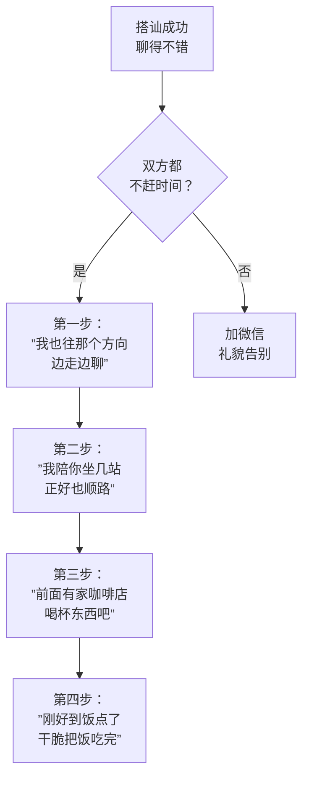

# 第10课：即时约会

## Learning Objectives
- 理解"搭讪本身可以是快乐的事"这一心态转变
- 掌握"步步为营"策略——将大要求拆解为多个小步骤逐步推进
- 能够在双方时间充裕时，将搭讪自然转化为即时约会

## Core Idea

搭讪的目的不仅仅是加微信。如果你和对方都不赶时间，完全可以把搭讪变成一次**即时约会**。

这种心态转变很重要——你不是在"完成任务"（加微信就算赢），而是在经历一次愉快的相遇。当双方都享受其中的时候，你们自然会想多待一会儿。

这个策略的核心是**步步为营**——不要一次性提出大要求（"我们去约会吧"），而是把大要求拆成小步骤，每一步只走一点点：

> **搭讪成功 → 边走边聊 → 坐一站 → 喝杯咖啡 → 吃个饭**

每一步都只比上一步多一点点，每一步都很自然、不突兀。女孩在每个小步骤都可以选择继续或停止，她不会感到压力，你也不会因为被拒绝而尴尬。

> [!TIP] Key Insight
> 即时约会的关键在于：**不要一次提出所有要求。** 每次只提一个小要求，等对方答应了再往前推进一步。如果她在某个步骤拒绝了你，就停在当前步骤，不要继续推进。比如她说"我不喝咖啡了"，你就说"好，那我陪你走到地铁站"，而不是"那去吃点别的"。

> [!NOTE] 搭讪本身是快乐的
> 很多人把搭讪看得很沉重，像在做一件痛苦但不得不做的事。但如果你能享受这个过程——认识一个陌生人、了解一个有趣的人、度过一段愉快的时光——那么即使最后没有加微信、没有进一步的发展，这次搭讪本身也是一件值得做的事。这种心态会让你在搭讪时更放松、更有魅力。

## Worked Example

**场景**：下午3点，你在书店搭讪了一个女孩，聊得很愉快。她没有表现出要离开的意思，你的时间也很充裕。

**步步为营推进过程**：

**第一步**——你准备离开书店，发现她也在往门口走：
你："你也走啦？我也刚好要走，一起出去吧。"（不是约她，只是顺路一起走出去）
她："好呀。"

**第二步**——出了书店，你发现她和你同一个方向：
你："你往哪边走？好巧，我刚好也往那个方向，一起走吧。"（边走边继续聊）

**第三步**——走了一段路，看到一家咖啡店：
你："走了这么一会儿有点渴了，我进去买杯咖啡，你要来一杯吗？"（顺便邀约）
她可能会犹豫："嗯……不太方便吧。"
你：（不勉强）"没关系，下次有机会再一起喝。"（保持轻松）

**第四步**——如果她同意了第三步，那在喝咖啡时继续聊天。如果临近饭点：
你："聊着聊着都到饭点了，对面有家餐厅还不错，要不一起吃个饭？我请你。"
她如果愿意，即时约会就成功了。

> [!WARNING] 尊重拒绝
> 步步为营不是死缠烂打。如果对方在任何一个步骤说"不"或表现出犹豫，立刻停止推进。如果你说"一起走走"，她说"不了，我还有点事"，你就应该回答"好的，那加个微信以后再联系"，而不是继续说服她。

## Practice

> [!QUESTION] Self-check
> 你在逛博物馆时搭讪了一个女孩，聊了十几分钟，气氛很好。你们一起看完了两个展厅。你想把关系往前推进。请用"步步为营"的原则，写出你的前三步行动方案（不可一次性跳到约饭）。

Reveal answer

参考方案：

**第一步**——看完当前展厅后说："那边还有两个展厅我也没看过，一起过去看看吧？"（在博物馆内自然推进）

**第二步**——一起看完所有展厅后说："我看得差不多了，你呢？要不一起出去喝点东西，旁边有个饮品区。"（从博物馆活动过渡到单独相处）

**第三步**——在饮品区坐下来聊天后，如果聊得不错，可以说："和你聊天很开心，如果等会儿你有空的话，我知道附近有家不错的餐厅……"（试探性提出约饭）

注意：每一步都要观察对方的反应，如果她在某步犹豫了，就停止推进，不要勉强。即时约会的目标是双方都开心，而不是完成一套流程。

## Next Step

恭喜你完成了前10课的搭讪基础篇学习！你已经掌握了：
- 正确的心态（双赢原则）
- 扩大社交圈的方法（搭讪）
- 核心品质（勇气与真诚）
- 社交原则（分层升级、一问一接）
- 实战技巧（加微信、即时约会）

请在实际生活中练习这10课的内容，然后再进入后续课程。理论学得再好，也不如一次真实的搭讪经验有价值。
