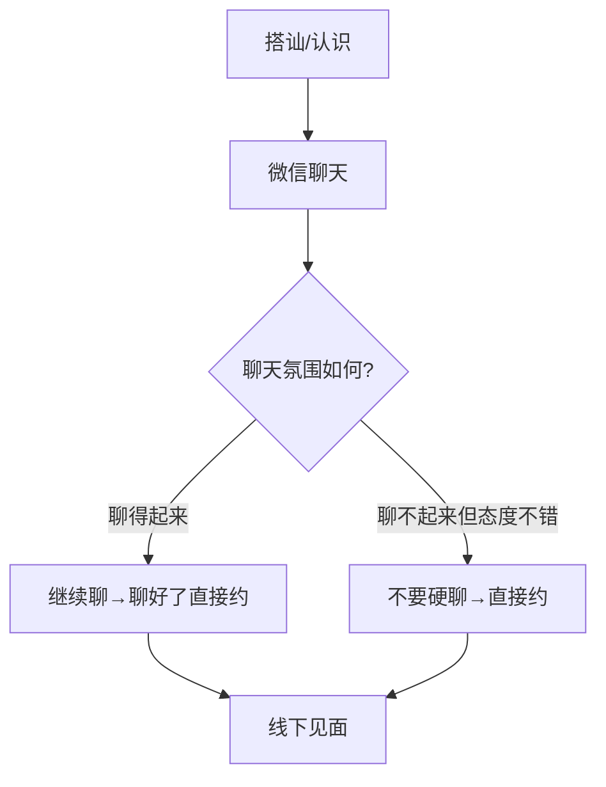

# 第15课：你聊微信的目标对吗

## Learning Objectives
- 明确微信聊天的核心目标是约出来见面，而非线上展示
- 学会根据对方回复质量选择"继续聊"或"直接约"
- 理解当代女性安全感变化对微信邀约策略的影响

## Core Idea

很多男生在微信上花了大量时间聊天，却始终没有推进关系，原因在于**搞错了微信聊天的目标**。

**微信聊天的唯一目标：约出来见面。**

男女交往，只有在见面时才能产生实质性的情感连接。微信上的文字聊天，无论聊得多好，都无法替代面对面的互动。文字没有语气、没有表情、没有肢体语言，信息传递量极其有限。

> [!NOTE] 时代变化：安全感的新来源
> 过去，女孩需要通过长时间的微信聊天来了解一个陌生男生，以此建立安全感。但现在情况变了——**朋友圈已经帮她们完成了一部分了解工作**。通过朋友圈，她可以看到你的生活状态、兴趣爱好、社交圈子。这意味着，你不需要在微信上"证明自己"到100%才约她，达到60%就够了。

基于这个变化，微信聊天之后有**两条路径**：

**路径一：聊得起来就聊好了约**

如果双方在微信上互动流畅，有来有回，可以继续聊，在氛围好的时候提出邀约。

**路径二：聊不起来但态度不错就赶紧约**

如果对方回复比较简短（"嗯嗯""好的"），但不反感你，小表情发得挺多，这时候**不要硬聊**。继续尬聊只会消耗好感。正确的做法是趁对方态度还在，直接提出邀约。

> [!WARNING] 硬聊的危害
> 很多男生在"聊不起来"的时候选择了更努力地找话题，结果越聊越尴尬，最后对方连约都懒得出来了。聊天氛围不好时，继续聊是负资产，及时转要约是正资产。

> [!TIP] Key Insight
> 判断微信聊天是否成功的标准，不是"聊了多少句话"或"有多开心"，而是"有没有成功约出来见面"。把微信当作约会工具，而不是恋爱工具。

## Worked Example

**场景一：聊得起来**

> 你："你之前说的那个展我周末去看了，确实不错！"
> 她："哈哈是吧！我觉得那个装置艺术特别有意思。"
> 你（聊天氛围好，顺势邀约）："下次有好的展一起去看吧？"
> 她："好呀~"

**场景二：聊不起来但态度不差**

> 你："周末过得怎么样？"
> 她："还行~"
> 你："有什么好玩的事吗？"
> 她："没有耶 😅"
> （这里不要继续追问了，直接转邀约）
> 你："下周有个不错的电影上映，一起去看吧？"
> 她："可以考虑哦~"

## Practice

> [!QUESTION] Self-check
> 1. 微信聊天的核心目标是什么？
> 2. 为什么现在不需要在微信上聊很久才约？
> 3. 当微信聊天氛围不好但对方态度不反感时，应该怎么做？

Reveal answer

1. 约出来见面。男女交往只有见面才有实质内容
2. 因为朋友圈已经帮女孩完成了一部分了解你的工作，不需要等到100%了解才约
3. 不要硬聊，直接提出邀约。继续尬聊会消耗好感，及时转邀约是更明智的选择

## Next Step

Continue with the next lesson or complete the review task above before moving on.
