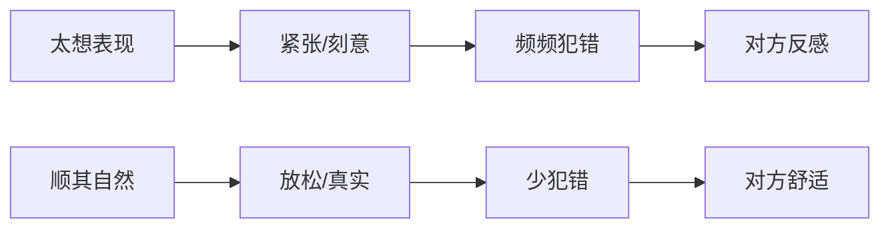

# 第16课：聊微信的心态陷阱

## Learning Objectives
- 识别微信聊天中"急于表现自己"的心态陷阱
- 掌握"聊不来就放着"的止损策略
- 理解"顺其自然"和"不犯错"在微信聊天中的优先级

## Core Idea

微信聊天中最大的心态陷阱是：**太想在微信中表现自己。**

当聊天不顺畅、气氛变冷时，很多男生的第一反应是"我要想办法把局面扭转过来"。于是开始拼命找话题、发段子、问问题，结果越努力越尴尬。

**一个值得反思的现象：**

> 很多男生发现，自己面对不太喜欢的女孩时，微信反而聊得更好。因为对对方没有"表现欲"，说话放松自然，不刻意、不紧张。而面对真正喜欢的女孩时，因为太在意、太想表现，反而束手束脚、频频出错。

这说明了一个核心道理：**顺其自然才可以聊好，不犯错最重要。**

**聊不来怎么办？**

正确的做法很简单：**聊不来就聊不来，今天放着，明天再找机会。**

不要把一次不成功的聊天当作"世界末日"。微信聊天是可以随时暂停、随时继续的。今天聊得不好，过一天再发起一个新话题就是。但如果你今天非要把局面"掰回来"，往往会把关系推向更糟的方向。

> [!NOTE] 技术 vs 心态
> - **技术方法**的作用是保证你不犯错
> - **好心态**的作用是让你出彩
>
> 两者缺一不可。技术是底线，心态决定上限。

> [!TIP] Key Insight
> 在微信聊天中，"不犯错"比"表现好"更重要。一个不犯错的聊天者，可以在多次平淡互动中等待机会；而一个犯错的人，可能一次就把关系搞砸了。"聊不来就放着"不是消极，而是成熟的自我管理。

## Worked Example

**场景一：聊天陷入尴尬**

> 你："周末去爬山了，风景很好。"
> 她："哦。"
> 你（错误反应）："你平时喜欢运动吗？我每周都去健身房，还打篮球……"（拼命展示自己）
>
> 正确反应：不强行延续话题。第二天发一条轻松的消息："今天看到一家不错的甜品店，推荐给你~"

**场景二：对方回复冷淡**

> 你："推荐一部最近看的电影《XXX》。"
> 她："看过了。"
> 你（错误反应）："那你觉得怎么样？我还看了另外几部……"（连续追问）
>
> 正确反应："好的，那有好的再推荐你。"——停，过两天再聊。

## Practice

> [!QUESTION] Self-check
> 1. 微信聊天中最大的心态陷阱是什么？
> 2. 为什么面对不喜欢的女孩反而聊得更好？
> 3. 聊天不顺畅时，正确的做法是什么？

Reveal answer

1. 太想在微信中表现自己，聊天不顺畅时急于扭转局面
2. 因为没有表现欲，说话放松自然，不刻意不紧张，反而能展示真实的自己
3. 聊不来就聊不来，今天放着，明天再找机会。不要硬聊，不犯错比扭转局面更重要

## Next Step

Continue with the next lesson or complete the review task above before moving on.
