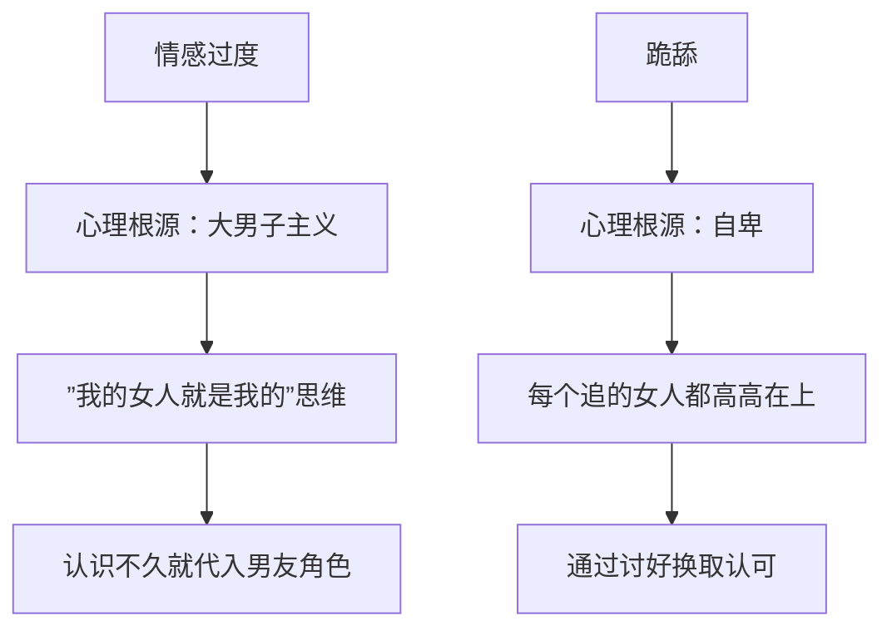

# 第17课：追女孩最常见的聊天错误

## Learning Objectives
- 识别"情感过度"和"跪舔"两种典型聊天错误
- 理解两种错误背后的心理根源：大男子主义与自卑
- 学会在日常聊天中保持平等自然的对话姿态

## Core Idea

追女孩聊天时最常见的两种错误：**情感过度**和**跪舔**。

**一、情感过度**

情感过度是指刚认识不久，就在聊天中表现出像男女朋友一样的喜欢和亲密感。

典型表现：
- 认识没几天就说"真的好想你"
- 过度关心"记得多穿衣服""按时吃饭"
- 发消息频率和语气仿佛已经在恋爱

**二、跪舔**

跪舔是指女孩说什么都表现出"特别好、特别棒、特别想关心你"的态度。

典型表现：
- 女孩随便发个朋友圈就狂夸"太美了"
- 女孩说任何话都回复"哇你好厉害""你好优秀"
- 无原则地附和和讨好，不敢有任何不同意见

| 错误类型 | 表现 | 对方感受 |
|---------|------|---------|
| 情感过度 | 过早表现出亲密感 | 压力大、想逃离 |
| 跪舔 | 无原则讨好附和 | 没意思、不尊重 |

**心理根源分析：**

- **情感过度**来自于大男子主义心态——"我看上你了，你就是我的女人了"，所以还没建立关系就开始以男友自居
- **跪舔**来自于自卑心态——把对方放在高高在上的位置，觉得自己不配，需要通过讨好来换取对方的垂青

> [!NOTE] 两者可能并存
> 一个人可能同时有这两种倾向：对某些类型的女孩跪舔（觉得对方高不可攀），对另外类型的女孩情感过度（觉得对方应该是自己的）。但它们的共同结果都是让对方感到不舒服。

> [!TIP] Key Insight
> 追女孩的本质是建立一段平等的关系，不是"征服"也不是"乞求"。情感过度是把自己放得太高，跪舔是把自己放得太低。正确的姿态是把对方当作一个平等的普通人来交流——尊重但不卑微，喜欢但不越界。

## Worked Example

**情感过度案例：**

> 认识第三天，女孩说"今天加班好累"。
> 错误回复："心疼你，要好好休息哦，明天我请你吃好吃的补充能量~"（情感过度，像男朋友的语气）
> 正确回复："加班确实累，早点休息吧。"

**跪舔案例：**

> 女孩发了一张普通自拍。
> 错误回复："天哪太美了！！女神！！"（跪舔）
> 正确回复：如果确实不错可以说"这张拍得挺自然的"，如果一般也可以不评价，自然聊别的。

## Practice

> [!QUESTION] Self-check
> 1. "情感过度"和"跪舔"分别指什么？各举一个例子。
> 2. 情感过度的心理根源是什么？
> 3. 跪舔的心理根源是什么？
> 4. 正确的聊天姿态应该是什么样的？

Reveal answer

1. 情感过度：刚认识就表现出男友式的亲密感，如"好想你"；跪舔：无原则讨好附和，如不管对方发什么都狂夸
2. 大男子主义心态——"我看上你了你就是我的"，还没建立关系就代入男友角色
3. 自卑心态——把对方放在高高在上的位置，觉得需要通过讨好换取认可
4. 平等交流——尊重但不卑微，喜欢但不越界，把对方当作一个平等的普通人来交流

## Next Step

Continue with the next lesson or complete the review task above before moving on.
