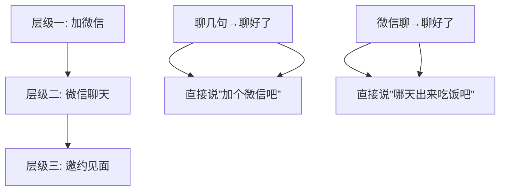

# 第18课：如何提出邀约

## Learning Objectives
- 理解"分层升级"原则在邀约中的应用
- 掌握"层内聊好情绪，升级时直接干脆"的操作方法
- 学会像加微信一样自然地提出邀约

## Core Idea

邀约是推进关系的关键一步，但很多人在这里卡住了。核心方法可以概括为**分层升级原则**。

**什么是分层升级？**

关系的发展不是平滑连续的，而是**阶梯式**的。你在当前层级内部把互动做好（把情绪拉起来），然后直接进入下一层级。不要在当前层级犹豫、铺垫、绕圈子。

**加微信的类比：**

当你在搭讪时想加微信，你不会说一堆铺垫然后小心翼翼地问"可以吗"，而是先闲聊几句，聊好了，直接说"加个微信吧"——干脆、自然、不拖泥带水。

**邀约也是一样的逻辑：**

在微信上先聊一会儿，把聊天氛围拉起来，等感觉双方情绪都不错的时候，直接说**"哪天出来吃饭吧"**。

> [!WARNING] 邀约时的常见错误
> - 加表情包和乱七八糟的修饰（"要不要……那个……一起吃个饭呢😅🙏"）
> - 铺垫太长（"你平时吃饭都喜欢去哪""你周末有空吗"……）
> - 邀约语气像请求（"可以请你吃个饭吗？"）
>
> 这些做法的共同问题是：让邀约看起来不自信、不确定。

**为什么邀约要直接？**

因为直接邀约传递的是自信和确定性。"哪天出来吃饭吧"听起来像是一个自然的提议，而不是一个需要批准的重大请求。对方接受起来没有压力，拒绝起来也不会尴尬。

> [!TIP] Key Insight
> 层内的工作是"聊好情绪"，不是"铺垫邀约"。把情绪聊好了，直接升级就够了，不需要额外铺垫。多余的铺垫会暴露你的不自信，反而让邀约变得尴尬。

## Worked Example

**正确的邀约流程：**

> 你："你推荐的那家餐厅我去试了，确实不错！"
> 她："哈哈是吧，我去了好几次了。"
> 你（情绪到位，直接升级）："那下次一起去吧，正好你可以推荐招牌菜。"
> 她："好呀~"

**错误的邀约流程：**

> 你："在吗？"
> 她："在。"
> 你："那个……我想问问你……"
> 她："怎么了？"
> 你："你周末有没有空啊？"
> 她："周末？有事吗？"
> 你："就是……想请你吃个饭……可以吗？😅"
> 她："再说吧。"

## Practice

> [!QUESTION] Self-check
> 1. 什么是"分层升级"原则？
> 2. 邀约时应该用什么语气和措辞？
> 3. 邀约前的"层内工作"应该做什么，不应该做什么？

Reveal answer

1. 在当前层级内部把情绪聊好，然后直接干脆地升级到下一层级，不要铺垫和绕圈子
2. 直接、自然、自信的语气，如"哪天出来吃饭吧"，不要加表情包和多余的修饰，不要像请求批准一样
3. 应该做：把聊天氛围拉起来，让双方情绪都不错；不应该做：为邀约做漫长的铺垫和试探

## Next Step

Continue with the next lesson or complete the review task above before moving on.
