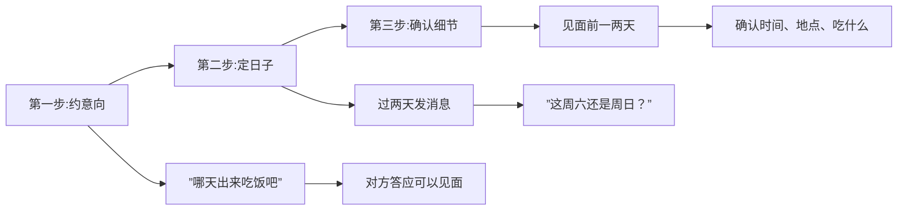

# 第19课：邀约要注意什么

## Learning Objectives
- 掌握邀约的三步走流程：意向确认、具体日子、细节确认
- 理解为什么不要一次把所有细节定完
- 明确约会的本质目的是互相了解而非吃饭

## Core Idea

邀约不是一步到位的事情，而是需要**分步推进**的技术流程。很多男生在对方答应邀约后马上陷入"细节轰炸"，这是最常见的错误。

**邀约三步走：**

**第一步：约意向**

先提出一个模糊的邀约意愿，目标是确认对方"可以见面"而不是"拒绝见面"。

> "哪天出来吃饭吧" / "有空一起出来走走"

对方如果说"好呀""可以"，那就说明她对见面不排斥。

**第二步：确定具体日子**

过两天再联系，确定一个具体的日期。不要太早定，也不要拖太久。

> "这周六还是周日有安排吗？"

**第三步：确认细节**

见面前一两天，确认具体的时间、地点和吃什么。

> "周六晚上七点在XX餐厅怎么样？"

**常见错误：一次把所有细节定完**

> "周日晚上七点我在XX餐厅订了位，你喜欢吃日料对吧，我带你去一家不错的日料店……"

这样做的问题：
1. 给对方造成了心理压力——好像一切都被安排好了，没有选择的余地
2. 过早定细节，中间如果对方有事要改，反而增加了沟通成本
3. 显得目的性太强——好像你满脑子只有约会这件事

> [!NOTE] 约会的本质目的
> 约会不是为了吃饭，而是为了互相了解。吃饭只是一个载体，让你们有一个自然的环境来交流和认识彼此。所以不要把注意力都放在"去哪吃""吃什么"上，而应该放在"怎么聊""怎么了解对方"上。

> [!TIP] Key Insight
> 邀约分三步走的核心价值在于：每一步都是"试探-确认"的节奏，给对方充分的调整空间，同时保护自己的心态。对方如果在任何一步犹豫或拒绝，你都可以体面地暂停，而不至于一次把所有筹码都押上。

## Worked Example

**正确的分步邀约：**

> **第一天（约意向）：**
> 你："下次有空一起出来吃饭吧。"
> 她："好呀~"
>
> **第三天（定日子）：**
> 你："这周末有空吗？周六还是周日方便？"
> 她："周日应该可以。"
>
> **周五（确认细节）：**
> 你："周日晚上七点在XX那家日料怎么样？"
> 她："没问题！"

**错误的一次性邀约：**

> "这周日晚上七点我在国贸那边订了一家评价很高的日料店，你爱吃三文鱼对吧，我已经看好菜单了……"
>
> 对方反应：压力大 / 觉得你太急了 / 找个理由推掉

## Practice

> [!QUESTION] Self-check
> 1. 邀约应该分为哪三步？每一步做什么？
> 2. 为什么不要一次把所有细节定完？
> 3. 约会的本质目的是什么？

Reveal answer

1. 第一步约意向（确认可以见面）→ 第二步定日子（过两天确认具体哪天）→ 第三步确认细节（见面前确认时间地点）
2. 因为一次性定完所有细节会给对方心理压力、减少对方的自主感、显得目的性太强
3. 不是为了吃饭，而是为了互相了解。吃饭只是让双方有一个自然交流和认识的载体

## Next Step

Continue with the next lesson or complete the review task above before moving on.
