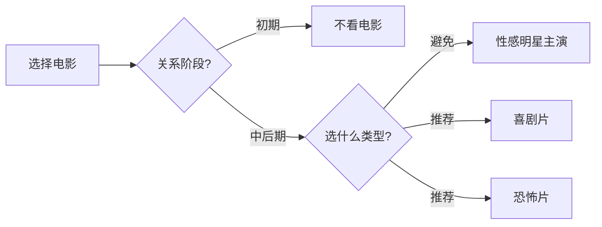

# 第23课：约会时应该看什么样的电影

## Learning Objectives
- 判断在约会关系发展的哪个阶段适合看电影
- 学会选择有利于关系推进的电影类型
- 识别并避免选择含有"性感明星"的电影

## Core Idea

上一课讲了"首次约会不宜看电影"，但这不意味着约会中永远不能看电影。关键在于**阶段**和**选片**。

### 看电影的时机

看电影适合在约会关系的**中后期**。当你们已经见过几次面，有过充足的交流，彼此有了基本了解之后，一起看电影可以作为共同娱乐和情感推进的工具。而在相互了解的初期阶段，任何分散交流注意力的活动都应该避免。

### 选片的智慧

### 要避免的电影

**性感明星拍的电影**。这包括让女生着迷的帅哥男星（如某知名好莱坞男星），也包括让男生分心的性感女星。当女朋友坐在你身边，看到荧幕上的性感演员时，她会不由自主地把情绪投射到荧幕上，对身边的你反而失去兴趣。

> [!WARNING] 警惕"荧幕情敌"
> 女生看到帅气的男演员，会沉浸在浪漫幻想中。她越是被荧幕上的角色吸引，就越会对身边的你感到平淡。你花钱请她看电影，结果她爱上了电影里的男主角——这是最不划算的约会。

### 推荐的类型

1. **喜剧片**：轻松愉快，共同的笑声是最好的情感催化剂。两人因为同一个笑点而哈哈大笑，会产生共情，拉近距离。

2. **恐怖片**：这是约会中非常特殊的一种选择。当女孩感到害怕时，会下意识地往你身上靠——这是一个自然的身体接触机会。心理学上称为"错误归因"——她会把心跳加速的原因部分归因于你，从而增加好感。

> [!TIP] Key Insight
> 恐怖片利用的是"吊桥效应"——人在恐惧时心跳加速，而这种生理反应会被错误地归因于身边的人。选对电影，等于让电影替你制造浪漫推进的机会。

## Worked Example

**场景：** 你和女生已经约会过三四次，关系稳步推进。她提出想一起看电影。

**好的选择：** 选一部口碑好的喜剧片，或者她感兴趣的非爱情主题电影。看完后你们可以一起讨论剧情、笑点，延续约会的交流。

**更好的选择：** 选一部合适的恐怖片。当她在惊吓时刻抓住你的手臂时，你只需要自然地拍拍她的手表示安慰，不需要说太多话。这种身体接触自然发生，比刻意牵手要顺畅得多。

**糟糕的选择：** 选一部有超级帅哥主演的爱情片。她会沉浸在一段浪漫爱情故事里，而走出电影院时，你的存在感会降到最低。

## Practice

> [!QUESTION] Self-check
> 你和约会对象去看电影，以下哪些电影类型是推荐的？A. 悬疑剧情片 B. 帅哥主演的爱情片 C. 喜剧片 D. 恐怖片

Reveal answer

正确答案：A、C、D。

- **悬疑剧情片**（可）：可以讨论剧情和推理，有交流互动。
- **帅哥主演的爱情片**（否）：她会对荧幕上的男生产生好感，对你不利。
- **喜剧片**（推荐）：共同笑声产生共情，拉近距离。
- **恐怖片**（强烈推荐）：利用吊桥效应，自然制造身体接触机会。

请记住：选片的原则不是"什么电影好看"，而是"什么电影有利于你们的关系推进"。

## Next Step

Continue with the next lesson or complete the review task above before moving on.