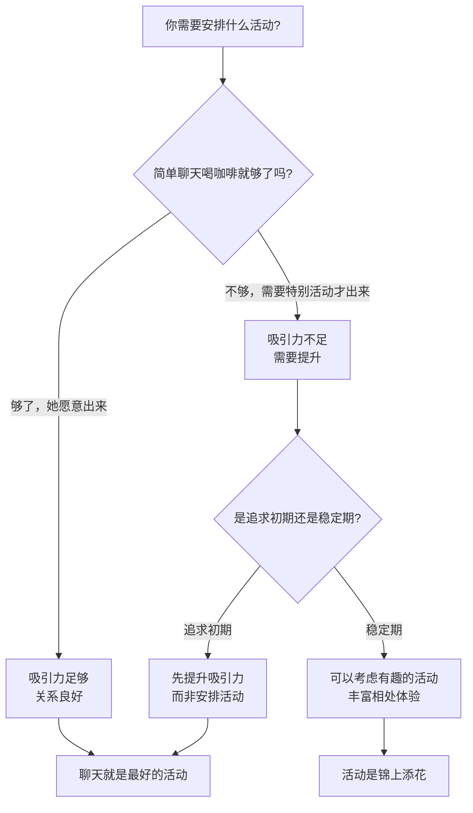

# 第25课：约会时能安排什么活动

## Learning Objectives
- 理解"聊天本身就是最好的约会活动"这一核心观念
- 辨别"需要特殊活动才能约出来"背后的吸引力问题
- 区分"追求期"和"关系稳定期"对活动的不同需求

## Core Idea

很多人在策划约会时，总在琢磨"该安排什么活动"——密室逃脱？手工DIY？看展览？游乐场？其实这是一个误区。

**聊天本身就是最好的活动。**

> [!NOTE] 核心观念
> 如果你和一个人在一起，光是聊聊天、喝杯咖啡就觉得很快乐、很满足，这说明你们之间有吸引力。如果必须依靠花哨的活动来维持约会的趣味性，那说明你们的交流本身缺乏吸引力。

### 吸引力诊断

### 两个阶段的区分

1. **追求阶段**：如果吃饭喝咖啡已经不足以引起对方的兴趣，你需要安排"别出心裁"的活动才愿意出来，这说明你对她的吸引力不够。这时候正确的做法不是想更花哨的活动，而是**提升自身的吸引力**。

2. **关系稳定期**：如果你们已经在一起了，觉得约会的日常有些平淡，想安排一些有趣的活动来丰富体验——这完全是另一回事。这是锦上添花，而非雪中送炭。

> [!WARNING]
> 不要用"活动创意"来掩盖"吸引力不足"的问题。如果你的聊天本身就不能让对方感兴趣，再精彩的活动也只是暂时的"遮羞布"。花更多时间去提升自己的沟通能力和个人魅力，比花时间策划活动更有效。

> [!TIP] Key Insight
> 如果吃饭喝咖啡已经不足以引起对方兴趣，需要安排别出心裁的活动才出来，说明你对她吸引力不够。聊天本身就是最好的活动——能通过简单交流就吸引对方，才是真正的能力。

## Worked Example

**场景：** 你约一个女生周末出来，她问你"去干什么"，你列举了一系列活动（陶瓷体验、密室逃脱、看展览），她才勉强答应。约会时你们主要靠活动本身填充时间，活动一结束就各回各家，交流很浅。

**问题诊断：** 这说明你们的吸引力基础不够牢固。她不是因为你这个人而出来，而是因为"那个活动听起来还不错"。这种约会即使成功了几次，也很难让关系有实质性推进。

**正确做法：** 退一步，减少约会的频率，增加日常聊天的质量。让她因为"和你聊天很开心"而期待见面，而不是因为"那个活动应该挺好玩的"才出来。当她说"不干什么也行，就是想见见你"时，你就知道吸引力到位了。

## Practice

> [!QUESTION] Self-check
> 当你约一个女生时，她是因为什么而答应出来的？是"想见到你"，还是"活动听起来不错"？这两者有什么区别？

Reveal answer

这两种情况的本质区别：

- **"想见到你"**：说明你本人对她有吸引力。简单喝咖啡也能很开心。这是关系健康推进的基础。
- **"活动听起来不错"**：说明吸引力在活动本身而不是你。一旦活动结束，关系没有实质推进。

如果你发现自己总是需要精心策划活动才能约出对方，请把精力从"策划活动"转移到"提升自己的吸引力"上——提高沟通质量、丰富自身阅历、展现自信和有趣的人格。

## Next Step

Continue with the next lesson or complete the review task above before moving on.