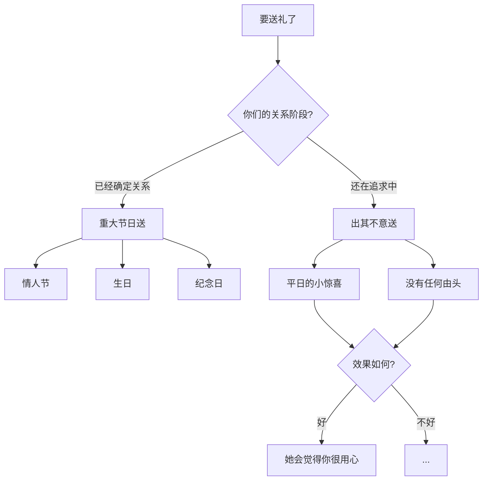

# 第27课：送礼物的正确方法

## Learning Objectives
- 区分追求阶段和关系稳定期的送礼时机与策略
- 理解"重大节日"和"出其不意"两种送礼方式的适用条件
- 识别并避免在不当时机送礼物带来的负面效果

## Core Idea

送礼物的核心原则只有一条：**追上了重大节日送，没追上出其不意送。**

这句话需要从两个角度来理解。

### 送礼时机的两种策略

### 常见的错误做法

很多人犯的最大的错是：**没追上却在重大节日送礼物**。

- 情人节还没确定关系，就送一份贵重的礼物
- 圣诞节还在追求阶段，精心准备了一份惊喜
- 对方生日，你们还不熟，却送了一份大礼

> [!WARNING] 节日送礼的"警惕效应"
> 当你还在追求阶段，在情人节这样的敏感节日送礼物，女生会立刻意识到"他在用礼物推进关系"。这会产生强烈的压力和警惕心理——"我收了礼物就要对他负责"、"他是不是想用礼物绑架我"。这种压力会让女生下意识地疏远你。

### 正确的送礼逻辑

| 关系阶段 | 推荐时机 | 理由 |
|---------|---------|------|
| 追求中 | 出其不意（平日） | 让她感受到你的用心，但没有压力 |
| 已追上 | 重大节日 | 巩固关系，表达情感，名正言顺 |

"出其不意"的核心是：非重大节日、没有任何特殊由头、纯粹因为"想到了你"而送。这种礼物传递的信息是"我想着你"而不是"我要你答应我什么"。

> [!TIP] Key Insight
> 追上了重大节日送，没追上出其不意送。很多人犯的错是：没追上在重大节日（情人节、圣诞）送礼物，效果差，女孩会很警惕。礼物的价值在于它所传递的信息——正确的时机传递正确信息，错误的时机传递错误信息。

## Worked Example

**错误案例：** 小明追求一个女生两个月，约出来吃过几次饭，关系还不错。情人节那天，他买了一束花和一条项链送给女生。女生收到后表情很复杂，之后回复消息的频率明显降低。

**问题分析：** 情人节送礼带有强烈的"关系确认"信号。女生还没有准备好确定关系，收到这样的礼物会感到巨大压力，觉得"收下了就意味着接受关系"，她只能选择回避。

**正确做法：** 如果小明真的想通过礼物表达心意，可以在一个普通的工作日，买一盒她喜欢的小蛋糕送到她公司，附上一张便签"路过看到，觉得你会喜欢"。这个礼物没有任何"要求"，纯粹是分享美好。她收得轻松，也觉得你贴心。

## Practice

> [!QUESTION] Self-check
> 你在以下哪个阶段送情人节礼物是合适的？A. 追求初期，还没单独约出来 B. 追求中，约出来过几次但没确定关系 C. 已经确定恋爱关系

Reveal answer

正确答案：C。

只有在已经确定恋爱关系后，情人节礼物才是合适的。在追求阶段（A和B），情人节送礼会带来压力和警惕感，适得其反。

追求阶段适合送礼物的时机是"出其不意"——一个普通的日子，没有特殊原因，只是因为想到了对方。这种礼物不会施加压力，反而会让女生觉得你用心且不功利。

## Next Step

Continue with the next lesson or complete the review task above before moving on.